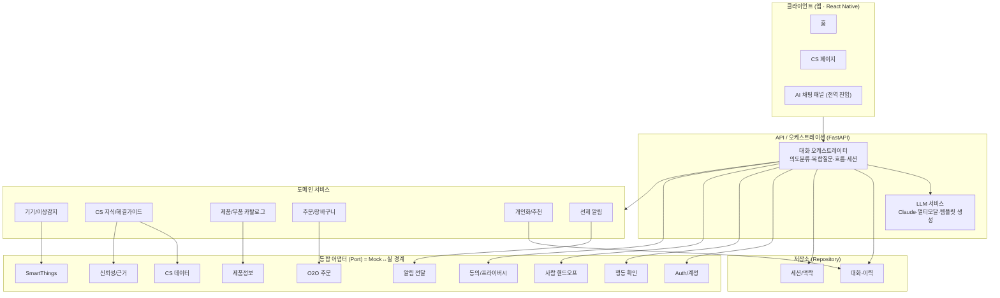
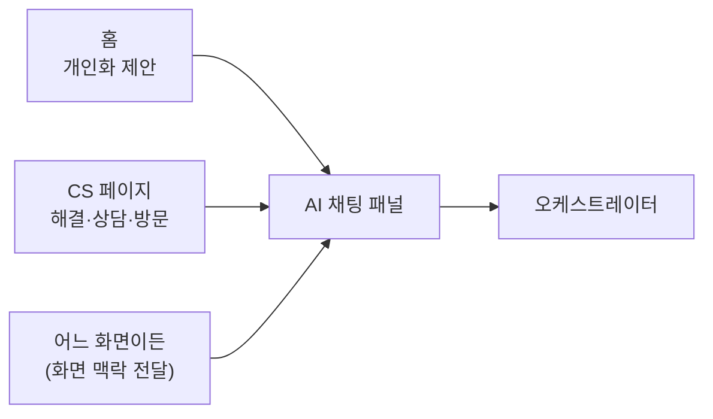
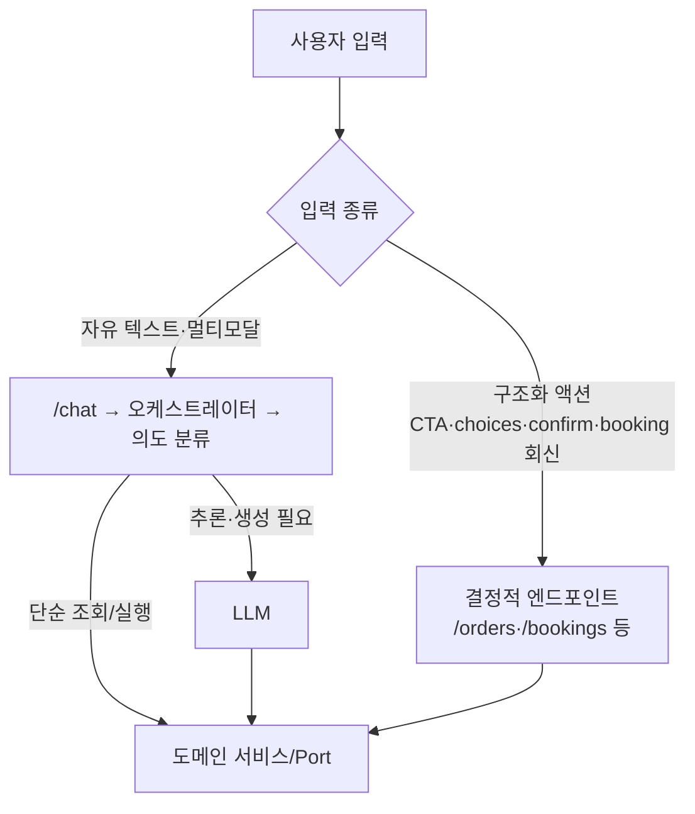

# 시스템 아키텍처 (Architecture)

> **기반 문서 (공유).** 제품·시스템 수준의 아키텍처를 정의한다.
> 개별 기능 스펙(`specs/<기능>/design.md`)은 이 문서를 참조하고,
> 아키텍처·기술 스택·Mock↔실 전략이 바뀌면 **이 문서를 갱신**한다.
> 공유 데이터 모델·클래스 구조는 `docs/data-model.md` 를 본다.

## 1. 개요

대화 **오케스트레이터**를 중심에 두고, 도메인 기능은 **도메인 서비스**로,
외부 연동(SmartThings·O2O·CS 데이터·인증 등)은 **어댑터(Port)** 로 추상화한다.
이 어댑터 경계가 **Mock ↔ 실 기능 교체 지점**이 된다.

### 핵심 설계 원칙
1. **어댑터(Port) 경계로 Mock→실 교체** — Mock 구현을 인터페이스 뒤에 두어,
   나머지 시스템은 동일 인터페이스로 통합한다. 저장소도 Repository 인터페이스로 동일하게 처리한다.
2. **스트리밍 우선** — 모든 응답 경로는 점진적 전달을 기본으로 한다.
3. **폴백 내장** — 모든 외부 호출은 실패/미연동 시 대체 경로를 가진다.
4. **상태 있는 대화 세션** — 흐름 전환·복합 질문·이력을 위해 세션 맥락을 1급으로 둔다.
5. **UI 디커플링** — 응답은 데이터(템플릿 모델)로 표현하고, 렌더링은 클라이언트가 담당한다.

## 2. 기술 스택

| 영역 | 선택 | 비고 |
|------|------|------|
| 프론트엔드 | **React Native** | 앱 (홈·CS·전역 채팅 패널) |
| 백엔드 | **FastAPI (Python)** | Node 전환은 후속 검토 |
| 저장소 | **인메모리/로컬 DB(기본) → Postgres + Redis(옵셔널)** | Repository 인터페이스로 교체 |
| LLM | **Claude** | 멀티모달·구조화 출력. 기본은 비용/지연 균형 모델, 복잡 추론은 상위 모델 라우팅 |

## 3. 아키텍처 다이어그램

## 4. 레이어 책임

- **클라이언트 (React Native)** — 홈/CS/전역 채팅 패널, 멀티모달 입력·출력 렌더링,
  템플릿·CTA 렌더링, 스트리밍 표시. 디자이너 애셋 전엔 플레이스홀더.
- **오케스트레이터** — 의도 분류, 복합 의도 분해, 흐름 전환·복원, 세션/맥락 관리,
  도메인 서비스 호출 조합, 스트리밍 집계.
- **LLM 서비스** — Claude 호출, 멀티모달 입력 처리, 응답을 **템플릿 모델**로 구조화.
- **도메인 서비스** — 비즈니스 로직. 외부 연동은 직접 하지 않고 Port를 통한다.
- **통합 어댑터(Port)** — 외부 시스템/민감 기능 추상화. **Mock↔실 교체 지점.**
- **저장소(Repository)** — 대화·이력, 세션 맥락. 인메모리/로컬(기본) ↔ Postgres+Redis(옵셔널) 교체.

### 컴포넌트 책임 요약
| 컴포넌트 | 책임 |
|----------|------|
| 대화 오케스트레이터 | 의도분류·분해, 흐름 전환/복원, 세션, 호출 조합 |
| LLM 서비스 | Claude 호출, 멀티모달, 템플릿 모델 생성 |
| 기기/이상감지 | 기기 상태 조회, 이상 기준 판정 |
| CS 지식/해결 | 근거 기반 해결 가이드 |
| 카탈로그 | 기기↔부품 매칭 |
| 주문 | 장바구니·결제·주문 |
| 개인화/추천 | 이력·보유기기 반영 추천 |
| 선제 알림 | 임계치 감지 → 알림 발생 |

## 5. Mock ↔ 실 기능 경계

| Port / 저장소 | MVP | 실 전환 시 |
|------|-----|-----------|
| SmartThings (STP) | 개인 API(PAT) 실연동 + 일부 Mock 시나리오 | 기업 API 확장 |
| CS 데이터 (CSDataP) | 실데이터 일부 적재 | 전체 CS 연동 |
| 제품정보 (CatP) | 실데이터 일부 | 전체 카탈로그 |
| O2O 주문 (O2OP) | **Mock** (주문 성공/실패 시뮬레이션) | 실제 주문/결제 연동 |
| Auth/계정 (AuthP) | **Mock** 고정 사용자/기기 | 삼성 계정 SSO |
| 신뢰성/근거 (TrustP) | **Mock** 고정 규칙/샘플 출처 | 실제 grounding·평가 |
| 행동 확인 (ActP) | 확인 UX는 실제, 처리만 Mock | 실 결제/주문 커밋 |
| 핸드오프 (HandoffP) | **Mock** 접수 응답 | 상담/방문 시스템 |
| 알림 전달 (AlertP) | **Mock** 인앱 표시 | 푸시/외부 채널 |
| 동의/프라이버시 (ConsentP) | **Mock** 동의/삭제 | 실 동의·데이터 관리 |
| 저장소 (Repository) | **인메모리/로컬 DB** | Postgres + Redis (옵셔널) |

## 6. 진입점 개요

## 7. 비기능 요구 / 제약 (NFR · Constraints)

설계 전반에 적용되는 고려사항·제약. 데이터 모델 수준의 제약은 `docs/data-model.md` §0 을 본다.

### 성능 / UX
- **스트리밍 우선** — 첫 토큰까지 지연(TTFB)을 짧게. 사용자 인지 지연은 진행 표시로 가린다(R14).
- **지연/타임아웃** — 외부 호출·LLM은 타임아웃을 두고, 초과 시 대기/재시도/취소 경로를 제공.
- LLM 호출은 비용·지연이 크므로 **불필요한 재호출 최소화**(의도 분류 결과·맥락 캐싱).

### 외부 연동 제약
- **SmartThings** — 개인 API는 **rate limit** 및 토큰 만료가 있고, 기기 상태는 **최종 일관성**(폴링/지연)일 수 있다.
  이상 감지는 실시간이 아닐 수 있음을 전제로 설계.
- **O2O / CS / 제품정보** — MVP는 **부분 실데이터**라 커버리지가 제한적. 매칭 실패를 정상 경로로 간주(폴백).
- 모든 외부 호출은 **실패·부분 응답·중복**을 가정하고 멱등성·재시도를 고려.

### 보안 / 프라이버시
- **인증 토큰(SmartThings PAT·세션 토큰 등)은 도메인 모델에 저장하지 않는다.** 별도 시크릿 저장소/어댑터에서 관리.
- 개인화·기기 데이터는 **동의 범위(Consent) 안에서만** 사용. 삭제 요청 시 연관 데이터까지 처리(R19).
- 멀티모달 업로드(이미지·영상)는 **크기·형식 제한** 및 민감정보 노출 가능성을 고려.

### 확장성 / 가용성
- 대화 이력·메시지는 무한정 커질 수 있으므로 **페이지네이션·보존 정책**을 둔다.
- 세션 맥락은 **TTL** 을 갖는 휘발성 저장(Redis 후보)에 적합.
- **단일 외부 실패가 전체 대화를 중단시키지 않는다**(부분 degradation, R13).

### 관측성 / 추적
- 대화·주문·핸드오프는 추적 가능한 식별자(상관관계 ID)로 연결.
- Mock↔실 전환을 고려해, 어떤 어댑터(Mock/Real)가 응답했는지 로깅 가능해야 한다.

## 8. 요청 라우팅 (LLM 경로 vs 결정적 API 경로)

**진입점은 FastAPI 단일.** 별도 BFF 계층을 두지 않고, FastAPI가 진입점 겸 오케스트레이션을 담당한다.
(응답 집계/정형화 전용 BFF가 필요해지면 후속에 분리 가능.)

요청은 **종류에 따라 두 경로**로 갈리며, 이 라우팅 판단은 **BE(오케스트레이터)가 소유**한다.
FE는 "무엇을 보냈는지"(자유 입력인지, 어떤 CTA인지)만 알고, 내부적으로 LLM을 타는지 API를 타는지는
**알 필요도, 결정할 수도 없다.**

### 원칙
1. **자연어(자유 텍스트·멀티모달)** → `/chat` → 오케스트레이터가 의도 분류(design §6.1) 후 LLM 또는 도메인으로 라우팅.
   FE/BFF에 **불투명**하다.
2. **구조화 액션**(CTA 탭, `choices` 선택, `confirmation`/`booking` 회신) → 의도가 이미 확정이므로
   **계약상 정해진 결정적 엔드포인트로 직행, LLM 미경유.** (비용·지연·비결정성 회피)
3. **되돌릴 수 없는 행동(R17)은 LLM 경로에 두지 않는다** — `confirmation` + 결정적 API로 처리해 안전성을 보장.
4. 구조화 회신 계약은 `docs/response-templates.md` §8(인터랙션 응답)을 따른다.
