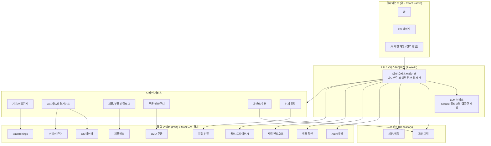
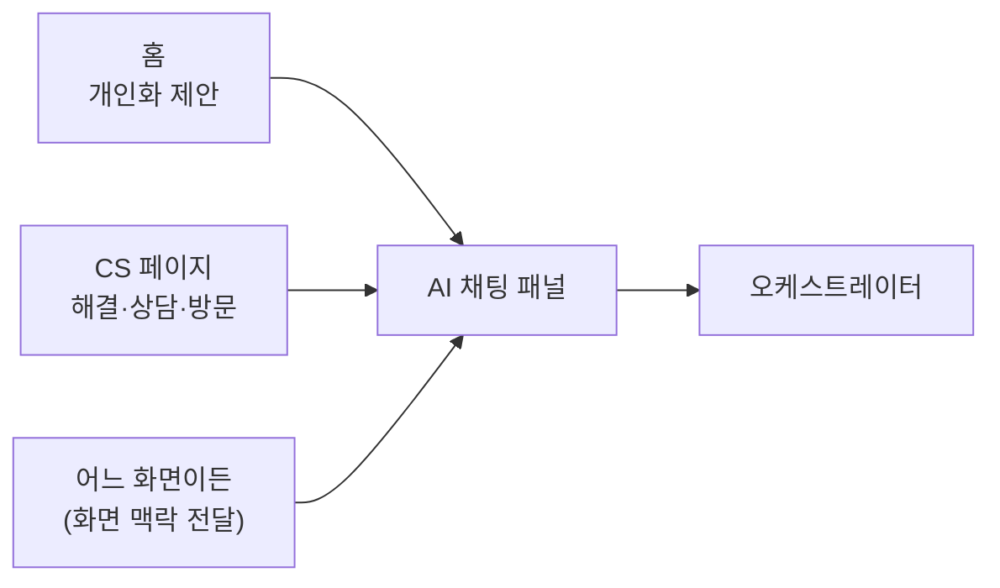

# 시스템 아키텍처 (Architecture)

> **기반 문서 (공유).** 제품·시스템 수준의 아키텍처를 정의한다.
> 개별 기능 스펙(`specs/<기능>/design.md`)은 이 문서를 참조하고,
> 아키텍처·기술 스택·Mock↔실 전략이 바뀌면 **이 문서를 갱신**한다.
> 공유 데이터 모델·클래스 구조는 `docs/data-model.md` 를 본다.

## 1. 개요

대화 **오케스트레이터**를 중심에 두고, 도메인 기능은 **도메인 서비스**로,
외부 연동(SmartThings·O2O·CS 데이터·인증 등)은 **어댑터(Port)** 로 추상화한다.
이 어댑터 경계가 **Mock ↔ 실 기능 교체 지점**이 된다.

### 핵심 설계 원칙
1. **어댑터(Port) 경계로 Mock→실 교체** — Mock 구현을 인터페이스 뒤에 두어,
   나머지 시스템은 동일 인터페이스로 통합한다. 저장소도 Repository 인터페이스로 동일하게 처리한다.
2. **스트리밍 우선** — 모든 응답 경로는 점진적 전달을 기본으로 한다.
3. **폴백 내장** — 모든 외부 호출은 실패/미연동 시 대체 경로를 가진다.
4. **상태 있는 대화 세션** — 흐름 전환·복합 질문·이력을 위해 세션 맥락을 1급으로 둔다.
5. **UI 디커플링** — 응답은 데이터(템플릿 모델)로 표현하고, 렌더링은 클라이언트가 담당한다.

## 2. 기술 스택

| 영역 | 선택 | 비고 |
|------|------|------|
| 프론트엔드 | **React Native** | 앱 (홈·CS·전역 채팅 패널) |
| 백엔드 | **FastAPI (Python)** | Node 전환은 후속 검토 |
| 저장소 | **인메모리/로컬 DB(기본) → Postgres + Redis(옵셔널)** | Repository 인터페이스로 교체 |
| LLM | **Claude** | 멀티모달·구조화 출력. 기본은 비용/지연 균형 모델, 복잡 추론은 상위 모델 라우팅 |

## 3. 아키텍처 다이어그램

## 4. 레이어 책임

- **클라이언트 (React Native)** — 홈/CS/전역 채팅 패널, 멀티모달 입력·출력 렌더링,
  템플릿·CTA 렌더링, 스트리밍 표시. 디자이너 애셋 전엔 플레이스홀더.
- **오케스트레이터** — 의도 분류, 복합 의도 분해, 흐름 전환·복원, 세션/맥락 관리,
  도메인 서비스 호출 조합, 스트리밍 집계.
- **LLM 서비스** — Claude 호출, 멀티모달 입력 처리, 응답을 **템플릿 모델**로 구조화.
- **도메인 서비스** — 비즈니스 로직. 외부 연동은 직접 하지 않고 Port를 통한다.
- **통합 어댑터(Port)** — 외부 시스템/민감 기능 추상화. **Mock↔실 교체 지점.**
- **저장소(Repository)** — 대화·이력, 세션 맥락. 인메모리/로컬(기본) ↔ Postgres+Redis(옵셔널) 교체.

### 컴포넌트 책임 요약
| 컴포넌트 | 책임 |
|----------|------|
| 대화 오케스트레이터 | 의도분류·분해, 흐름 전환/복원, 세션, 호출 조합 |
| LLM 서비스 | Claude 호출, 멀티모달, 템플릿 모델 생성 |
| 기기/이상감지 | 기기 상태 조회, 이상 기준 판정 |
| CS 지식/해결 | 근거 기반 해결 가이드 |
| 카탈로그 | 기기↔부품 매칭 |
| 주문 | 장바구니·결제·주문 |
| 개인화/추천 | 이력·보유기기 반영 추천 |
| 선제 알림 | 임계치 감지 → 알림 발생 |

## 5. Mock ↔ 실 기능 경계

| Port / 저장소 | MVP | 실 전환 시 |
|------|-----|-----------|
| SmartThings (STP) | 개인 API(PAT) 실연동 + 일부 Mock 시나리오 | 기업 API 확장 |
| CS 데이터 (CSDataP) | 실데이터 일부 적재 | 전체 CS 연동 |
| 제품정보 (CatP) | 실데이터 일부 | 전체 카탈로그 |
| O2O 주문 (O2OP) | **Mock** (주문 성공/실패 시뮬레이션) | 실제 주문/결제 연동 |
| Auth/계정 (AuthP) | **Mock** 고정 사용자/기기 | 삼성 계정 SSO |
| 신뢰성/근거 (TrustP) | **Mock** 고정 규칙/샘플 출처 | 실제 grounding·평가 |
| 행동 확인 (ActP) | 확인 UX는 실제, 처리만 Mock | 실 결제/주문 커밋 |
| 핸드오프 (HandoffP) | **Mock** 접수 응답 | 상담/방문 시스템 |
| 알림 전달 (AlertP) | **Mock** 인앱 표시 | 푸시/외부 채널 |
| 동의/프라이버시 (ConsentP) | **Mock** 동의/삭제 | 실 동의·데이터 관리 |
| 저장소 (Repository) | **인메모리/로컬 DB** | Postgres + Redis (옵셔널) |

## 6. 진입점 개요

