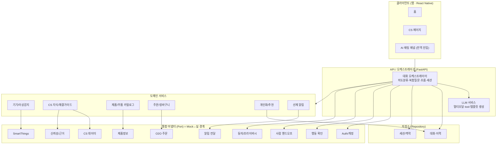
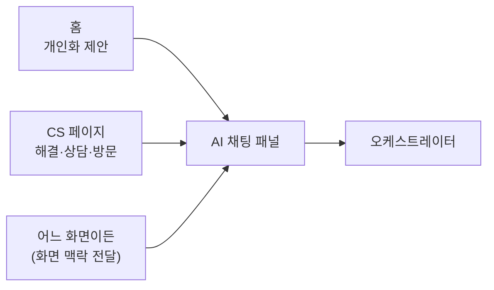
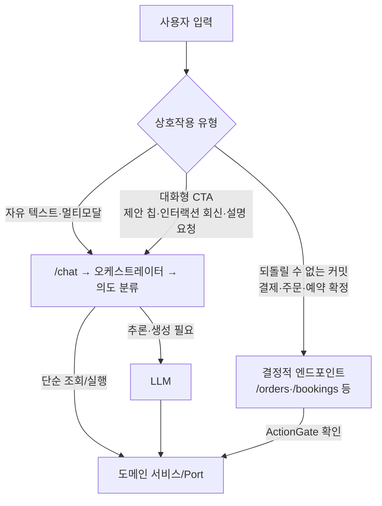
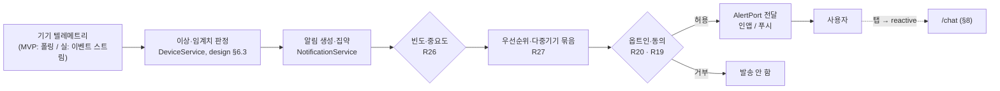

# 시스템 아키텍처 (Architecture)

> **기반 문서 (공유).** 제품·시스템 수준의 아키텍처를 정의한다.
> 개별 기능 스펙(`specs/<기능>/design.md`)은 이 문서를 참조하고,
> 아키텍처·기술 스택·Mock↔실 전략이 바뀌면 **이 문서를 갱신**한다.
> 공유 데이터 모델·클래스 구조는 `docs/data-model.md` 를 본다.

## 1. 개요

대화 **오케스트레이터**를 중심에 두고, 도메인 기능은 **도메인 서비스**로,
외부 연동(SmartThings·O2O·CS 데이터·인증 등)은 **어댑터(Port)** 로 추상화한다.
이 어댑터 경계가 **Mock ↔ 실 기능 교체 지점**이 된다.

### 핵심 설계 원칙
1. **어댑터(Port) 경계로 Mock→실 교체** — Mock 구현을 인터페이스 뒤에 두어,
   나머지 시스템은 동일 인터페이스로 통합한다. 저장소도 Repository 인터페이스로 동일하게 처리한다.
2. **스트리밍 우선** — 모든 응답 경로는 점진적 전달을 기본으로 한다.
3. **폴백 내장** — 모든 외부 호출은 실패/미연동 시 대체 경로를 가진다.
4. **상태 있는 대화 세션** — 흐름 전환·복합 질문·이력을 위해 세션 맥락을 1급으로 둔다.
5. **UI 디커플링** — 응답은 데이터(템플릿 모델)로 표현하고, 렌더링은 클라이언트가 담당한다.

## 2. 기술 스택

| 영역 | 선택 | 비고 |
|------|------|------|
| 프론트엔드 | **React Native** | 앱 (홈·CS·전역 채팅 패널) |
| 백엔드 | **FastAPI (Python)** | Node 전환은 후속 검토 |
| 저장소 | **인메모리/로컬 DB(기본) → Postgres + Redis(옵셔널)** | Repository 인터페이스로 교체 |
| LLM | **범용 LLM** <span>(provider-agnostic)</span> | 멀티모달·tool 호출·구조화 출력 지원. 비용/지연 균형 모델 기본, 복잡 추론은 상위 모델 라우팅 |

## 3. 아키텍처 다이어그램



## 4. 레이어 책임

- **클라이언트 (React Native)** — 홈/CS/전역 채팅 패널, 멀티모달 입력·출력 렌더링,
  템플릿·CTA 렌더링, 스트리밍 표시. 디자이너 애셋 전엔 플레이스홀더.
- **오케스트레이터** — 의도 분류, 복합 의도 분해, 흐름 전환·복원, 세션/맥락 관리,
  도메인 서비스 호출 조합, 스트리밍 집계.
- **LLM 서비스** — LLM 호출, 멀티모달 입력 처리, 응답을 **템플릿 모델**로 구조화.
- **도메인 서비스** — 비즈니스 로직. 외부 연동은 직접 하지 않고 Port를 통한다.
- **통합 어댑터(Port)** — 외부 시스템/민감 기능 추상화. **Mock↔실 교체 지점.**
- **저장소(Repository)** — 대화·이력, 세션 맥락. 인메모리/로컬(기본) ↔ Postgres+Redis(옵셔널) 교체.

### 컴포넌트 책임 요약
| 컴포넌트 | 책임 |
|----------|------|
| 대화 오케스트레이터 | 의도분류·분해, 흐름 전환/복원, 세션, 호출 조합 |
| LLM 서비스 | LLM 호출, 멀티모달, 템플릿 모델 생성 |
| 기기/이상감지 | 기기 상태 조회, 이상 기준 판정 |
| CS 지식/해결 | 근거 기반 해결 가이드 |
| 카탈로그 | 기기↔부품 매칭 |
| 주문 | 장바구니·결제·주문 |
| 개인화/추천 | 이력·보유기기 반영 추천 |
| 선제 알림 | 임계치 감지 → 알림 발생 |

## 5. Mock ↔ 실 기능 경계

| Port / 저장소 | MVP | 실 전환 시 |
|------|-----|-----------|
| SmartThings (STP) | 개인 API(PAT) 실연동 + 일부 Mock 시나리오 | 기업 API 확장 |
| CS 데이터 (CSDataP) | 실데이터 일부 적재 | 전체 CS 연동 |
| 제품정보 (CatP) | 실데이터 일부 | 전체 카탈로그 |
| O2O 주문 (O2OP) | **Mock** (주문 성공/실패·취소/환불 시뮬레이션, R21) | 실제 주문/결제 연동 |
| 보증 (WarrantyP) | **Mock** 샘플 보증 규칙 (R22) | 실 보증 데이터 연동 |
| Auth/계정 (AuthP) | **Mock** 고정 사용자/기기 | 삼성 계정 SSO |
| 신뢰성/근거 (TrustP) | **Mock** 고정 규칙/샘플 출처 | 실제 grounding·평가 |
| 행동 확인 (ActP) | 확인 UX는 실제, 처리만 Mock | 실 결제/주문 커밋 |
| 핸드오프 (HandoffP) | **Mock** 접수 응답 | 상담/방문 시스템 |
| 알림 전달 (AlertP) | **Mock** 인앱 표시 | 푸시/외부 채널 |
| 동의/프라이버시 (ConsentP) | **Mock** 동의/삭제 | 실 동의·데이터 관리 |
| 저장소 (Repository) | **인메모리/로컬 DB** | Postgres + Redis (옵셔널) |

### 공개 데이터 소스 / ACL 매핑 (Real 어댑터)

`DevicePort`·`CSKnowledgePort`·`CatalogPort` 는 **공개 소스에서 가져올 수 있어** 순수 Mock이 아니라
"실데이터 일부" 티어다. 외부 스키마는 **ACL(Anti-Corruption Layer = 어댑터)** 에서 우리 도메인 타입으로
변환해, 외부 표현이 도메인에 새지 않게 격리한다(`data-model.md` §1 Port I/O 분리).

| Port | 공개 소스 후보 | 매핑 대상(우리 타입) |
|------|----------------|----------------------|
| `DevicePort` | SmartThings 개인 API(PAT) | 디바이스/상태 → `Device`(`consumables`·`metrics`), `Anomaly`(`error_code` 등) |
| `CSKnowledgePort` | 공개 CS·사용설명서·FAQ | 문서 → `Solution`(`steps`·`sources`), `Source`(`title`·`ref`) |
| `CatalogPort` | 공개 제품/부품 스펙 | 스펙 → `Part`(`sku`·`price`·`device_model`·`in_stock`) |

- 변환·정규화·누락 필드 폴백은 **ACL 책임**. 도메인은 변환된 타입만 본다.
- 소스 커버리지는 부분적일 수 있다(최종 일관성·누락) → null 허용·폴백(R13, `data-model.md` §0).
- 즉 **계약(Port 시그니처·타입)은 고정**돼 있고, **"어떤 소스 + 필드 매핑 표·적재 파이프라인"** 은
  Real 어댑터 구현 시 확정한다(MVP는 Mock/부분 실데이터). 인터페이스 위 도메인 작업은 그 전에 병렬로 진행 가능.

## 6. 진입점 개요



## 7. 비기능 요구 / 제약 (NFR · Constraints)

설계 전반에 적용되는 고려사항·제약. 데이터 모델 수준의 제약은 `docs/data-model.md` §0 을 본다.

### 성능 / UX
- **스트리밍 우선** — 첫 토큰까지 지연(TTFB)을 짧게. 사용자 인지 지연은 진행 표시로 가린다(R14).
- **지연/타임아웃** — 외부 호출·LLM은 타임아웃을 두고, 초과 시 대기/재시도/취소 경로를 제공.
- LLM 호출은 비용·지연이 크므로 **불필요한 재호출 최소화**(의도 분류 결과·맥락 캐싱).

### 외부 연동 제약
- **SmartThings** — 개인 API는 **rate limit** 및 토큰 만료가 있고, 기기 상태는 **최종 일관성**(폴링/지연)일 수 있다.
  이상 감지는 실시간이 아닐 수 있음을 전제로 설계.
- **O2O / CS / 제품정보** — MVP는 **부분 실데이터**라 커버리지가 제한적. 매칭 실패를 정상 경로로 간주(폴백).
- 모든 외부 호출은 **실패·부분 응답·중복**을 가정하고 멱등성·재시도를 고려.

### 보안 / 프라이버시
- **인증 토큰(SmartThings PAT·세션 토큰 등)은 도메인 모델에 저장하지 않는다.** 별도 시크릿 저장소/어댑터에서 관리.
- 개인화·기기 데이터는 **동의 범위(Consent) 안에서만** 사용. 삭제 요청 시 연관 데이터까지 처리(R19).
- 멀티모달 업로드(이미지·영상)는 **크기·형식 제한** 및 민감정보 노출 가능성을 고려.

### 확장성 / 가용성
- 대화 이력·메시지는 무한정 커질 수 있으므로 **페이지네이션·보존 정책**을 둔다.
- 세션 맥락은 **TTL** 을 갖는 휘발성 저장(Redis 후보)에 적합.
- **단일 외부 실패가 전체 대화를 중단시키지 않는다**(부분 degradation, R13).

### 관측성 / 추적
- 대화·주문·핸드오프는 추적 가능한 식별자(상관관계 ID)로 연결.
- Mock↔실 전환을 고려해, 어떤 어댑터(Mock/Real)가 응답했는지 로깅 가능해야 한다.

## 8. 요청 라우팅 (LLM 경로 vs 결정적 API 경로)

**진입점은 FastAPI 단일.** 별도 BFF 계층을 두지 않고, FastAPI가 진입점 겸 오케스트레이션을 담당한다.
(BFF가 지던 책임은 사라지지 않고 FastAPI 안으로 흡수된다 — §9 참조.)

FE는 **상호작용 유형**(자유 입력인지, 어떤 버튼인지)만 알고 **채널**을 고른다. 그 안에서
"LLM을 타는지 도메인을 타는지"의 라우팅 판단은 **BE(오케스트레이터)가 소유**한다.

> **주의 — CTA가 곧 "LLM 미경유"는 아니다.** LLM을 안 타는 것은 CTA 전체가 아니라
> **되돌릴 수 없는 *커밋*(결제·주문·예약 확정)** 뿐이다. 그 외 **대화형 CTA**(제안 칩,
> `choices`/`confirmation`/`booking` 회신, "왜 추천?"·"자세히" 같은 설명 요청)는 `/chat`으로
> 재진입해 **LLM을 탈 수 있다.**



### 원칙
1. **자연어(자유 텍스트·멀티모달)** → `/chat` → 오케스트레이터가 의도 분류(design §6.1) 후 LLM 또는 도메인으로 라우팅.
   FE/BFF에 **불투명**하다.
2. **대화형 CTA**(제안 칩=자연어 단축키, `choices` 등 인터랙션 회신, 설명/이유 요청) → `/chat` 재진입.
   회신은 진행 흐름(FlowState)에 반영돼 **LLM으로 다음 단계를 이어갈 수 있다.**
3. **되돌릴 수 없는 커밋**(결제·주문·예약 확정, R17) → **결정적 엔드포인트로 직행, LLM 미경유** +
   `confirmation`/ActionGate 확인. (안전성·비결정성 회피) — 단, 커밋 *주변*의 요약·후속 제안은 LLM이 생성할 수 있다.
4. 즉 LLM 미경유 보장은 **커밋 자체에 한정**된다. FE는 채널만 고르고, 채널 안의 LLM-vs-도메인 판단은 BE 몫이다.
5. 구조화 회신 계약은 `docs/response-templates.md` §8(인터랙션 응답)을 따른다.

## 9. BFF 책임 (별도 계층 없이 흡수)

별도 BFF 서비스를 두지 않기로 했지만(§8), **BFF가 지던 책임 자체는 사라지지 않는다.**
그 책임은 **FastAPI의 API/표현 계층**이 진다. 즉 "BFF는 고려할 게 없다"가 아니라,
**"분리하지 않고 안에서 처리한다"** 가 정확한 표현이다.

### BFF 책임과 현재 배치
| BFF 책임 | 우리 시스템에서 |
|----------|----------------|
| 화면 단위 aggregation | 홈(`home_summary`) 등 여러 도메인 서비스 결과를 **API 계층이 조합** |
| 응답 정형화 | 도메인/LLM 출력 → `Template`/`Cta` 모델로 변환(`response-templates.md`) |
| 스트리밍 중계 | LLM·오케스트레이터 스트림을 **WebSocket으로 클라이언트에 중계**(R14) |
| 클라이언트 맞춤 | 현재 **단일 클라이언트(RN)** 용 페이로드 |
| 인증/세션 게이트 | 토큰 검증·세션 식별을 **진입에서 처리**(AuthP) |
| 에러/폴백 표준화 | 외부 실패를 클라이언트 계약(폴백 응답)으로 정규화(R13) |

### FastAPI 내부 계층 (책임 분리)
```text
[API / 표현 계층]  ← BFF 책임: aggregation · Template 변환 · 스트리밍 중계 · 인증 게이트
       │
[오케스트레이션]   ← 의도 분류 · 흐름 · 세션 · tool 조합
       │
[도메인 서비스]    ← 비즈니스 로직
       │
[어댑터(Port)]     ← Mock↔실, 외부 연동
```
- **경계 원칙** — API/표현 계층은 **비즈니스 로직을 갖지 않는다**(조합·변환·중계만).
  도메인 DB에 직접 접근하지 않고 서비스/Port를 통한다. → 나중에 떼어내기 쉬운 **이음새(seam)** 를 유지.

### 별도 BFF로 분리할 조건 (트리거)
다음이 생기면 API/표현 계층을 독립 BFF로 **분리 검토**한다. 책임 정의가 이미 같으므로 이동 비용이 낮다.
- **2nd 클라이언트**(웹 등) 추가로 클라이언트별 페이로드 분기가 커질 때
- API/표현 계층을 **도메인과 독립적으로 스케일/배포**해야 할 때
- 프론트/백 **팀·계약 소유권이 분리**될 때
- 분리 시: aggregation·정형화·중계·인증 게이트 → **BFF로**, 도메인 로직·Port → **도메인 BE에 잔류.**

### MVP 판단
단일 클라이언트(RN) + Mock 중심 + 단일 배포라 **지금 분리 이득은 없다**(계층·운영 복잡도만 증가).
**이음새만 지켜두고 통합 유지**, 위 트리거 발생 시 재검토한다.

## 10. 선제(Proactive) 파이프라인

§8 라우팅은 **사용자가 시작하는(reactive)** 요청을 다룬다. 반대로 **시스템이 먼저 시작하는(proactive)**
경로 — 이상 감지·소모품 선제안·알림(R2·R5·R20·R26·R27) — 는 별도 파이프라인이다.
(시나리오 분류는 `specs/samsung-ai-concierge/scenarios.md` §4-B.)



### 원칙
1. **트리거는 사용자가 아니라 이벤트/임계치.** 백그라운드 모니터링이 전제다(reactive와 근본적으로 다름).
2. **동의·빈도 게이트 필수** — `opted_in`(R20)·`Consent`(R19)·빈도/중요도(R26)를 통과해야 전달. 과하면 신뢰 하락.
3. **다중 동시 이상은 묶어서**(R27) — 심각도·안전 우선순위로 정렬, `home_summary`로 종합.
4. **proactive → reactive 전이** — 알림을 탭하면 §8의 `/chat`으로 들어가 대화가 이어진다(맥락 주입).

### Mock ↔ 실
- **MVP** — 텔레메트리는 SmartThings 폴링/임계치, 전달은 인앱 Mock(AlertPort).
- **실 전환** — 이벤트 스트림(예: 메시지 버스) 기반 실시간 감지 + 실 푸시 채널.
