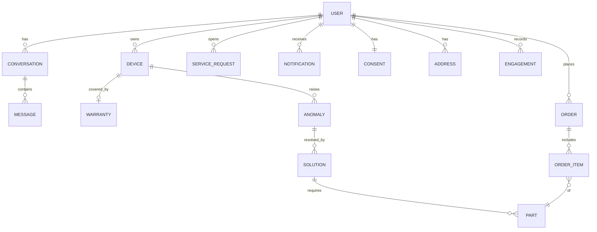

# 데이터 모델 / 클래스 구조 (Data Model)

> **기반 문서 (공유).** 여러 스펙이 공유하는 도메인 데이터 모델·스키마·클래스 구조와
> Repository/Port 인터페이스 타입을 정의한다. 데이터 모델이나 공개 인터페이스가 바뀌면
> 스펙 design이 아니라 **이 문서를 갱신**한다. 전체 아키텍처·NFR은 `docs/architecture.md` 를 본다.
>
> 표기는 FastAPI(Python) 기준의 의사 타입이며, 실제 구현 시 Pydantic/도메인 클래스로 옮긴다.

## 0. 고려사항 / 제약사항 (Cross-cutting)

모든 엔티티에 공통으로 적용되는 규칙. (개별 제약은 각 절에 추가로 명시)

| 항목 | 규칙 / 제약 |
|------|------------|
| **식별자** | `Id`는 UUIDv4 문자열. 서버 생성, 클라이언트 지정 금지. 전역 유일. |
| **시간** | 모든 시각은 **UTC, timezone-aware**(`datetime`). 표시 시점에 로컬 변환. |
| **통화/수량** | 금액은 **정수 최소 단위(원)**, 음수 금지. 수량(`qty`)은 1 이상. |
| **다국어** | 사용자 노출 텍스트는 로케일 의존. 모델은 원문 + (선택)`locale` 보관. |
| **개인정보** | 인증 토큰·결제수단 등 민감정보는 **도메인 모델에 저장하지 않는다**(시크릿 저장소). |
| **동의 범위** | 개인화·기기 데이터 사용은 `Consent.scopes` 안에서만. 범위 밖 접근은 거부(R19). |
| **보존/삭제** | 사용자 삭제 요청 시 연관 데이터(대화·이력·주문 참조)까지 처리(R19). 보존 기간은 정책으로 분리. |
| **외부 데이터 신뢰** | SmartThings 상태는 **최종 일관성**(지연 가능). CS·제품은 **부분 실데이터**라 누락 가능 → null 허용·폴백. |
| **불변/감사** | `Message`·`Order` 등 거래성 레코드는 **append-only**(수정 대신 새 레코드/상태전이). |
| **동시성** | `Conversation` 갱신은 동시 수정 가능 → 낙관적 잠금(`version`/`updated_at`) 고려. |
| **검증 위치** | 1차 검증은 API DTO(Pydantic)에서, 도메인 불변식은 도메인 모델 생성 시 보장. |

## 1. 모델 계층 구분

같은 개념도 계층에 따라 별도 모델로 둔다. (혼용 금지)

| 계층 | 용도 | 예 |
|------|------|----|
| **API DTO** (Pydantic) | 클라이언트↔FastAPI 요청/응답 | `ChatRequest`, `ChatResponse`, `OrderRequest` |
| **도메인 모델** | 비즈니스 로직 내부 표현 | `Device`, `Anomaly`, `Solution` |
| **저장 모델** | Repository 영속화 (인메모리/ORM) | `ConversationRecord` 등 |
| **Port I/O 타입** | 외부 어댑터 입출력 계약 | `DeviceStatus`, `SolutionResult` |

> MVP는 도메인 모델 ≈ 저장 모델로 단순화 가능. 단, **API DTO 와 Port I/O 타입은 분리**해
> 외부 표현 변화가 도메인에 새지 않게 한다.

## 2. 공통 타입 / Enum

> Enum 값은 **추가만, 제거/재사용 금지**(저장된 과거 데이터 호환). 알 수 없는 값은 거부하지 말고
> `UNKNOWN`/폴백으로 흡수할지 정책으로 정한다.

```python
Id = str  # UUIDv4

class Modality(str, Enum):
    TEXT = "text"; IMAGE = "image"; VIDEO = "video"

class Role(str, Enum):
    USER = "user"; ASSISTANT = "assistant"; SYSTEM = "system"

class AnomalyType(str, Enum):
    ERROR_CODE = "error_code"            # 오류 코드
    CONSUMABLE = "consumable"            # 소모품 수명
    ABNORMAL_METRIC = "abnormal_metric"  # 비정상 수치

class Severity(str, Enum):               # 순서 의미 있음: info < warning < critical
    INFO = "info"; WARNING = "warning"; CRITICAL = "critical"

class OrderStatus(str, Enum):            # 전이: DRAFT→CONFIRMED|FAILED, CONFIRMED→CANCELLED→REFUNDED (R21)
    DRAFT = "draft"; CONFIRMED = "confirmed"; FAILED = "failed"
    CANCELLED = "cancelled"; REFUNDED = "refunded"               # MVP: Mock

class ServiceRequestType(str, Enum):
    AGENT = "agent"; VISIT = "visit"

class IntentType(str, Enum):
    DEVICE_STATUS = "device_status"; TROUBLESHOOT = "troubleshoot"
    ORDER = "order"; RECOMMEND = "recommend"; GENERAL = "general"
    UNKNOWN = "unknown"                  # 분류 실패 폴백

class NotificationType(str, Enum):
    ANOMALY = "anomaly"; CONSUMABLE_REORDER = "consumable_reorder"

class SafetyLevel(str, Enum):            # 작업 위험도 (R23). 순서: none < caution < danger
    NONE = "none"; CAUTION = "caution"; DANGER = "danger"

class Coverage(str, Enum):               # 보증 유·무상 (R22)
    FREE = "free"; PAID = "paid"; UNKNOWN = "unknown"

class CtaType(str, Enum):
    ADD_TO_CART = "add_to_cart"; CHECKOUT = "checkout"
    CONNECT_AGENT = "connect_agent"; REQUEST_VISIT = "request_visit"
    REORDER = "reorder"
    CANCEL_ORDER = "cancel_order"        # R21
    CONFIRM_RESOLVED = "confirm_resolved" # R25 수리 후 확인

class EngagementAction(str, Enum):       # 유저 확인 상태 (R29)
    VIEWED = "viewed"; DISMISSED = "dismissed"
    ACKNOWLEDGED = "acknowledged"; INTERESTED = "interested"

class EngagementRef(str, Enum):          # 확인 대상 종류 (R29)
    RECOMMENDATION = "recommendation"; ALERT = "alert"; SOLUTION = "solution"
    PRODUCT = "product"; BRIDGE = "bridge"
```

## 3. 도메인 엔티티



```python
class UserPreferences:                   # 알림·관심 설정 (R26)
    notify_opt_in: bool = True
    notify_min_priority: Severity = Severity.INFO  # 이 이상만 알림
    interest_categories: list[str] = []  # 관심 카테고리(개인화 보조, R8)

class Address:                           # 배송/방문 주소 (R4·R18)
    label: str                           # 예: "집"
    line: str
    default: bool = False

class User:
    id: Id
    display_name: str
    linked_device_ids: list[Id]          # R15 (MVP: Mock 고정). 중복 없음
    preferences: UserPreferences         # 선호/알림 설정 (R26)
    addresses: list[Address] = []        # 배송/방문 (R4·R18). default 1개 이하

class EngagementRecord:                  # 유저가 확인한 정보 (R29). append-only, 내부 데이터
    user_id: Id
    ref_type: EngagementRef              # recommendation/alert/solution/product/bridge
    ref_id: Id
    action: EngagementAction             # viewed/dismissed/acknowledged/interested
    at: datetime                         # UTC

class Consumable:
    name: str                            # 비어있지 않음
    life_remaining: float                # 0.0~1.0 (범위 밖 거부)
    threshold: float                     # 0.0~1.0, 재주문 임계치

class Device:
    id: Id
    type: str                            # 예: "washer"
    model: str
    status: str                          # 정상/오류 등 요약 상태
    consumables: list[Consumable]        # name 유일
    metrics: dict[str, float]            # 임의 수치 지표

class Anomaly:
    id: Id
    device_id: Id                        # 존재하는 Device 참조
    type: AnomalyType
    severity: Severity
    detail: str
    detected_at: datetime                # UTC

class Source:                            # 근거/출처 (R16)
    title: str
    ref: str                             # CS 데이터 식별자/URL
    confidence: float | None = None      # 0.0~1.0. MVP: Mock 값

class Media:
    modality: Modality                   # IMAGE/VIDEO (TEXT 불가)
    url: str
    alt: str | None = None
    size_bytes: int | None = None        # 업로드 제한 검증용
    mime: str | None = None              # 허용 형식 화이트리스트

class SolutionStep:
    order: int                           # 1부터 연속, 유일
    instruction: str
    media: list[Media] = []              # 시각 자료 (R10)
    safety: SafetyLevel = SafetyLevel.NONE   # 위험 작업 경고 (R23)
    pro_required: bool = False           # 셀프 부적절 → 기사 연결 우선 (R23)

class Solution:
    id: Id
    anomaly_id: Id | None
    steps: list[SolutionStep]            # 1개 이상
    sources: list[Source]                # 근거 (R16). 비어있으면 신뢰도 낮음 취급
    required_parts: list[Id]             # 존재하는 Part.id
    escalation_needed: bool              # 사람 연결 필요 (R18)
    coverage: Coverage = Coverage.UNKNOWN    # 보증 유·무상 판별 (R22)

class Part:
    id: Id
    device_model: str                    # 호환 기기 모델
    name: str
    sku: str                             # 유일
    price: int                           # ≥ 0, 최소 단위(원)
    in_stock: bool = True                # 재고 없으면 주문 CTA 비활성

class OrderItem:
    part_id: Id
    qty: int                             # ≥ 1

class Order:
    id: Id
    user_id: Id
    items: list[OrderItem]               # 1개 이상
    status: OrderStatus                  # MVP: Mock. 전이 규칙 준수
    confirmed_at: datetime | None        # CONFIRMED 일 때만 존재 (R17)
    cancelled_at: datetime | None = None # CANCELLED 일 때 (R21)

class Warranty:                          # 보증 (R22)
    device_id: Id                        # 존재하는 Device 참조
    in_warranty: bool
    expires_at: datetime | None
    scope: str | None = None             # 보증 범위 설명. MVP: Mock

class ServiceRequest:                    # 사람 핸드오프 (R18)
    id: Id
    user_id: Id
    type: ServiceRequestType
    context_ref: Id                      # Conversation.id 등 (존재 참조)
    created_at: datetime

class BookingSlot:                       # 방문 예약 슬롯 (R18)
    id: Id
    start: datetime; end: datetime       # start < end
    available: bool

class Booking:                           # 확정된 방문 예약 (VISIT 핸드오프의 스케줄 형태)
    id: Id
    user_id: Id
    slot_id: Id                          # 존재하는 BookingSlot 참조
    context_ref: Id                      # Conversation.id
    created_at: datetime

class Notification:                      # 선제 알림 (R5·R20)
    id: Id
    user_id: Id
    type: NotificationType
    body: str
    channel: str                         # MVP: "in_app"
    opted_in: bool                       # False면 발송 금지 (R20)
    priority: Severity = Severity.INFO   # 빈도·중요도 정렬/묶음 (R26·R27)

class Consent:                           # 프라이버시 (R19)
    user_id: Id
    scopes: list[str]                    # 허용 범위 ("analytics" 포함 시 분석 수집 허용, R28)
    updated_at: datetime

class AnalyticsEvent:                    # 사용 분석 이벤트 (R28). 명세: docs/analytics.md
    name: str                            # 택소노미 이벤트명 (예: "cta_click")
    ts: datetime                         # UTC
    session_id: Id
    user_ref: str | None                 # 가명화 식별자(원본 식별자 아님, R19)
    props: dict                          # 이벤트별 속성 (예: {"cta": "checkout"})
    context: dict                        # screen·flow·flow_step·correlation_id
```

### 대화/메시지 (세션·이력 R6·R7·R12)
```python
class Cta:                               # R11
    type: CtaType
    label: str
    payload: dict                        # 예: {"part_id": ...} / {"order_id": ...}

class Template:                          # 응답 템플릿 모델 (R11)
    kind: str                            # 종류·data 스키마는 docs/response-templates.md 참조
    data: dict                           # kind별 구조화 데이터(kind와 스키마 일치, 불일치 시 text 폴백)

class Message:
    id: Id
    role: Role
    modality: Modality
    text: str | None                     # TEXT면 필수
    media: list[Media] = []              # IMAGE/VIDEO면 1개 이상
    template: Template | None = None     # assistant 메시지에만
    ctas: list[Cta] = []
    created_at: datetime                 # append-only, 수정 불가

class FlowState:                         # 흐름 전환/복원 (R6)
    name: str                            # 예: "troubleshoot", "order"
    step: str
    data: dict                           # 진행 중 맥락(대상 기기/문제/주문 등)

class Conversation:
    id: Id
    user_id: Id
    messages: list[Message]              # 시간순 append-only
    active_flow: FlowState | None        # 현재 진행 흐름
    suspended_flow: FlowState | None     # 채팅 전환 시 보관 (R6)
    version: int                         # 낙관적 잠금
    updated_at: datetime
```

### 엔티티 불변식 (Invariants)
- **Device** — `consumables[].name` 유일, `life_remaining/threshold ∈ [0,1]`.
- **Anomaly/Solution** — `Anomaly.device_id`·`Solution.required_parts`·`anomaly_id`는 **존재하는 참조**여야 한다(또는 명시적 null).
- **Solution** — `steps` 1개 이상, `step.order`는 1부터 연속. `sources` 비면 `escalation_needed=True` 권장.
- **Order** — `items` 1개 이상. 상태 전이는 `DRAFT→CONFIRMED|FAILED`, `CONFIRMED→CANCELLED→REFUNDED`만(역전이 금지). `CONFIRMED`는 `confirmed_at`, `CANCELLED`는 `cancelled_at` 필수(R17·R21).
- **Warranty** — `device_id`는 존재하는 Device 참조. `in_warranty=False`면 유상(`Coverage.PAID`) 취급(R22).
- **SolutionStep** — `safety=DANGER`이거나 `pro_required=True`면 셀프 진행 대신 기사 연결을 우선 안내(R23).
- **Message** — `TEXT`면 `text` 필수, `IMAGE/VIDEO`면 `media` 필수. 생성 후 불변.
- **Conversation** — `active_flow`와 `suspended_flow`는 동시에 같은 흐름을 가리키지 않는다. 채팅 전환 시 `active→suspended` 이동.
- **Notification** — `opted_in=False`면 전달하지 않는다.
- **Engagement** — append-only. 동의 범위(`Consent.scopes`) 안에서만 활용하고, 삭제 요청 시 cascade(R19·R29).
- **User** — `addresses` 중 `default=True`는 최대 1개.

## 4. API DTO (Pydantic, 예시)

> 1차 입력 검증 지점. 크기·길이·형식 제약을 DTO에서 강제한다.

```python
class ChatRequest(BaseModel):
    conversation_id: Id | None
    text: str | None = Field(default=None, max_length=4000)
    media: list[Media] = []              # 개수·총 크기 제한
    screen_context: dict | None          # 진입 화면 맥락 (R9)
    # 제약: text 와 media 중 최소 하나는 있어야 함

class ChatResponseChunk(BaseModel):      # 스트리밍 단위 (R14)
    conversation_id: Id
    delta_text: str | None = None
    template: Template | None = None
    ctas: list[Cta] = []
    done: bool = False                   # 마지막 청크 표시

class IntentResult(BaseModel):           # 복합 질문 (R7)
    intents: list[IntentType]            # 1개 이상
    handled: list[IntentType]
    unhandled: list[IntentType]          # handled+unhandled = intents

class OrderRequest(BaseModel):
    items: list[OrderItem] = Field(min_length=1)
    confirmed: bool                      # 행동 확인 (R17). False면 주문 진행 거부

class InteractionReply(BaseModel):       # 대화형 CTA 회신 (response-templates §8)
    conversation_id: Id
    ref: Id                              # 원본 메시지/템플릿
    kind: str                            # "choices" | "confirmation" | "booking"
    payload: dict                        # 선택/확정 값 (예: {"option_id": ...})

class CartRequest(BaseModel):
    items: list[OrderItem] = Field(min_length=1)

class BookingRequest(BaseModel):         # 방문 예약 슬롯 확정 (R18)
    slot_id: Id
    context_ref: Id
```

## 5. Repository 인터페이스

> 저장소 교체 경계. MVP는 인메모리, 옵셔널로 Postgres+Redis.
> 제약: 조회는 **부재 시 None**(예외 금지), 저장은 **멱등**, 목록은 **페이지네이션** 지원.

```python
class Page(Generic[T]):                   # 커서 기반 페이지네이션 결과
    items: list[T]
    next_cursor: str | None              # None이면 마지막 페이지

class ConversationRepository(Protocol):
    def get(self, conversation_id: Id) -> Conversation | None: ...
    def save(self, conversation: Conversation) -> None: ...   # version 충돌 시 ConflictError
    def list_by_user(self, user_id: Id, *, limit: int, cursor: str | None) -> "Page[Conversation]": ...

class SessionRepository(Protocol):       # 세션 맥락 (R6·R7), Redis 후보
    def load(self, conversation_id: Id) -> FlowState | None: ...
    def store(self, conversation_id: Id, state: FlowState | None, *, ttl_sec: int) -> None: ...

class OrderRepository(Protocol):
    def get(self, order_id: Id) -> Order | None: ...
    def save(self, order: Order) -> None: ...

class EngagementRepository(Protocol):    # 유저가 확인한 정보 (R29). 내부 데이터 = Repository(외부 Port 아님)
    def record(self, e: EngagementRecord) -> None: ...                       # append-only
    def has_seen(self, user_id: Id, ref_type: EngagementRef, ref_id: Id) -> bool: ...  # 중복 방지
    def dismissed(self, user_id: Id, ref_type: EngagementRef) -> list[Id]: ...         # 재노출 제외
    def interests(self, user_id: Id) -> list[str]: ...                       # 관심 신호(개인화 R8)
```

## 6. Port 인터페이스 (외부 어댑터 = Mock↔실 경계)

> 공통 제약: 모든 Port는 **타임아웃·재시도 가능**해야 하고, 실패 시 도메인 예외(`PortError`)로 변환한다.
> 부분 응답·빈 결과는 정상으로 취급(폴백은 호출 측 책임, R13).

```python
class AuthPort(Protocol):                              # R15  MVP: Mock
    def current_user(self) -> User: ...
    def linked_devices(self, user_id: Id) -> list[Device]: ...

class DevicePort(Protocol):                            # R2  SmartThings
    def list_devices(self, user_id: Id) -> list[Device]: ...       # rate limit 고려
    def get_status(self, device_id: Id) -> Device: ...             # 최종 일관성(지연 가능)
    def detect_anomalies(self, device_id: Id) -> list[Anomaly]: ...

class CSKnowledgePort(Protocol):                       # R3  CS 데이터
    def find_solutions(self, query: str | Anomaly) -> list[Solution]: ...   # 빈 결과 가능

class CatalogPort(Protocol):                           # R4  제품정보
    def match_parts(self, device_id: Id, part_spec: str) -> list[Part]: ... # 0/다수 → 호출측 확인

class OrderPort(Protocol):                             # R4  O2O  MVP: Mock
    def add_to_cart(self, items: list[OrderItem]) -> Order: ...
    def checkout(self, order: Order) -> Order: ...     # 멱등 키 고려(중복 결제 방지)
    def cancel(self, order_id: Id) -> Order: ...        # 취소→환불 상태전이 (R21)

class WarrantyPort(Protocol):                          # R22  MVP: Mock
    def get_warranty(self, device_id: Id) -> Warranty: ...

class TrustPort(Protocol):                             # R16  MVP: Mock
    def evaluate(self, answer: str, sources: list[Source]) -> tuple[bool, float]: ...

class ActionGatePort(Protocol):                        # R17  확인 UX 실/처리 Mock
    def requires_confirmation(self, cta: Cta) -> bool: ...

class HandoffPort(Protocol):                           # R18  MVP: Mock
    def handoff(self, req_type: ServiceRequestType, context_ref: Id) -> ServiceRequest: ...
    def list_slots(self, user_id: Id) -> list[BookingSlot]: ...     # 방문 예약 가능 슬롯
    def book_slot(self, slot_id: Id, context_ref: Id) -> Booking: ... # 멱등(중복 예약 방지)

class AlertPort(Protocol):                             # R20  MVP: Mock(in_app)
    def deliver(self, notification: Notification) -> None: ...   # opted_in=False면 no-op

class ConsentPort(Protocol):                           # R19  MVP: Mock
    def get_consent(self, user_id: Id) -> Consent: ...
    def revoke(self, user_id: Id, scope: str) -> None: ...
    def delete_data(self, user_id: Id) -> None: ...    # 연관 데이터까지(cascade)

class AnalyticsPort(Protocol):                         # R28  MVP: Mock(로컬 로그)
    def track(self, event: AnalyticsEvent) -> None: ...        # 비차단. 동의 없으면 no-op
    def track_batch(self, events: list[AnalyticsEvent]) -> None: ...  # FE 배치 전송
```

각 Port는 `Mock*` 구현(MVP)과 `Real*` 구현(후속)을 가지며, 의존성 주입으로 교체한다.

## 7. 오류 / 예외 타입

> 외부·도메인 실패를 타입으로 구분해 폴백(R13)·확인(R17)·핸드오프(R18) 분기를 명확히 한다.

```python
class DomainError(Exception): ...
class NotFoundError(DomainError): ...          # 참조 부재
class ValidationError(DomainError): ...        # 불변식/검증 위반
class ConflictError(DomainError): ...          # 낙관적 잠금 충돌
class ConsentError(DomainError): ...           # 동의 범위 밖 접근 (R19)
class PortError(DomainError): ...              # 외부 어댑터 실패(타임아웃 등) → 폴백 대상
class ConfirmationRequired(DomainError): ...   # 확인 없이 되돌릴 수 없는 행동 시도 (R17)
```

## 8. 백엔드 모듈 / 디렉터리 레이아웃 (제안)

```
backend/
├─ app/
│  ├─ main.py                  # FastAPI 진입점
│  ├─ api/                     # 라우터 (DTO ↔ 서비스)
│  │  ├─ chat.py               # /chat (스트리밍)
│  │  ├─ devices.py
│  │  └─ orders.py
│  ├─ models/                  # 도메인 모델 + DTO + 예외
│  │  ├─ domain.py             # §3 엔티티 + 불변식
│  │  ├─ dto.py                # §4 Pydantic DTO
│  │  ├─ enums.py              # §2 Enum
│  │  └─ errors.py             # §7 예외 타입
│  ├─ orchestrator/            # 의도분류·분해·흐름·세션
│  ├─ services/                # 도메인 서비스 (device, knowledge, catalog, order, personalization, notification)
│  ├─ ports/                   # §6 Port 인터페이스(Protocol)
│  ├─ adapters/
│  │  ├─ mock/                 # MVP Mock 구현
│  │  └─ real/                 # 후속 실 구현
│  ├─ repositories/
│  │  ├─ memory/               # 기본(인메모리)
│  │  └─ sql/                  # 옵셔널(Postgres+Redis)
│  └─ llm/                     # LLM 클라이언트, 템플릿 구조화
└─ tests/                      # 단위·계약·통합·폴백
```
