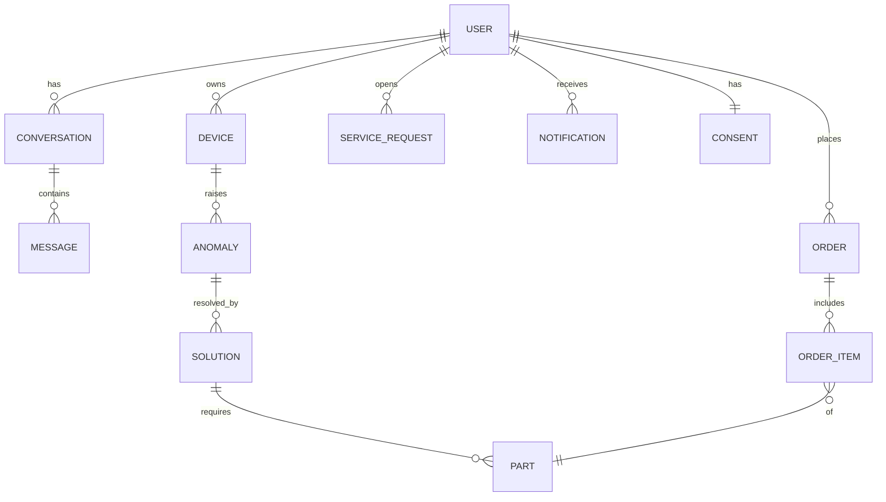

# 데이터 모델 / 클래스 구조 (Data Model)

> **기반 문서 (공유).** 여러 스펙이 공유하는 도메인 데이터 모델·스키마·클래스 구조와
> Repository/Port 인터페이스 타입을 정의한다. 데이터 모델이나 공개 인터페이스가 바뀌면
> 스펙 design이 아니라 **이 문서를 갱신**한다. 전체 아키텍처는 `docs/architecture.md` 를 본다.
>
> 표기는 FastAPI(Python) 기준의 의사 타입이며, 실제 구현 시 Pydantic/도메인 클래스로 옮긴다.

## 1. 모델 계층 구분

같은 개념도 계층에 따라 별도 모델로 둔다. (혼용 금지)

| 계층 | 용도 | 예 |
|------|------|----|
| **API DTO** (Pydantic) | 클라이언트↔FastAPI 요청/응답 | `ChatRequest`, `ChatResponse`, `OrderRequest` |
| **도메인 모델** | 비즈니스 로직 내부 표현 | `Device`, `Anomaly`, `Solution` |
| **저장 모델** | Repository 영속화 (인메모리/ORM) | `ConversationRecord` 등 |
| **Port I/O 타입** | 외부 어댑터 입출력 계약 | `DeviceStatus`, `SolutionResult` |

> MVP는 도메인 모델 ≈ 저장 모델로 단순화 가능. 단, **API DTO 와 Port I/O 타입은 분리**해
> 외부 표현 변화가 도메인에 새지 않게 한다.

## 2. 공통 타입 / Enum

```python
Id = str  # UUID 문자열

class Modality(str, Enum):
    TEXT = "text"; IMAGE = "image"; VIDEO = "video"

class Role(str, Enum):
    USER = "user"; ASSISTANT = "assistant"; SYSTEM = "system"

class AnomalyType(str, Enum):
    ERROR_CODE = "error_code"        # 오류 코드
    CONSUMABLE = "consumable"        # 소모품 수명
    ABNORMAL_METRIC = "abnormal_metric"  # 비정상 수치

class Severity(str, Enum):
    INFO = "info"; WARNING = "warning"; CRITICAL = "critical"

class OrderStatus(str, Enum):
    DRAFT = "draft"; CONFIRMED = "confirmed"; FAILED = "failed"  # MVP: Mock

class ServiceRequestType(str, Enum):
    AGENT = "agent"        # 상담원 연결
    VISIT = "visit"        # 수리기사 방문

class IntentType(str, Enum):
    DEVICE_STATUS = "device_status"; TROUBLESHOOT = "troubleshoot"
    ORDER = "order"; RECOMMEND = "recommend"; GENERAL = "general"

class NotificationType(str, Enum):
    ANOMALY = "anomaly"; CONSUMABLE_REORDER = "consumable_reorder"

class CtaType(str, Enum):
    ADD_TO_CART = "add_to_cart"; CHECKOUT = "checkout"
    CONNECT_AGENT = "connect_agent"; REQUEST_VISIT = "request_visit"
    REORDER = "reorder"
```

## 3. 도메인 엔티티



```python
class User:
    id: Id
    display_name: str
    linked_device_ids: list[Id]          # R15 (MVP: Mock 고정)

class Consumable:
    name: str
    life_remaining: float                # 0.0~1.0
    threshold: float                     # 재주문 임계치

class Device:
    id: Id
    type: str                            # 예: "washer"
    model: str
    status: str                          # 정상/오류 등 요약 상태
    consumables: list[Consumable]
    metrics: dict[str, float]            # 임의 수치 지표

class Anomaly:
    id: Id
    device_id: Id
    type: AnomalyType
    severity: Severity
    detail: str                          # 사람이 읽는 설명
    detected_at: datetime

class Source:                            # 근거/출처 (R16)
    title: str
    ref: str                             # CS 데이터 식별자/URL
    confidence: float | None = None      # MVP: Mock 값

class SolutionStep:
    order: int
    instruction: str
    media: list["Media"] = []            # 시각 자료 (R10)

class Solution:
    id: Id
    anomaly_id: Id | None
    steps: list[SolutionStep]
    sources: list[Source]                # 근거 (R16)
    required_parts: list[Id]             # Part.id
    escalation_needed: bool              # 사람 연결 필요 (R18)

class Part:
    id: Id
    device_model: str
    name: str
    sku: str
    price: int                           # 최소 화폐 단위(원)

class OrderItem:
    part_id: Id
    qty: int

class Order:
    id: Id
    user_id: Id
    items: list[OrderItem]
    status: OrderStatus                  # MVP: Mock

class ServiceRequest:                    # 사람 핸드오프 (R18)
    id: Id
    user_id: Id
    type: ServiceRequestType
    context_ref: Id                      # Conversation.id 등
    created_at: datetime

class Notification:                      # 선제 알림 (R5·R20)
    id: Id
    user_id: Id
    type: NotificationType
    body: str
    channel: str                         # MVP: "in_app"
    opted_in: bool

class Consent:                           # 프라이버시 (R19)
    user_id: Id
    scopes: list[str]
    updated_at: datetime
```

### 대화/메시지 (세션·이력 R6·R7·R12)
```python
class Media:
    modality: Modality                   # IMAGE/VIDEO
    url: str
    alt: str | None = None

class Cta:                               # R11
    type: CtaType
    label: str
    payload: dict                        # 예: {"part_id": ...} / {"order_id": ...}

class Template:                          # 응답 템플릿 모델 (R11)
    kind: str                            # "product_card" | "guide_steps" | "comparison" | "text"
    data: dict                           # kind별 구조화 데이터

class Message:
    id: Id
    role: Role
    modality: Modality
    text: str | None
    media: list[Media] = []
    template: Template | None = None
    ctas: list[Cta] = []
    created_at: datetime

class FlowState:                         # 흐름 전환/복원 (R6)
    name: str                            # 예: "troubleshoot", "order"
    step: str
    data: dict                           # 진행 중 맥락(대상 기기/문제/주문 등)

class Conversation:
    id: Id
    user_id: Id
    messages: list[Message]
    active_flow: FlowState | None        # 가이드 흐름 진행 상태
    suspended_flow: FlowState | None     # 채팅 전환 시 보관 (R6)
    updated_at: datetime
```

## 4. API DTO (Pydantic, 예시)

```python
class ChatRequest(BaseModel):
    conversation_id: Id | None
    text: str | None
    media: list[Media] = []
    screen_context: dict | None          # 진입 화면 맥락 (R9)

class ChatResponseChunk(BaseModel):      # 스트리밍 단위 (R14)
    conversation_id: Id
    delta_text: str | None
    template: Template | None
    ctas: list[Cta] = []
    done: bool = False

class IntentResult(BaseModel):           # 복합 질문 (R7)
    intents: list[IntentType]
    handled: list[IntentType]
    unhandled: list[IntentType]

class OrderRequest(BaseModel):
    items: list[OrderItem]
    confirmed: bool                      # 행동 확인 (R17)
```

## 5. Repository 인터페이스

> 저장소 교체 경계. MVP는 인메모리 구현, 옵셔널로 Postgres+Redis 구현.

```python
class ConversationRepository(Protocol):
    def get(self, conversation_id: Id) -> Conversation | None: ...
    def save(self, conversation: Conversation) -> None: ...
    def list_by_user(self, user_id: Id) -> list[Conversation]: ...   # 이력 조회 (R12)

class SessionRepository(Protocol):       # 세션 맥락 (R6·R7), Redis 후보
    def load(self, conversation_id: Id) -> FlowState | None: ...
    def store(self, conversation_id: Id, state: FlowState | None) -> None: ...

class OrderRepository(Protocol):
    def get(self, order_id: Id) -> Order | None: ...
    def save(self, order: Order) -> None: ...
```

## 6. Port 인터페이스 (외부 어댑터 = Mock↔실 경계)

```python
class AuthPort(Protocol):                              # R15  MVP: Mock
    def current_user(self) -> User: ...
    def linked_devices(self, user_id: Id) -> list[Device]: ...

class DevicePort(Protocol):                            # R2  SmartThings
    def list_devices(self, user_id: Id) -> list[Device]: ...
    def get_status(self, device_id: Id) -> Device: ...
    def detect_anomalies(self, device_id: Id) -> list[Anomaly]: ...

class CSKnowledgePort(Protocol):                       # R3  CS 데이터
    def find_solutions(self, query: str | Anomaly) -> list[Solution]: ...

class CatalogPort(Protocol):                           # R4  제품정보
    def match_parts(self, device_id: Id, part_spec: str) -> list[Part]: ...

class OrderPort(Protocol):                             # R4  O2O  MVP: Mock
    def add_to_cart(self, items: list[OrderItem]) -> Order: ...
    def checkout(self, order: Order) -> Order: ...     # status 갱신

class TrustPort(Protocol):                             # R16  MVP: Mock
    def evaluate(self, answer: str, sources: list[Source]) -> tuple[bool, float]: ...

class ActionGatePort(Protocol):                        # R17  확인 UX 실/처리 Mock
    def requires_confirmation(self, cta: Cta) -> bool: ...

class HandoffPort(Protocol):                           # R18  MVP: Mock
    def handoff(self, req_type: ServiceRequestType, context_ref: Id) -> ServiceRequest: ...

class AlertPort(Protocol):                             # R20  MVP: Mock(in_app)
    def deliver(self, notification: Notification) -> None: ...

class ConsentPort(Protocol):                           # R19  MVP: Mock
    def get_consent(self, user_id: Id) -> Consent: ...
    def revoke(self, user_id: Id, scope: str) -> None: ...
    def delete_data(self, user_id: Id) -> None: ...
```

각 Port는 `Mock*` 구현(MVP)과 `Real*` 구현(후속)을 가지며, 의존성 주입으로 교체한다.

## 7. 백엔드 모듈 / 디렉터리 레이아웃 (제안)

```
backend/
├─ app/
│  ├─ main.py                  # FastAPI 진입점
│  ├─ api/                     # 라우터 (DTO ↔ 서비스)
│  │  ├─ chat.py               # /chat (스트리밍)
│  │  ├─ devices.py
│  │  └─ orders.py
│  ├─ models/                  # 도메인 모델 + DTO
│  │  ├─ domain.py             # §3 엔티티
│  │  ├─ dto.py                # §4 Pydantic DTO
│  │  └─ enums.py              # §2 Enum
│  ├─ orchestrator/            # 의도분류·분해·흐름·세션
│  ├─ services/                # 도메인 서비스 (device, knowledge, catalog, order, personalization, notification)
│  ├─ ports/                   # §6 Port 인터페이스(Protocol)
│  ├─ adapters/
│  │  ├─ mock/                 # MVP Mock 구현
│  │  └─ real/                 # 후속 실 구현
│  ├─ repositories/
│  │  ├─ memory/               # 기본(인메모리)
│  │  └─ sql/                  # 옵셔널(Postgres+Redis)
│  └─ llm/                     # Claude 클라이언트, 템플릿 구조화
└─ tests/                      # 단위·계약·통합·폴백
```
