# 다이어그램 모음 (Diagrams)

> 기반 문서의 구조를 시각화한 **모음(derived)** 이다. 단일 출처는 각 기반 문서이며,
> 본 문서는 클래스·시퀀스·상태·흐름 다이어그램을 모은다. GitHub가 ` ```mermaid ` 블록을 렌더한다.
> LLM은 특정 모델에 종속되지 않게 **provider-agnostic** 으로 표기한다.

목차: [BE 클래스](#be--클래스) · [BE 시퀀스](#be--시퀀스) · [BE 상태](#be--상태) · [공통](#공통) · [FE](#fe)

---

## BE — 클래스

### 도메인 클래스

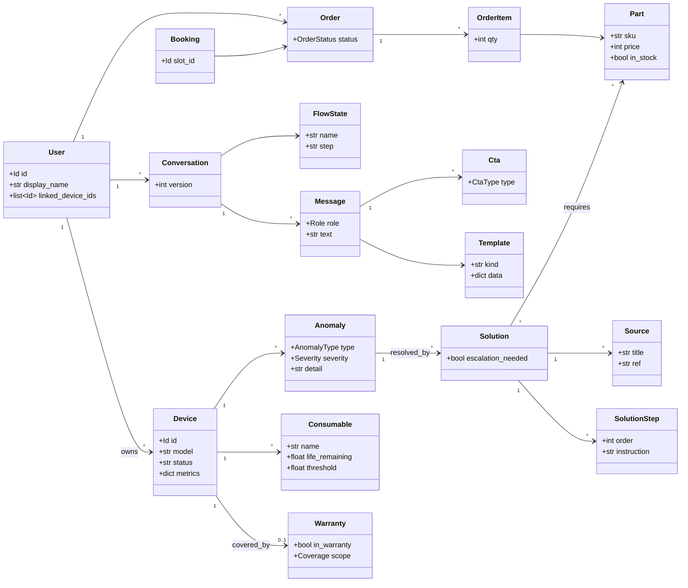

상세 필드·불변식: `docs/data-model.md §3`.

### 서비스 · Port · 어댑터 (Mock↔실 교체 패턴)

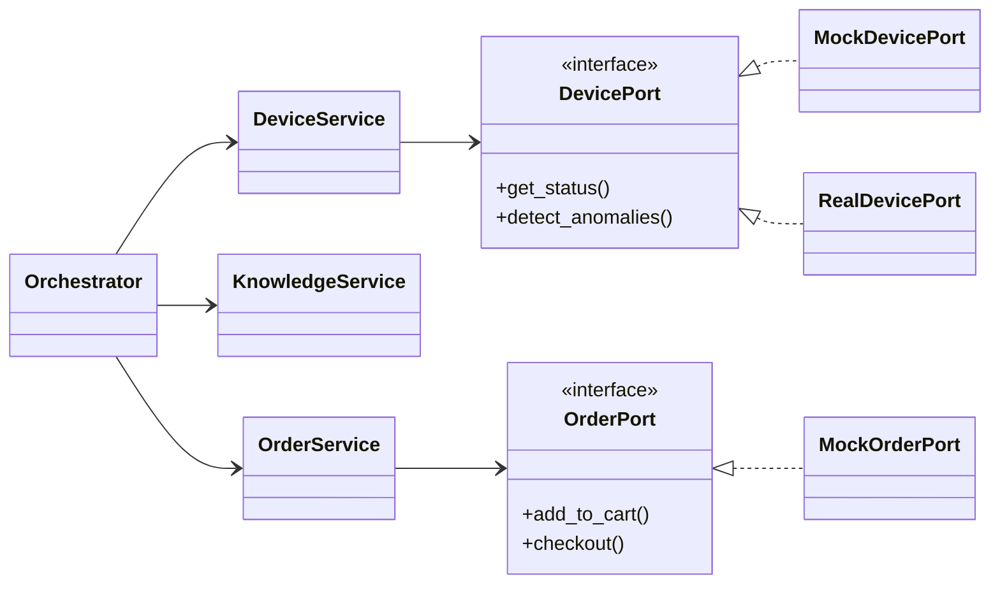

모든 Port는 `Mock*`(MVP)/`Real*`(후속)을 의존성 주입으로 교체. 상세: `docs/data-model.md §6`.

### 예외 계층

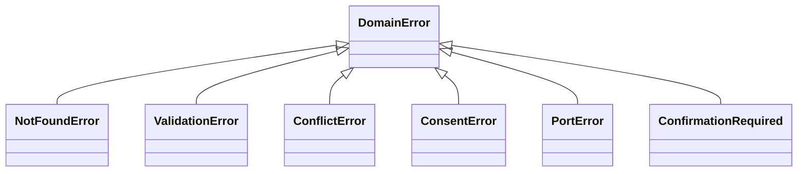

---

## BE — 시퀀스

### 메인 플로우 (이상 감지 → 해결 → 주문)

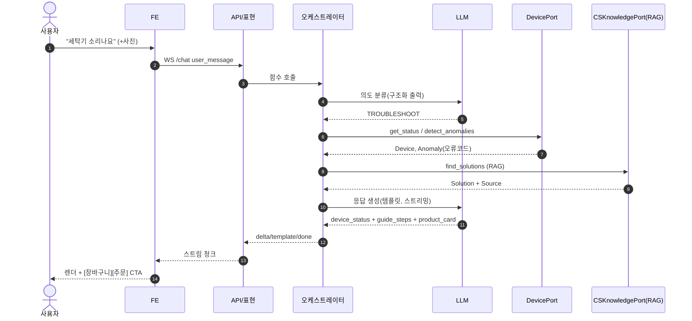

### 주문 확인 게이트 (R17)

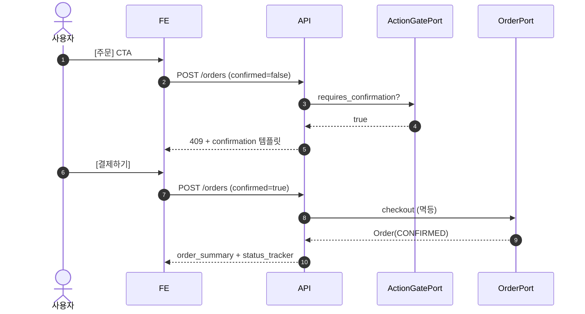

### 선제 알림 (R5/R20)

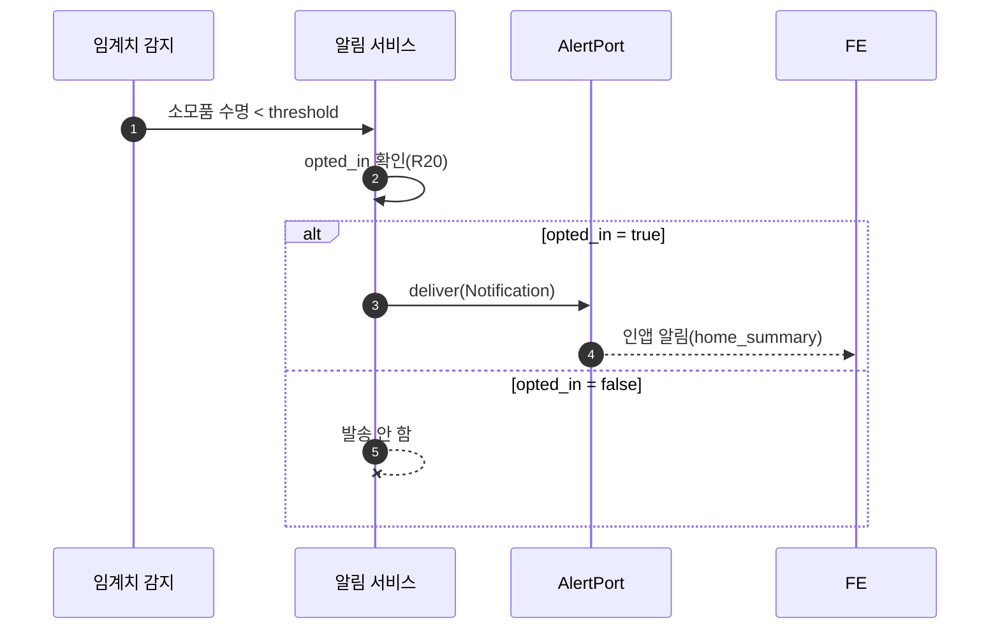

### 핸드오프 · 방문 예약 (R18)

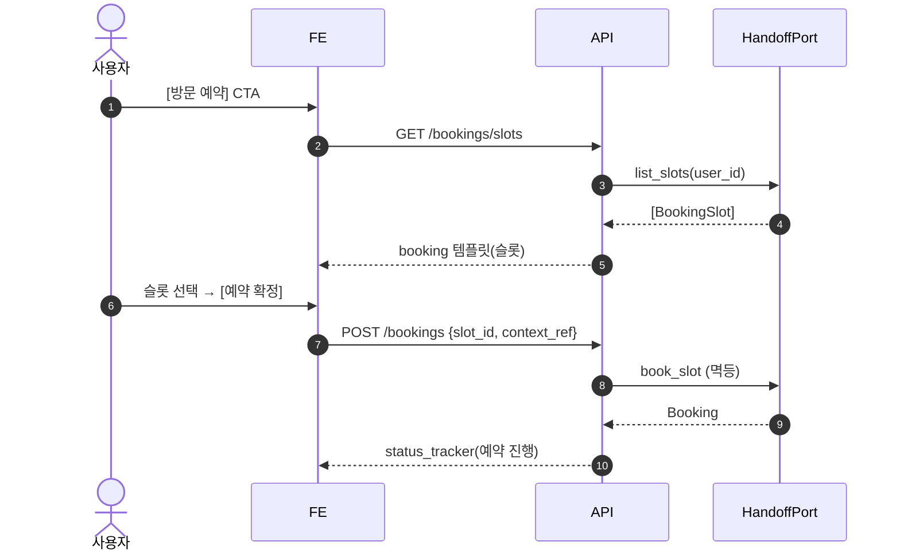

### 복합 질문 분해 (R7)

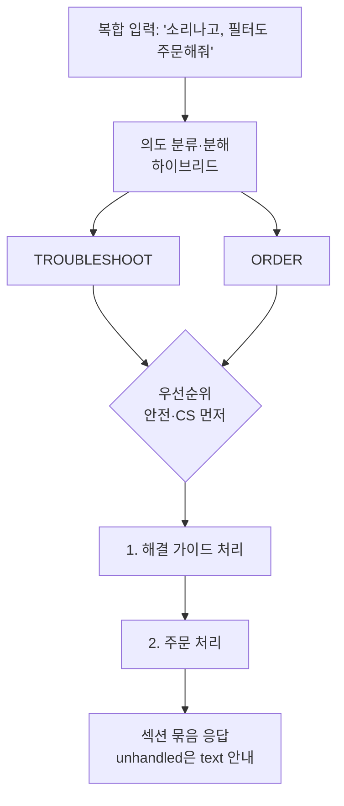

### 흐름 전환 · 복원 (R6)

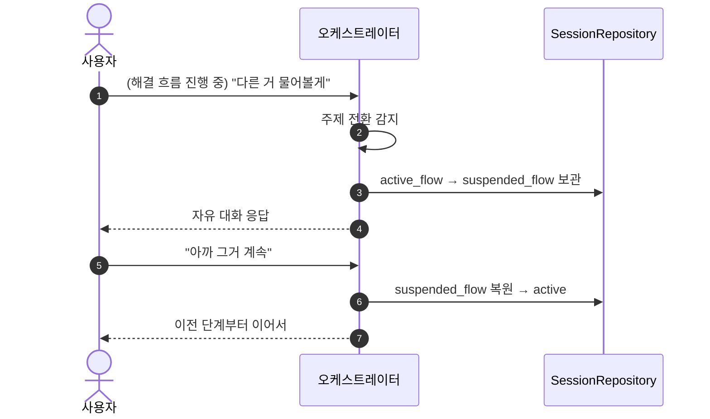

### 멀티모달 업로드 (R10)

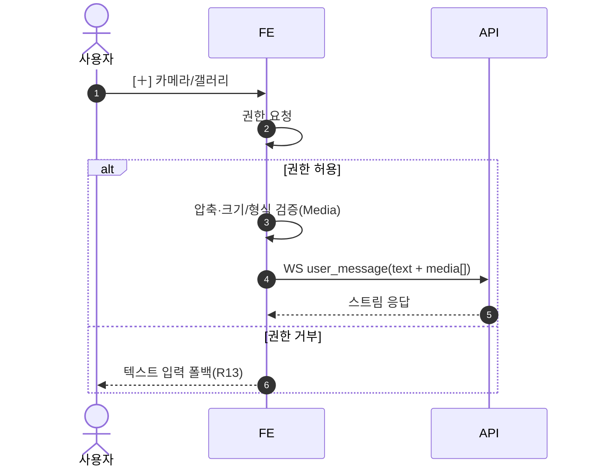

---

## BE — 상태

### 주문(Order) 전이

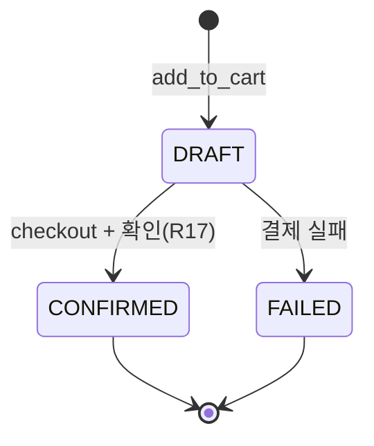

### 대화 흐름 (FlowState, R6)

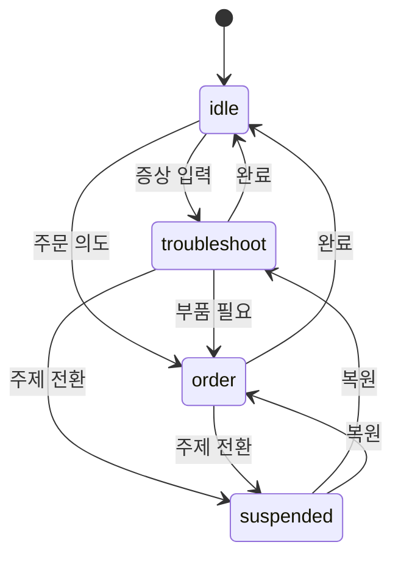

### WebSocket 연결 상태

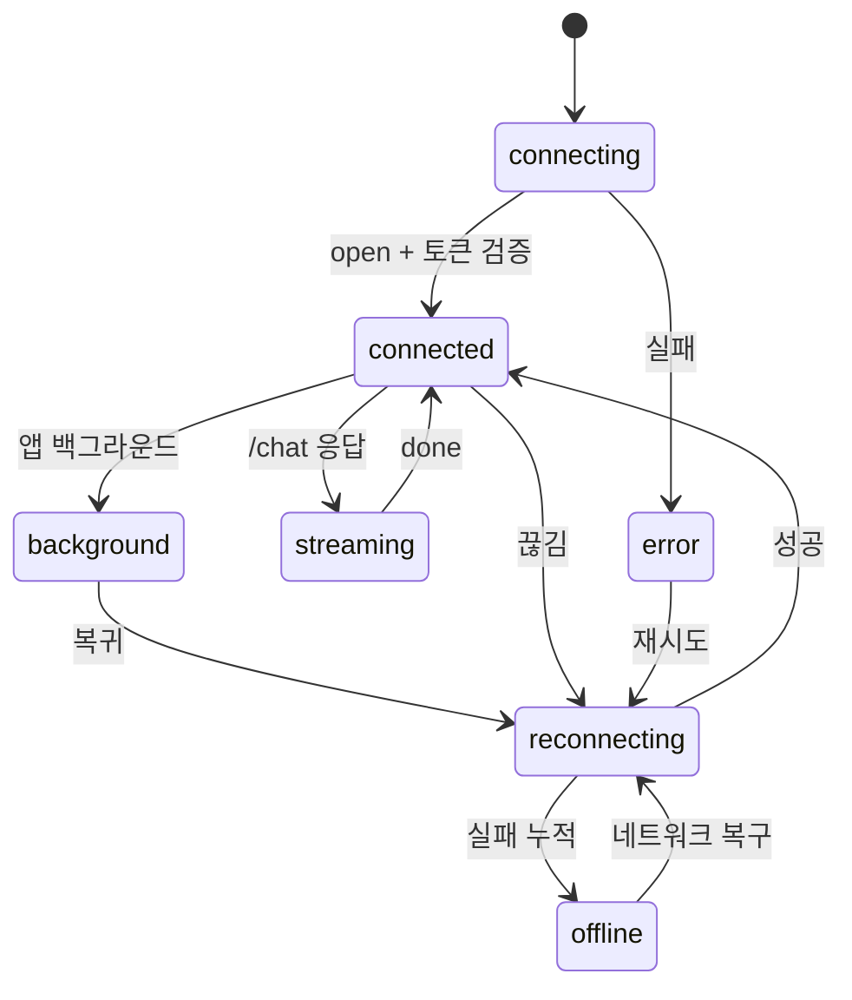

---

## 공통

### 시스템 컨텍스트 (외부 시스템 경계)

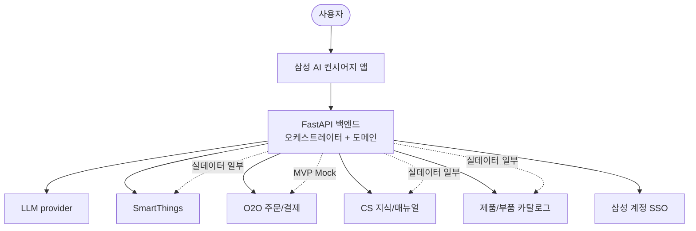

### 도메인 맵 (Bounded Context)

외부 연동=Port, 내부 데이터=Repository. (`architecture.md` §12)

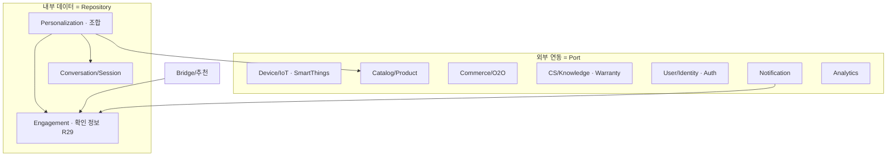

### RAG 데이터 흐름 (DFD)

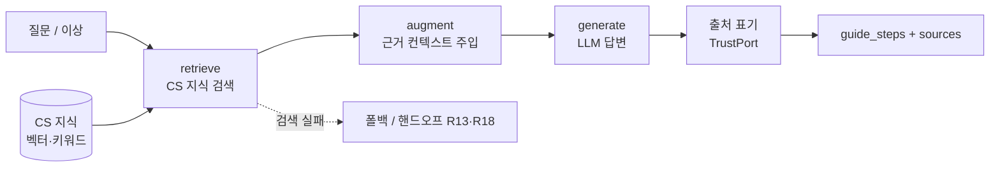

### CS 인제스천 & 하이브리드 검색

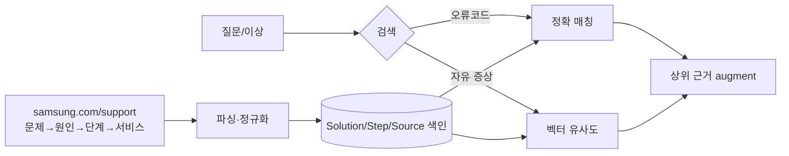

> 코드 매칭 우선 + 의미 검색 보완. 상세: `orchestration.md` §5.

### 폴백 / 예외 결정 흐름 (R13)

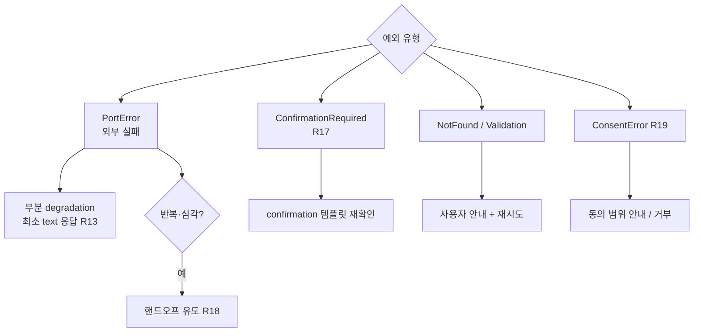

### 오케스트레이션 파이프라인 (Reactive)

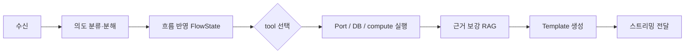

### 선제(Proactive) 파이프라인

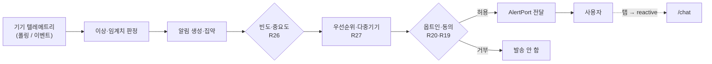

> 상세: `docs/architecture.md` §10 · `scenarios/classification.md`.

### SmartThings 이벤트 구독 (실 전환)

```mermaid
sequenceDiagram
  autonumber
  participant BE as 우리 BE(Sink)
  participant ST as SmartThings
  participant ACL as ACL/DeviceService
  participant NOTI as 알림 서비스
  Note over BE,ST: 셋업
  BE->>ST: Sink 등록(HTTPS webhook)
  ST-->>BE: SINK_CONFIRMATION(challenge)
  BE-->>ST: 200 + challenge 에코
  BE->>ST: Subscription 생성(필터: DEVICE_EVENT·capability)
  Note over BE,ST: 운영(배치 이벤트)
  ST->>BE: POST 이벤트 배치 (HTTP Signature)
  BE->>BE: 서명 검증(rsa-sha256·digest·date<5m, 공개키 동적 fetch)
  BE->>ACL: deviceEvent 정규화 → Device/Anomaly
  ACL->>NOTI: 이상·임계치 판정(§6.3)
  NOTI->>NOTI: 빈도·동의 게이트(R26·R20·R19)
```

> 폴링(MVP)과 구독(실)은 같은 내부 기기 이벤트로 정규화 → 이상감지 불변. 상세: `architecture.md` §10.

---

## FE

### 사용자 여정 (User Journey)

```mermaid
journey
  title 이상 알림 → 해결 → 주문
  section 발견
    홈 선제 알림 확인: 4: 사용자
    알림 탭 → 채팅 진입: 4: 사용자
  section 진단·해결
    증상 입력(+사진): 3: 사용자
    가이드 단계 따라하기: 4: 사용자, 어시스턴트
  section 주문
    부품 후보 확인: 3: 사용자
    장바구니 → 결제 확인: 4: 사용자
    주문 완료·상태 추적: 5: 사용자
```

### 화면 네비게이션 플로우

```mermaid
flowchart LR
  Home[홈 S1] -->|채팅 FAB| Chat[채팅 패널 S3]
  Home -->|바로가기| Support[CS S2]
  Support -->|증상/모델로 찾기| Chat
  Support -->|상담/방문| Chat
  Chat -->|CTA 제품| Product[제품/부품]
  Chat -->|CTA 주문| Cart[장바구니/결제]
  Chat -->|CTA 예약| Booking[방문 예약]
  Push((푸시 알림 R20)) -. 딥링크 .-> Chat
  Push -. 딥링크 .-> Home
```

### 컴포넌트 트리 + 상태 관리

```mermaid
flowchart TD
  App --> Nav[Navigation]
  Nav --> Home[홈]
  Nav --> Support[CS]
  Nav --> ChatPanel[채팅 패널]
  ChatPanel --> MsgList[MessageList]
  MsgList --> Renderer[TemplateRenderer<br/>kind→컴포넌트 레지스트리]
  Renderer --> T1[guide_steps]
  Renderer --> T2[product_card]
  Renderer --> T3[choices ...]
  ChatPanel --> Input[InputBar + 멀티모달]
  Input --> Transport[ChatTransport<br/>WebSocket]
  ChatPanel --> US[UI·세션 store<br/>패널·FlowState]
  MsgList --> SS[서버상태<br/>쿼리/캐시]
  Transport --> SS
```

### 메시지 렌더 파이프라인 (WS 청크 → 렌더)

```mermaid
flowchart LR
  WS[WS 청크] --> D{type}
  D -->|delta| ACC[리드 텍스트 누적]
  D -->|section| SEC[섹션 추가<br/>label·template·ctas·handled]
  D -->|flow| FL[FlowState 배지 갱신]
  D -->|done| FIN[메시지 확정]
  D -->|error| FB[폴백 섹션 표시 R13]
  ACC --> RENDER[리렌더]
  SEC --> RENDER
  FIN --> RENDER
```

> 트랜스포트 연결 상태 머신은 [BE 상태 → WebSocket 연결 상태](#websocket-연결-상태) 참조(동일 채널).

---

## O2O (후속)

### 견적 이어보기 (reverse O2O)

```mermaid
sequenceDiagram
  autonumber
  actor U as 사용자
  participant ST as 매장(오프라인)
  participant FE
  participant API
  participant QP as QuotePort
  ST-->>U: 상담/견적 + 식별자(QR/번호)
  U->>FE: 견적번호 입력/스캔
  FE->>API: GET 견적 (ref)
  API->>QP: get_quote(ref)
  QP-->>API: Quote(items·total·store)
  API->>API: 본인 확인 · 만료/현재가 검증
  API-->>FE: bridge/order_summary 표시
  alt 주문 전환
    U->>FE: [주문] (확인 R17) → Quote.status=CONVERTED
  else 추가 질문
    U->>FE: AI에게 물어보기 → /chat
  end
```

### 매장 픽업 (BOPIS)

```mermaid
sequenceDiagram
  autonumber
  actor U as 사용자
  participant API
  participant SP as StorePort
  participant ORD as OrderPort
  participant NOTI as 알림
  U->>API: 제품 + 픽업 선택(위치)
  API->>SP: find_stores(geo) + check_stock(part)
  SP-->>API: 재고 있는 매장 목록
  alt 재고 있음
    U->>API: 매장 선택 → 주문(PICKUP, RESERVED)
    ORD-->>API: Order(fulfillment=PICKUP)
    NOTI-->>U: 준비 완료(READY) 선제 알림(R20)
    U->>API: 매장 수령 → PICKED_UP
  else 재고 없음
    API-->>U: 대체 매장 / 배송 전환
  end
```

### 서비스 트리아지 (self / 기사 / 센터)

```mermaid
flowchart TD
  S[증상 진단 R2·R3] --> W[유·무상 판별 R22]
  W --> D{트리아지}
  D -->|셀프 가능·안전| SELF[guide_steps + 부품 주문]
  D -->|위험·복잡 R23| TECH[수리기사 방문 R18]
  D -->|휴대·정밀| CENTER[서비스센터 예약]
  D -->|불확실| AGENT[상담원 R16-2]
  SELF -. 미해결 .-> TECH
```

> 상세 흐름·엣지: `specs/mvp-concierge/design.md` §8.

## 멀티에이전트 (agents.md)

### 에이전트 그래프 (슈퍼바이저-워커 · 단일 패스)

```mermaid
flowchart TD
  In["사용자 입력 (/chat)"] --> SUP["Supervisor 에이전트<br/>의도 분해·우선순위·위임·조립 (R7·§6.6)"]
  SUP -->|troubleshoot| DIAG["Diagnosis 에이전트<br/>상태 + 해결책 RAG (R2·R3·R16)"]
  SUP -->|order| COMM["Commerce 에이전트<br/>부품 매칭 + 주문 초안 (R4)"]
  SUP -->|recommend| TR["tool get_recommendations (R8)"]
  SUP -->|handoff| TB["tool booking (R18)"]
  SUP -->|history| TH["tool get_history (R12)"]
  DIAG --> TLS["tool get_device_status · search_solutions(RAG)"]
  COMM --> TMP["tool match_parts"]
  DIAG -. required_parts .-> COMM
  COMM -->|되돌릴 수 없는 커밋| GATE["ActionGate 확인 (R17)"]
  DIAG --> REV{"Review? 조건부<br/>안전 R23·커밋 R17·불확실 R16"}
  COMM --> REV
  REV -->|통과 / 스킵| ASM["Supervisor 조립<br/>섹션 묶음 · handled/unhandled (R7)"]
  REV -->|위반| FB["안전 폴백 / 사람 연결 (R18)"]
  TR --> ASM
  TB --> ASM
  TH --> ASM
  ASM --> Out["다단계 스트리밍 (orchestration §10)"]
```

### 멀티에이전트 턴 시퀀스 (병렬 + 조건부 리뷰 + 다단계 스트림)

```mermaid
sequenceDiagram
  autonumber
  actor U as 사용자
  participant SUP as Supervisor
  participant DIAG as Diagnosis
  participant COMM as Commerce
  participant REV as Review(조건부)
  U->>SUP: 복합 입력(해결 + 주문)
  SUP->>SUP: 의도 분해·우선순위 (R7·§6.6)
  par 독립 워커 병렬(fan-out)
    SUP->>DIAG: 위임(troubleshoot)
    DIAG-->>U: device_status·guide_steps (즉시 섹션 스트림)
  and
    SUP->>COMM: 위임(order)
  end
  DIAG-->>COMM: required_parts 전달(의존 §6.6)
  COMM-->>U: product_card·order_summary (섹션 스트림)
  opt 커밋/안전/불확실
    SUP->>REV: 검수 요청
    REV-->>SUP: 통과 / 위반(보정·폴백 R18)
  end
  SUP-->>U: flow + done (handled/unhandled R7)
```

> 구조·역할·프롬프트: `docs/agents.md`. 다단계 스트리밍·지연: `docs/orchestration.md` §10 · `docs/operations.md` §14.

### 통합 capability 오케스트레이터 + 하이브리드 병합 (ADR-0043)

```mermaid
flowchart TD
  IN["사용자 입력"] --> ORCH["Orchestrator(planner)<br/>의도 분해·우선순위(§6.6)"]
  ORCH --> DIAG["agent: Diagnosis<br/>상태+RAG"]
  ORCH --> COMM["agent: Commerce<br/>매칭+주문초안"]
  ORCH --> AREC["agent: Recommend<br/>자연어 추천(ADR-0044)"]
  AREC --> TREC["tool: recommend<br/>(grounding)"]
  ORCH --> TO2O["tool: O2O(Store/Quote)"]
  ORCH --> THAND["tool: Handoff"]
  ORCH --> THIST["tool: History"]
  DIAG -. required_parts .-> COMM
  DIAG --> MERGE
  COMM --> MERGE
  AREC --> MERGE
  TO2O --> MERGE
  THAND --> MERGE
  THIST --> MERGE
  MERGE["Merge(하이브리드)<br/>결정적 섹션 스택 + 얇은 LLM 연결문구"] --> REV{"조건부 Review<br/>안전·커밋·불확실"}
  REV -->|통과/스킵| DONE["done · 다단계 스트리밍<br/>(빠른 결정적 섹션 먼저)"]
  REV -->|위반| FB["보정·사람 연결"]
```

> 그래뉼래리티 1b(진단·커머스만 agent)·병합 2c(하이브리드)·오케스트레이터 통합: `docs/agents.md` §11 · ADR-0043.
