# 다이어그램 모음 (Diagrams)

> 기반 문서의 구조를 시각화한 **모음(derived)** 이다. 단일 출처는 각 기반 문서이며,
> 본 문서는 클래스·시퀀스·상태·흐름 다이어그램을 모은다. GitHub가 ` ```mermaid ` 블록을 렌더한다.
> LLM은 특정 모델에 종속되지 않게 **provider-agnostic** 으로 표기한다.

목차: [BE 클래스](#be--클래스) · [BE 시퀀스](#be--시퀀스) · [BE 상태](#be--상태) · [공통](#공통) · [FE](#fe)

---

## BE — 클래스

### 도메인 클래스

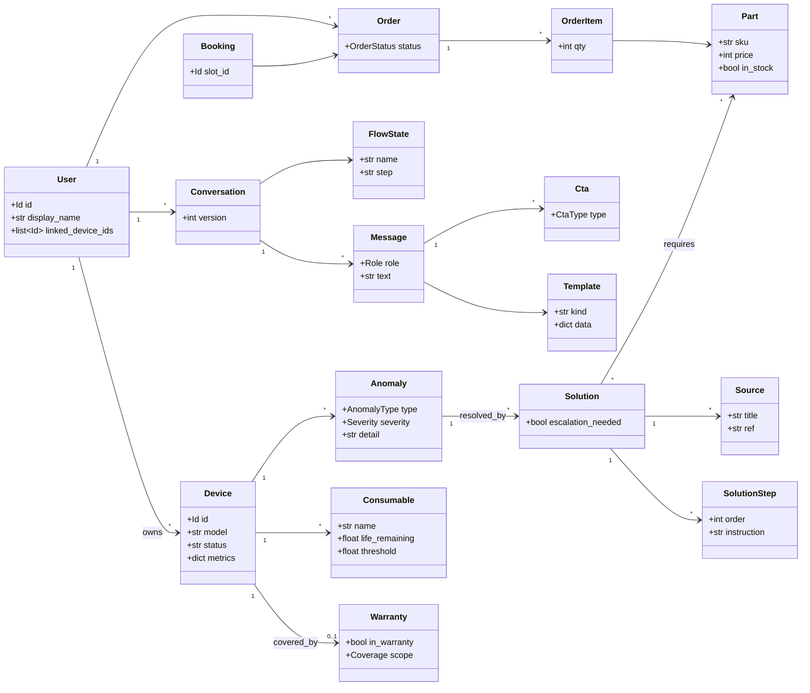

상세 필드·불변식: `docs/data-model.md §3`.

### 서비스 · Port · 어댑터 (Mock↔실 교체 패턴)

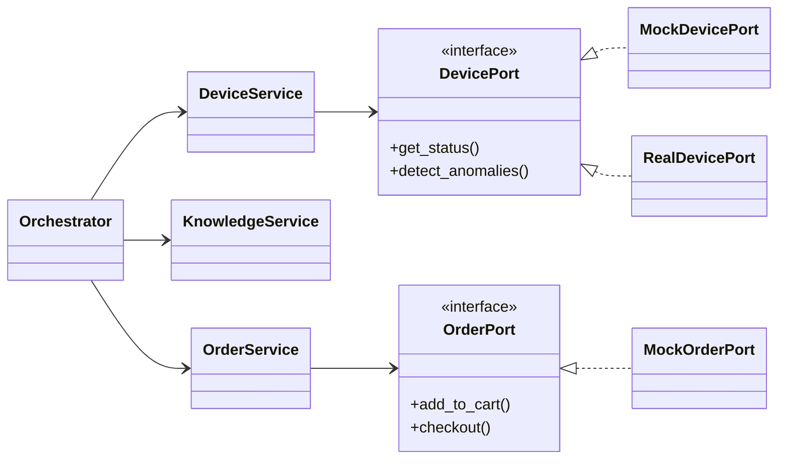

모든 Port는 `Mock*`(MVP)/`Real*`(후속)을 의존성 주입으로 교체. 상세: `docs/data-model.md §6`.

### 예외 계층

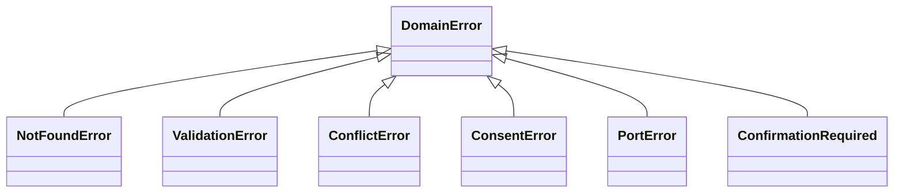

---

## BE — 시퀀스

### 메인 플로우 (이상 감지 → 해결 → 주문)

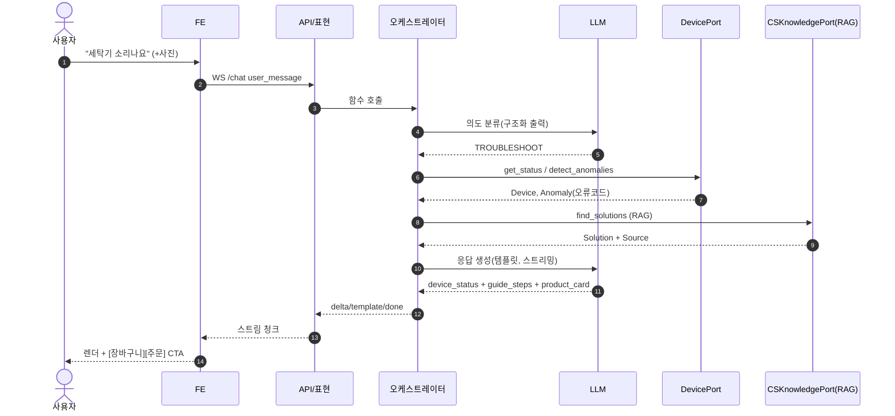

### 주문 확인 게이트 (R17)

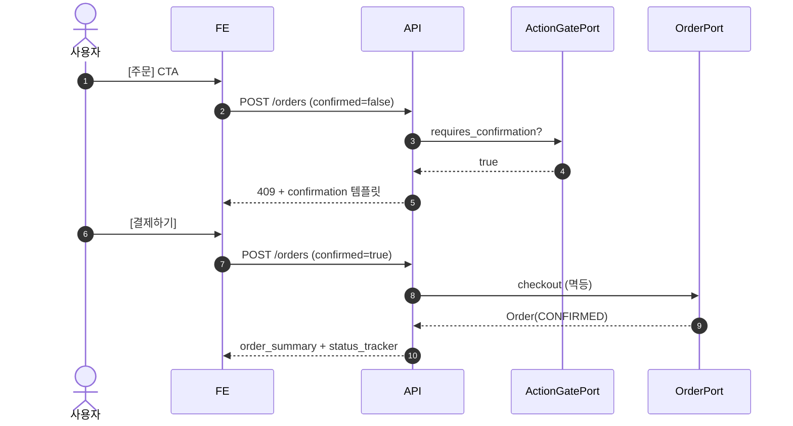

### 선제 알림 (R5/R20)

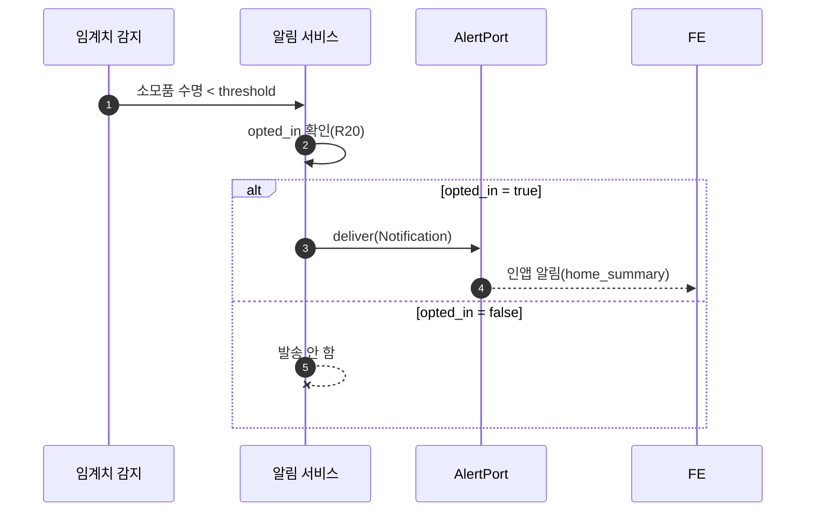

### 핸드오프 · 방문 예약 (R18)

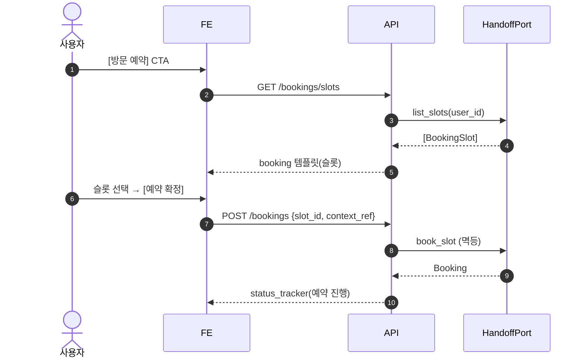

### 복합 질문 분해 (R7)

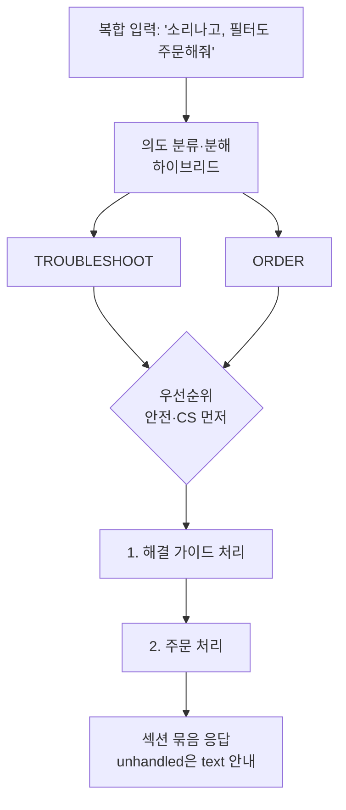

### 흐름 전환 · 복원 (R6)

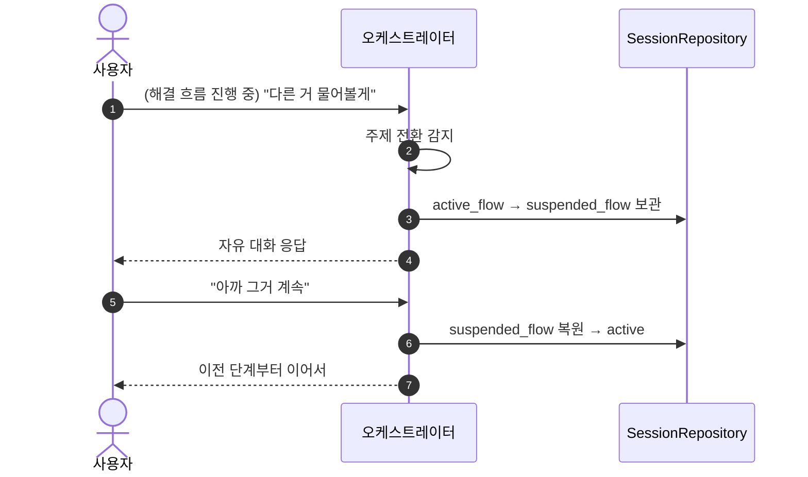

### 멀티모달 업로드 (R10)

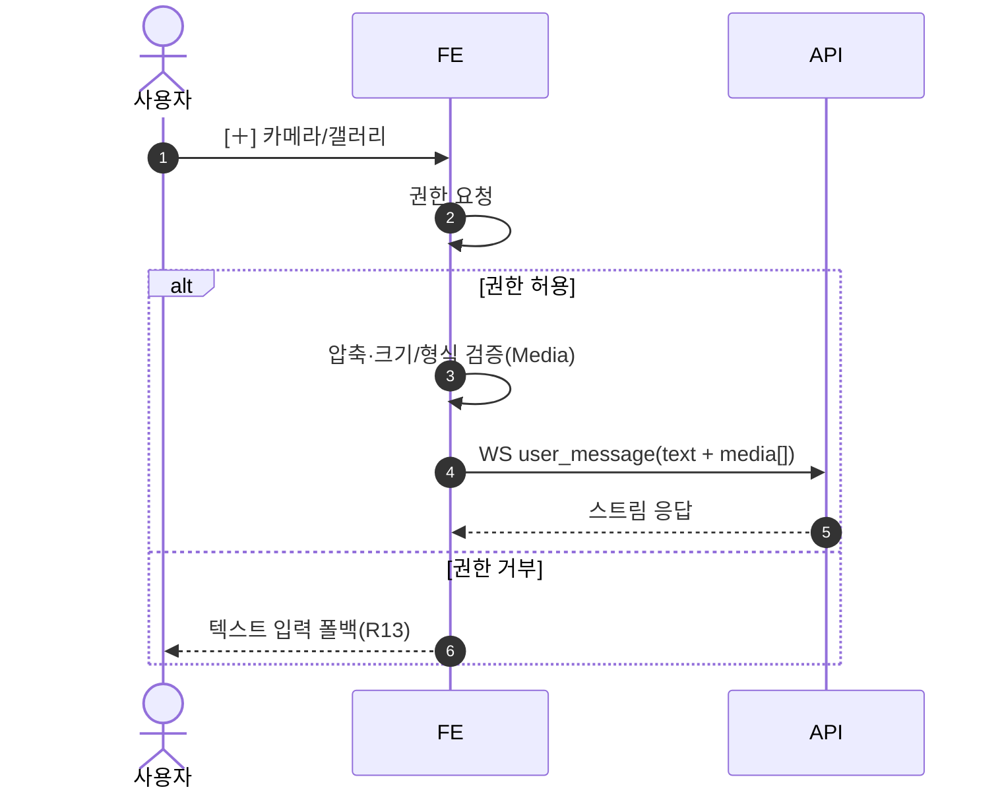

---

## BE — 상태

### 주문(Order) 전이

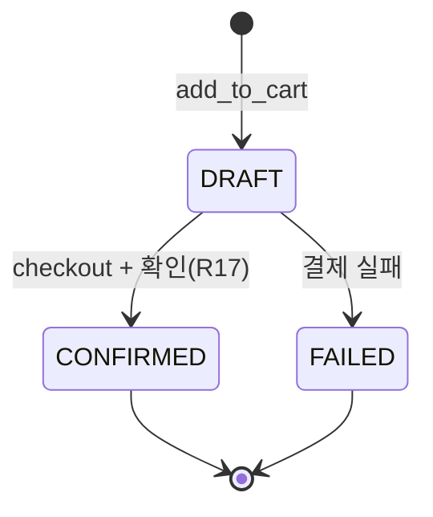

### 대화 흐름 (FlowState, R6)

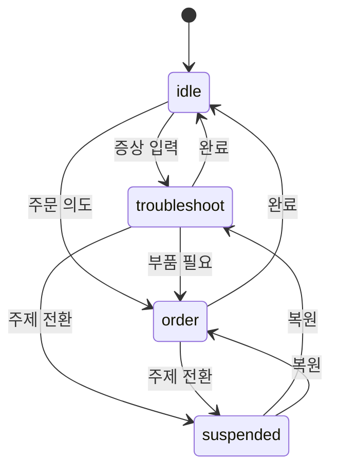

### WebSocket 연결 상태

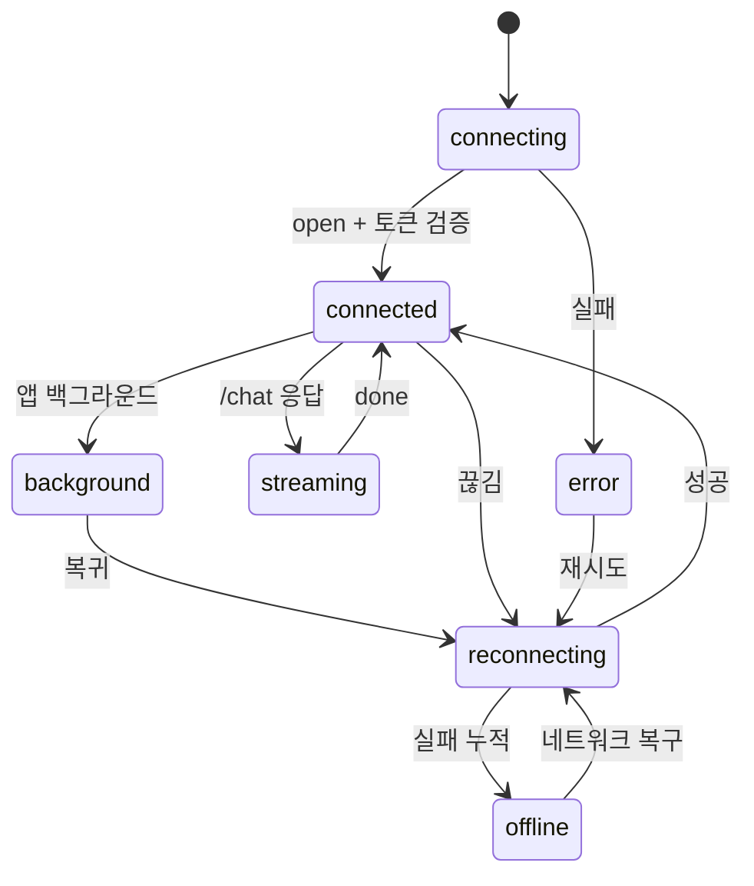

---

## 공통

### 시스템 컨텍스트 (외부 시스템 경계)


### RAG 데이터 흐름 (DFD)

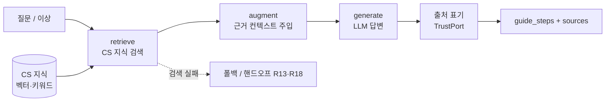

### 폴백 / 예외 결정 흐름 (R13)

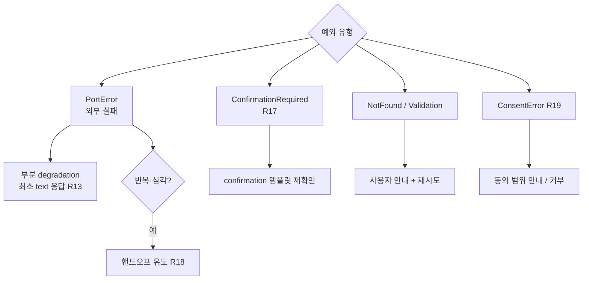

### 오케스트레이션 파이프라인 (Reactive)

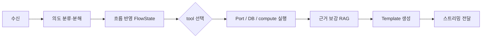

### 선제(Proactive) 파이프라인

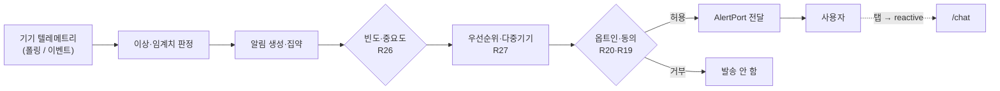

> 상세: `docs/architecture.md` §10 · `scenarios.md` §4-B.

---

## FE

### 사용자 여정 (User Journey)

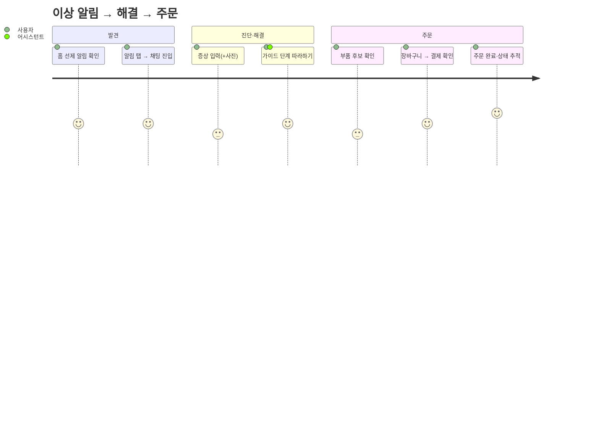

### 화면 네비게이션 플로우

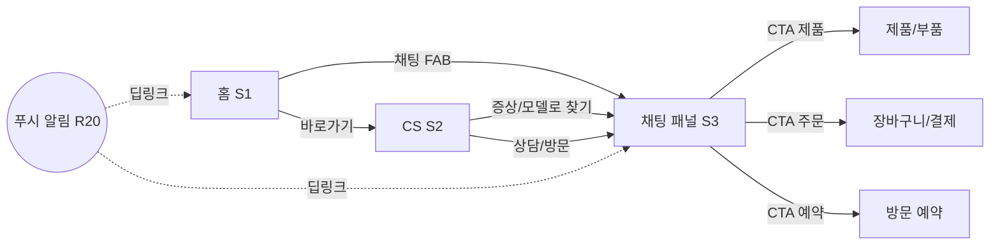

### 컴포넌트 트리 + 상태 관리

```mermaid
flowchart TD
  App --> Nav[Navigation]
  Nav --> Home[홈]
  Nav --> Support[CS]
  Nav --> ChatPanel[채팅 패널]
  ChatPanel --> MsgList[MessageList]
  MsgList --> Renderer[TemplateRenderer<br/>kind→컴포넌트 레지스트리]
  Renderer --> T1[guide_steps]
  Renderer --> T2[product_card]
  Renderer --> T3[choices ...]
  ChatPanel --> Input[InputBar + 멀티모달]
  Input --> Transport[ChatTransport<br/>WebSocket]
  ChatPanel --> US[UI·세션 store<br/>패널·FlowState]
  MsgList --> SS[서버상태<br/>쿼리/캐시]
  Transport --> SS
```

### 메시지 렌더 파이프라인 (WS 청크 → 렌더)

```mermaid
flowchart LR
  WS[WS 청크] --> D{type}
  D -->|delta| ACC[텍스트 누적]
  D -->|template| TPL[Template 추가]
  D -->|flow| FL[FlowState 배지 갱신]
  D -->|done| FIN[메시지 확정 + ctas]
  D -->|error| FB[폴백 템플릿 표시 R13]
  ACC --> RENDER[리렌더]
  TPL --> RENDER
  FIN --> RENDER
```

> 트랜스포트 연결 상태 머신은 [BE 상태 → WebSocket 연결 상태](#websocket-연결-상태) 참조(동일 채널).
