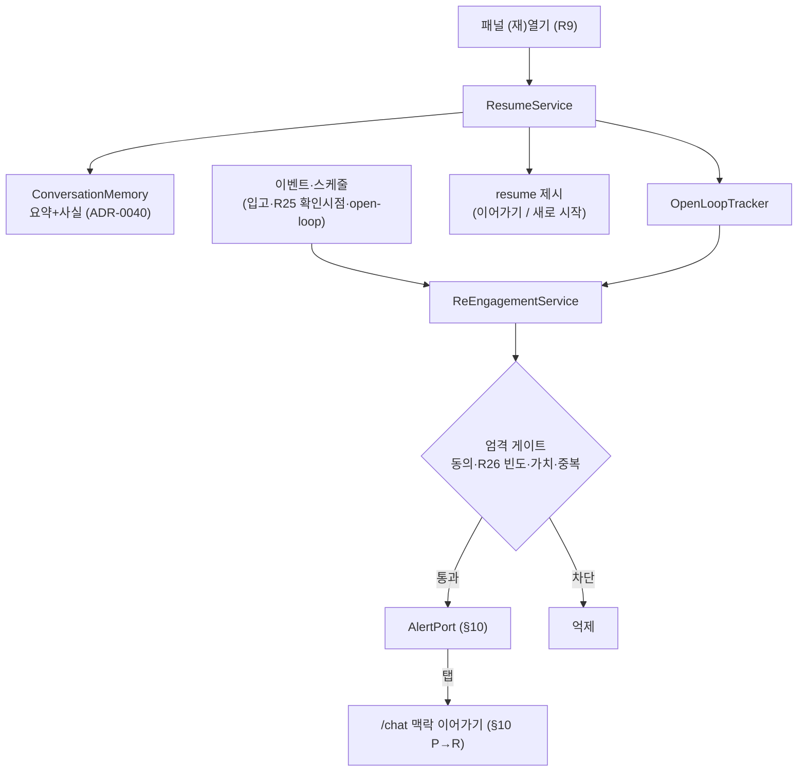

# 설계 (Design) — always-present companion

> `requirements.md`를 **어떻게** 만족시킬지. 토대 문서를 **참조**하고 이 기능 고유 설계만 담는다.
> 토대: ADR-0040(메모리 컴팩션)·ADR-0028(흐름 전환/복원)·`architecture.md` §10(선제 파이프라인)·
> `operations.md` §4-1(연속성)·§3(세션 격리)·R9·R12·R25·R26·R19.

## 개요
컴패니언 = **메모리(토대) + 3개 얇은 레이어**: ① Resume(복원) ② OpenLoop(미해결 추적) ③ ReEngagement(엄격 게이트 선제).
새 인프라 없이 기존 메모리(ADR-0040)·선제 파이프라인(§10)·전역 패널(R9) 위에 얹는다.

## 아키텍처

## 주요 컴포넌트 / 인터페이스

- **ResumeService** — 패널 open 시 user 메모리 rehydrate + open-loop 조회 → `ResumePayload`. _(요구 1·4·5)_
  - `resume(user_id) -> ResumePayload{ summary, open_loops[], suspended_flow, elapsed }`
  - `elapsed`로 상대 시간 인지(요구 5). '새로 시작' = 메모리 비주입 새 흐름(요구 1.3).
- **OpenLoopTracker** — 미해결 이슈·진행 주문·보류 흐름을 open-loop로 적재·조회·해소. _(요구 2)_
  - `OpenLoop{ id, kind(issue|order|flow), ref, status(open|resolved|dismissed), priority, opened_at, last_touch }`
  - 생성: 진단 미해결·주문 DRAFT/진행·`suspended_flow`. 해소: R25 해결확인·주문 배송완료·사용자 dismiss.
- **ReEngagementService** — 트리거 평가 + **엄격 게이트** → 선제 메시지. _(요구 3)_
  - 트리거: open-loop 후속(부품 입고·해결확인 시점·리마인드).
  - **게이트(순서)**: `Consent/opted_in` → R26 빈도/중요도 → **가치**(불확실/중복이면 억제) → 다중기기 묶음(R27).
  - 통과분만 AlertPort(§10). 탭 시 proactive→reactive 전이(맥락 주입).
- **user 단위 메모리 키** — 메모리·open-loop는 `user_id` 키(세션 아님) → 교차기기 연속(요구 4). 접근은 Consent 가드(요구 6).

## 데이터 모델
- **재사용** — `ConversationMemory`(summary·facts·summarized_through, ADR-0040), `FlowState.suspended_flow`(ADR-0028).
- **신규** — `OpenLoop`(위). facts에서 파생 가능하나 **상태·우선순위·해소 시점**을 가지므로 별도 엔티티로 둔다.
- 시간: `opened_at`·`last_touch`·메모리 타임스탬프로 `elapsed` 산출(요구 5).

## 에러 처리
- 메모리 없음(첫 방문) → **깨끗한 시작**(폴백, 끊김 아님).
- 선제 생성/전달 실패 → **무시·비차단**(§10·analytics §7).
- open-loop 추적 실패 → resume는 **요약만** 제시(부분 degradation, R13).
- 동의 철회 → 선제 즉시 중단 + 개인화 메모리 사용 제한(요구 6).

## 테스트 전략
- **Resume** — TTL 만료 후에도 영속 메모리에서 복원(요구 1.2), '새로 시작' 분기.
- **OpenLoop 라이프사이클** — 생성→제시→해소(R25/배송/dismiss) 결정적 테스트(Mock).
- **게이트** — 동의 없음·빈도 초과·저가치·중복에서 **선제 차단** 검증(가장 중요).
- **교차기기** — 다른 세션/기기에서 같은 user 메모리 복원.
- 선제 트리거·억제 단위 테스트(Mock 이벤트).

## 설계 결정 / 대안
- **선제 = 엄격 게이트**(반응형/적극형 대신) — "곁에 있음" vs 피로 균형. 근거·대안: **ADR-0042**.
- **OpenLoop를 별도 엔티티**(facts 내 임베드 대신) — 상태·해소 라이프사이클이 있어 추적/쿼리에 유리.
- **resume에 '새로 시작' 제공** — 프라이버시·클러터 회피(항상 이전 맥락 강요 X).
