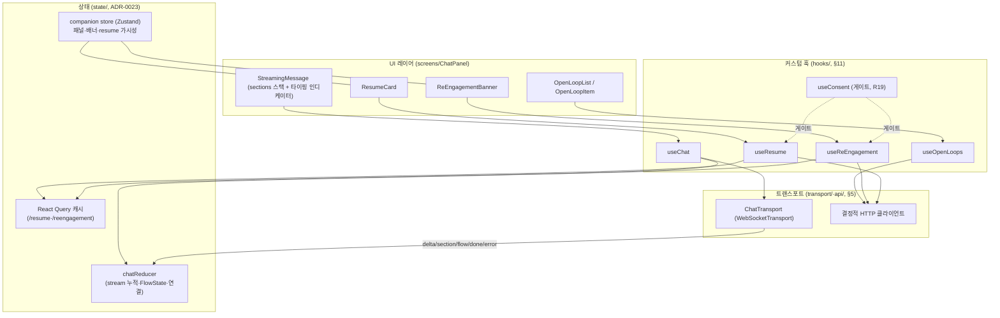

# 설계 (Design) — frontend-companion (컴패니언 FE)

> 이 문서는 `requirements.md` 의 요구사항을 **어떻게** 만족시킬지 설명한다.
> 공유 계약·구조는 **기반 문서를 참조**하고, 여기서 재정의하지 않는다.
>
> 토대 문서:
> - `docs/frontend-architecture.md` §2(상태관리)·§3(네비·카드 surface)·§4(템플릿 렌더러)·
>   §5(WS 트랜스포트)·§8(UX 상태)·§11(reducer·훅 카탈로그)
> - `docs/api-contract.md` §2.1(`/chat` WS 봉투)·§2.2(`/resume`·`/reengagement`·`/reengagement/deliver`·
>   `/open-loops/{ref}/{action}`)·§3(세션)·§4(폴백)
> - `docs/response-templates.md` (템플릿 kind·CTA·인터랙션 회신 §8)
> - `specs/always-present-companion/requirements.md`·`design.md` (resume·open-loop·선제의 BE 계약·라이프사이클)
> - ADR-0022(WebSocket)·0023(RQ+Zustand+reducer)·0025(구조화 템플릿)·0026(MessageSection)·
>   0028(FlowState)·0040(메모리)·0042(선제 엄격 게이트)

## 개요

BE 컴패니언(resume·open-loop·선제 재관여·메모리)은 이미 구현·노출돼 있다. 이 스펙은 그 계약을
**React Native 앱에서 표현·인터랙션**하는 **얇은 FE 레이어**다. 새 BE 계약이나 새 템플릿 kind를
만들지 않고, 기존 트랜스포트 추상화(`ChatTransport`, §5)·상태관리 패턴(ADR-0023)·템플릿 렌더러(§4)
위에 다음 4개의 표현 요소를 얹는다:

1. **이어가기(resume) 카드** — 패널 open 시 `GET /resume` 결과를 패널 상단에 렌더(요약·상대시간·미해결 목록·이어가기/새로 시작). _(요구 1)_
2. **미해결 스레드(open-loop) UI** — resume의 `open_loops[]`를 목록으로 보여주고 탭(재진입)·해소/닫기 액션 제공. _(요구 2)_
3. **선제 재관여 배너** — `GET /reengagement` 결과를 배너로 노출, `deliver`로 재노출 억제, 탭 시 `/chat` 전이. _(요구 3)_
4. **증분 스트리밍 표시** — `/chat` WS 청크(`delta`/`section`/`flow`/`done`/`error`)를 도착 즉시 점진 렌더. _(요구 4)_

이 모두는 트랜스포트 추상화·결정적 HTTP 클라이언트에만 의존하고(요구 5), 동의 게이트(요구 6)를 통과한
경우에만 선제·개인화 표현을 노출한다.

## 아키텍처

- **읽기(조회) = React Query 캐시.** `/resume`·`/reengagement`는 서버 데이터이므로 Query로 패칭·캐시·무효화(ADR-0023 §2). _(요구 1·3)_
- **쓰기(액션) = HTTP 직행 + 캐시 무효화.** `/open-loops/{ref}/{action}`·`/reengagement/deliver`는 mutation → 성공 시 관련 Query 무효화/낙관적 갱신. _(요구 2·3)_
- **스트리밍 = reducer 환원.** WS 청크 시퀀스는 `chatReducer`(§11 환원 후보 1)로 누적. _(요구 4)_
- **가시성(패널·배너·resume 노출 여부) = 경량 store.** 화면 간 공유되는 UI 상태. _(요구 1·3·5)_
- **모든 선제·개인화 노출은 `useConsent` 게이트를 거친다.** 동의 없으면 조회·노출 자체를 no-op. _(요구 6)_

## 주요 컴포넌트 / 인터페이스

> 시그니처는 **TS 의사 타입**이다. DTO(`ResumePayload`·`ReEngagement`·`OpenLoop`·`ChatResponseChunk` 등)는
> `data-model`·`api-contract`·`always-present-companion`이 단일 출처이며 여기서 재정의하지 않는다.

### 훅 (hooks/)

- **`useResume`** — 패널 open 시 `GET /resume`(`?fresh`) 호출, `ResumePayload` 캐시·노출. _(요구 1·5·6)_
  - `useResume() -> { resume: ResumePayload | null, hasContext: bool, startFresh(): void, status }`
  - `startFresh()` → `fresh=true`로 재호출 + resume 가시성 store를 `dismissed`로(요약 화면 제거). _(요구 1.5)_
  - 동의 없음 → 개인화 요약 필드 비노출/제한(요구 6.2). `has_context=false` → 카드 미표시(요구 1.6).
- **`useOpenLoops`** — resume의 `open_loops[]` 표현 + 해소/닫기 mutation. _(요구 2·5)_
  - `useOpenLoops() -> { loops: OpenLoop[], resolve(ref): Promise, dismiss(ref): Promise, reopen(ref): void, status }`
  - `resolve`/`dismiss` → `POST /open-loops/{ref}/{action}`; 성공 시 목록 갱신, `404`/실패 시 롤백 + 재시도(요구 2.4·2.5).
  - 항목 탭 → `useChat.resumeFromRef(ref)`로 `/chat` 재진입(요구 2.2).
- **`useReEngagement`** — `GET /reengagement` 조회·배너 노출·`deliver`·dismiss. _(요구 3·5·6)_
  - `useReEngagement() -> { banner: ReEngagement | null, deliver(): Promise, openInChat(): void, dismiss(): void }`
  - 노출 시 `POST /reengagement/deliver`로 재노출 억제(요구 3.2). `{}` 응답 → 배너 미노출(요구 3.4).
  - `openInChat()` → `primary_ref`로 `/chat` 재진입(proactive→reactive, 요구 3.3). `dismiss()` → 숨김 + 재노출 안 함(요구 3.5).
  - **동의 게이트** — `useConsent`가 미동의면 조회/노출을 **수행하지 않는다**(요구 6.1).
- **`useChat`**(기존, §11) — 스트림 누적·흐름·재진입. 본 스펙은 **재진입 진입점**을 추가로 사용.
  - `resumeFromRef(ref, screen_context?)` — open-loop/배너 탭 시 해당 맥락으로 `/chat` send(맥락 주입). _(요구 2.2·3.3)_
  - 스트림 청크 처리는 `chatReducer`에 위임(아래). _(요구 4)_
- **`useConsent`**(기존, §11) — 동의 범위·opt-out 상태. 선제/개인화 표현 훅이 의존하는 **게이트**. _(요구 6)_

### UI 컴포넌트 (screens/ChatPanel/, templates/)

- **`ResumeCard`** — 패널 상단 카드: `summary` + `elapsed_label`(상대시간) + `OpenLoopList` + '이어가기'/'새로 시작' 액션. _(요구 1)_
  - degraded 시 요약만/부분 표시(요구 5.4). 동의 없으면 개인화 요약 축소(요구 6.2).
- **`OpenLoopList` / `OpenLoopItem`** — `kind`(issue|order|flow)·요약·우선순위 구분 렌더, 탭·resolve·dismiss 제공. _(요구 2)_
  - 스와이프/버튼으로 resolve·dismiss, 진행 중 로딩·실패 재시도 상태(§8 4종 상태).
- **`ReEngagementBanner`** — `primary_label`·`message`·`also_count`(추가 개수) 노출, 탭·닫기. _(요구 3)_
- **`StreamingMessage`** — 진행 중 메시지: `delta` 누적 텍스트 + `section` 세로 스택 + **타이핑 인디케이터**. _(요구 4)_
  - 섹션은 **템플릿 렌더러(§4)** 로 kind별 렌더(모르는 kind → `text` 폴백). 미처리(`handled:false`) 라벨 표시(§4·ADR-0026).
  - 진행 문구는 **답변 중심**만(내부 시스템·대기 비노출, 요구 4.6).

### 상태 환원 (state/, ADR-0023 · §11)

- **`chatReducer`** — WS 청크 → (진행 메시지 + 섹션 리스트 + 스트리밍 상태 + FlowState) 환원. _(요구 4)_
  - 액션: `delta`(텍스트 누적) · `section`(섹션 push, 도착 순서 유지) · `flow`(`active_flow` 반영) ·
    `done`(누적 섹션으로 메시지 확정·타이핑 종료) · `error`(폴백 템플릿 삽입, 대화 유지). (api-contract §2.1)
  - 환원은 **api-contract §2.1 봉투를 그대로** 따른다(중복 정의 금지).
- **`companion` store(Zustand)** — `panelOpen` · `resumeVisibility(shown|dismissed)` · `bannerState(hidden|shown|dismissed)` · 화면 맥락. _(요구 1·3·5)_

## 데이터 모델

> **전부 재사용** — 신규 FE DTO를 만들지 않는다.

| 데이터 | 출처(단일 진실) | 용도 |
|--------|----------------|------|
| `ResumePayload`(`has_context`·`summary`·`facts`·`open_loops[]`·`elapsed_label`·`suspended_flow`) | api-contract §2.2 · companion §1·§2 | 이어가기 카드(요구 1) |
| `OpenLoop`(`id`·`kind`·`ref`·`status`·`priority`·`opened_at`·`last_touch`) | companion design §주요컴포넌트 | 미해결 스레드 목록·액션(요구 2) |
| `ReEngagement`(`primary_ref`·`primary_label`·`kind`·`also_count`·`message`) | api-contract §2.2 · companion §3 | 선제 배너(요구 3) |
| `ChatResponseChunk`(`delta`·`section`·`flow`·`done`·`error` 봉투) | api-contract §2.1 · data-model §4 | 증분 스트리밍(요구 4) |
| `MessageSection`(`label`·`intent`·`template`·`ctas`·`handled`) | response-templates §5 · ADR-0026 | 섹션 스택 렌더(요구 4) |
| `Consent`/`opted_in` | ADR-0030 · R19 | 선제·개인화 게이트(요구 6) |

- FE는 위 타입을 `types/`(data-model DTO 대응, §10)에서 받아 렌더만 한다. 파생 UI 상태(가시성·로딩·degraded)만 FE 로컬.

## 에러 처리

기반: api-contract §4(폴백 정규화) · frontend-architecture §8(4종 상태)·§9(오프라인). _(요구 5)_

| 상황 | 처리 |
|------|------|
| `/chat` `error` 청크(요구 5.2) | `fallback` 템플릿으로 렌더, 대화 중단 안 함(누적 섹션 보존). |
| 오프라인/연결 끊김(요구 5.3) | 오프라인 안내 + 재연결/재시도. WS 재연결은 연결 상태머신(§11 환원 2)에 위임. |
| `/resume` 부분 실패(요구 5.4) | 가능한 부분(요약만) degraded 표시, open-loop 누락은 빈 목록. |
| `/open-loops/{ref}/{action}` `404`/실패(요구 2.5) | 항목 미제거 + 오류 안내·재시도(낙관적 갱신 롤백). |
| `/reengagement` `{}`/실패(요구 3.4) | 배너 미노출(조용한 실패, 선제는 비차단·analytics §7). |
| 첫 방문(`has_context=false`, 요구 1.6) | 카드 미표시·깨끗한 빈 상태(에러 아님). |
| 모르는 템플릿 kind·스키마 불일치 | `text` 폴백(response-templates §7). |

## 테스트 전략

- **컴포넌트** — `ResumeCard`(요약·`elapsed_label`·open-loop 목록·이어가기/새로 시작/빈상태), `ReEngagementBanner`(노출·탭·닫기·`{}`미노출), `OpenLoopItem`(resolve·dismiss·실패 롤백), `StreamingMessage`(섹션 스택·타이핑·done 확정). _(요구 1·2·3·4)_
- **reducer 단위** — `chatReducer`에 `delta`→`section`(순서)→`flow`→`done`/`error` 시퀀스를 넣어 메시지·섹션·FlowState·타이핑 상태 환원 검증(api-contract §2.1 봉투). _(요구 4)_
- **훅(계약 stub)** — `useResume`/`useOpenLoops`/`useReEngagement`를 BFF **계약 stub**(api-contract §5)에 물려 호출·무효화·`deliver` 억제·`404` 롤백 검증. _(요구 1·2·3·5)_
- **게이트** — `useConsent` 미동의 시 `/reengagement` 조회·배너·개인화 요약이 **노출되지 않음**을 검증(가장 중요). 동의 변경 시 즉시 갱신. _(요구 6)_
- **폴백/오프라인** — `error` 청크·오프라인·부분 실패에서 대화 미중단·degraded 표시. _(요구 5)_
- **트랜스포트 독립** — UI/훅이 `ChatTransport` 인터페이스에만 의존함을 stub 트랜스포트 주입으로 확인. _(요구 5.1)_

## 설계 결정 / 대안

- **신규 BE 계약·템플릿 kind 없이 기존 위에 얹는다** — resume·open-loop·reengagement·스트리밍 모두 이미 노출된 엔드포인트(api-contract §2.1·§2.2)와 기존 템플릿/섹션 모델(response-templates)을 그대로 소비. 대안(전용 FE 전용 응답)은 계약 드리프트·중복을 낳아 기각.
- **조회=Query, 액션=mutation+무효화, 스트림=reducer** — ADR-0023의 상태 분류를 그대로 적용. resume/reengagement는 서버 데이터(캐시 적합), open-loop 해소·deliver는 이벤트성 쓰기, 스트림은 청크 누적이라 reducer가 자연스럽다.
- **이어가기 카드 = 패널 상단 표면(별도 화면 X)** — 전역 패널(R9) 흐름을 끊지 않고 맥락을 곁들이기 위해. '새로 시작'으로 언제든 깨끗한 시작 선택 가능(companion 요구 1.3·프라이버시).
- **선제는 FE에서도 동의 게이트로 한 번 더 거른다** — BE가 게이트(ADR-0042)하지만, FE도 미동의면 **조회 자체를 하지 않아**(요구 6.1) 네트워크·노출을 원천 차단. 깊이 방어.
- **낙관적 갱신 + 롤백(open-loop)** — 해소/닫기 즉시 반응성(요구 2.4)을 위해 낙관적 제거, `404`/실패 시 롤백(요구 2.5). 대안(서버 확정 후 갱신)은 체감 지연이 커 기각.
- **`deliver`로 재노출 억제** — 같은 선제 메시지의 중복 노출(피로)을 막기 위해 노출 시점에 전달 확정(요구 3.2, companion §3.3). ADR-0042의 피로 방지 취지와 일치.
