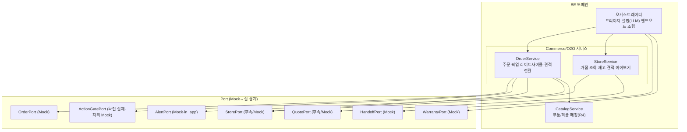
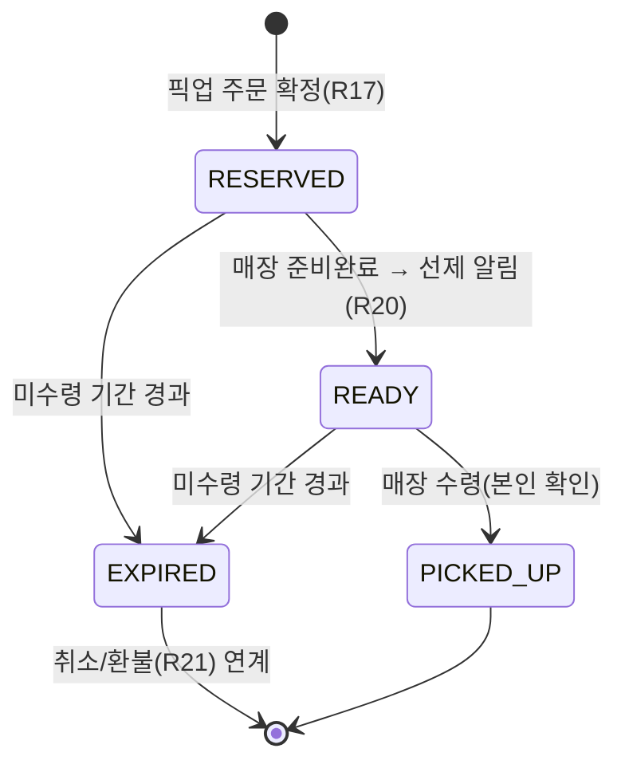
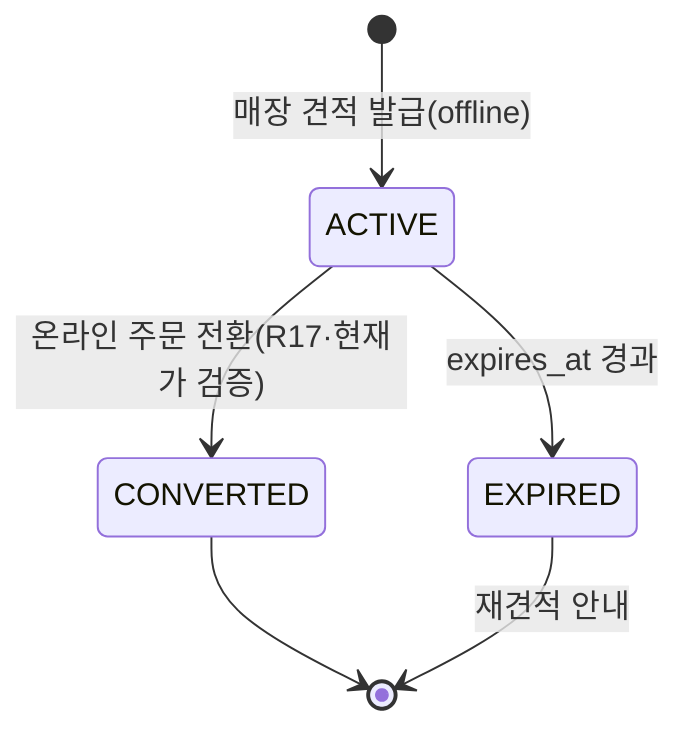

# 설계 (Design) — O2O 풀(매장 픽업·재고·견적 이어보기)

> 이 문서는 `requirements.md` 의 요구사항(O1~O8)을 **어떻게** 만족시킬지 설명한다.
> 전체 아키텍처·기술 스택·Mock↔실 전략·공유 데이터 모델은 **기반 문서**를 따른다 — 여기서
> 중복 정의하지 않는다. 본 스펙은 이미 선반영된 `StorePort`/`QuotePort`/`Store`/`Quote` 위에서
> **O2O 고유 흐름**만 정의한다.
>
> - 시스템 아키텍처(StoreP/QuoteP Mock↔실 §5, Commerce/O2O 도메인 맵 §12, 라우팅 §8):
>   [`docs/architecture.md`](../../docs/architecture.md)
> - 공유 데이터 모델(`Order`·`Store`·`Quote`·`Fulfillment`·`PickupStatus`·`StoreType`·`QuoteStatus`,
>   `StorePort`/`QuotePort`/`OrderPort`/`HandoffPort`/`ActionGatePort` 시그니처):
>   [`docs/data-model.md`](../../docs/data-model.md)
> - 외부 노출 계약·결정적 엔드포인트: [`docs/api-contract.md`](../../docs/api-contract.md)
> - 응답 표현(`product_card`·`order_summary`·`status_tracker`·`handoff_card`·`booking`·`bridge`):
>   [`docs/response-templates.md`](../../docs/response-templates.md)
> - O2O 시퀀스(견적·BOPIS·트리아지): [`docs/diagrams.md`](../../docs/diagrams.md) §O2O(후속)
> - O2O 심화 흐름·엣지: [`specs/mvp-concierge/design.md`](../mvp-concierge/design.md) §8
> - 결정 기록: ADR-0020(Port Mock↔실), ADR-0033(ActionGate 확인 실제/처리 Mock)

## 1. 개요

mvp-concierge 설계 §8(O2O 심화)은 견적 이어보기·BOPIS·서비스 트리아지의 **흐름·엣지 윤곽**을
이미 잡았다. 본 스펙은 그 윤곽을 **구현 가능한 수준의 컴포넌트·계약·상태머신·폴백**으로 구체화한다.
핵심 접근은 다음과 같다:

- **선반영 인터페이스 재사용** — `StorePort`·`QuotePort`·`OrderPort`(픽업 필드 포함)는 이미
  `docs/data-model.md` §6에 있다. 새 Port/엔티티를 만들지 않고, 이들을 조합하는 **도메인 서비스
  로직과 상태 전이·확인 게이트**를 정의한다.
- **결정적 채널 우선** — 매장·재고·견적·픽업 조회/커밋은 **결정적 엔드포인트**로(`/chat` LLM 미경유),
  설명·트리아지 판단 등 추론은 `/chat`/bridge `escalate`로 보낸다(`architecture.md` §8) (O8-4).
- **Mock↔실 경계 유지** — `StorePort`/`QuotePort`는 후속/Mock, 픽업·견적 커밋은 확인 UX 실제·처리
  Mock(ADR-0033). 실 전환은 어댑터 교체만(O8-2).

## 2. 아키텍처 (O2O 도메인 위치)

O2O는 **Commerce/O2O bounded context**(`architecture.md` §12)에 속한다. 주문 서비스(OrderService)를
확장하고, 거점·재고·견적을 다루는 **StoreService**를 둔다(도메인 서비스, 내부 함수 호출 — Port만
외부 API).

- **StoreService** — `StorePort`(거점·재고)·`QuotePort`(견적)를 조합. 거점 필터·재고 게이트·견적 본인
  확인/만료·현재가 검증을 담당.
- **OrderService(확장)** — 기존 주문(R4·R21)에 **픽업 라이프사이클**과 **견적→주문 전환**을 추가.
  픽업 재고 게이트는 StoreService와 협력.
- **오케스트레이터** — 트리아지 판단(self/기사/센터)과 설명·맥락 전달은 추론이 들어가므로 여기서
  조립하고, 결정적 조회/커밋은 도메인 서비스로 직행시킨다.

## 3. 주요 컴포넌트 / 인터페이스

> 시그니처는 모두 `docs/data-model.md` §6에 **이미 정의된** 것이다. 여기서는 **호출 조합·로직**만
> 적고 타입은 중복 정의하지 않는다.

### 3.1 StoreService — 거점·재고·견적 _(O1·O2·O5·O8)_
- **거점 조회** — `StorePort.find_stores(geo, type)`로 위치 기반 거점을 가져온다. `type`으로
  retail/experience/service_center 필터(O1-2). 위치 없으면 입력 요청/배송 폴백(O1-3).
- **재고 확인** — `StorePort.check_stock(store_id, part_id)`로 매장별 픽업 재고 게이트(O2). `False`면
  픽업 진행 비활성, 대체 매장/배송 제안(O2-2·O2-3).
- **견적 이어보기** — `QuotePort.get_quote(quote_ref)`로 견적 조회. **본인 확인**(`Quote.user_id`
  불일치 거부, O5-2)·**만료 검증**(`expires_at` 경과 시 재견적, O5-3)·**현재가/재고 변동 검증**
  (O5-4)을 StoreService가 수행한다(`data-model.md` Quote 불변식과 정합).

### 3.2 OrderService(확장) — 픽업 라이프사이클·견적 전환 _(O3·O4·O6)_
- **픽업 주문 생성** — `Fulfillment.PICKUP` + `store_id` + `pickup_status=RESERVED`로 `Order` 생성
  (O3-1). 생성 전 재고 게이트(3.1), 확정 직전 `ActionGatePort.requires_confirmation` 확인(O3-2·R17).
  실제 커밋은 `OrderPort.checkout`(Mock 시뮬레이션, ADR-0033).
- **픽업 상태 전이** — `RESERVED→READY→PICKED_UP | EXPIRED`만 허용, 역전이 거부(O3-6,
  `data-model.md` Order(픽업) 불변식). `READY` 전이 시 `AlertPort.deliver`로 준비완료 선제 알림
  (O3-3·R20). 미수령 만료 시 `EXPIRED` → 취소/환불(R21) 연계(O4-1·O4-2).
- **견적 → 주문 전환** — `Quote.status==ACTIVE`만 전환 가능(O6-2). 전환 시 현재가·재고 재검증(O6-3),
  확인(R17) 후 `Quote`를 `CONVERTED`로 전이하며 `Order` 생성(O6-1). 전환 주문도 배송/픽업 선택 가능
  (O6-4 → O3 흐름 재사용).

### 3.3 트리아지 오케스트레이션 — self/기사/센터 _(O7)_
- 증상 진단(R2·R3) 결과 + `WarrantyPort.get_warranty`(유·무상, O7-3) + `SolutionStep.safety/pro_required`
  (위험·셀프 부적절)로 경로를 판단(O7-1·O7-2).
- **센터 방문** — `HandoffPort.list_slots(user_id, visit_type=...)` → `book_slot(..., store_id=서비스센터)`
  로 예약(O7-4). 거점은 StoreService(`StoreType.SERVICE_CENTER`)에서 선택. `Booking.visit_type`·
  `store_id`로 표현(`data-model.md` Booking).
- **맥락 전달** — `HandoffPort.handoff(req_type, context_ref=Conversation.id)`로 대화 맥락 동반(O7-5·R18).
- **불확실** — 단정 금지, 상담원 연결(`ServiceRequestType.AGENT`)(O7-6·R16-2).

### 3.4 결정적 엔드포인트 계약 (제안) _(O8-4)_

`docs/api-contract.md` §2.2 스타일로 **추가 제안**한다(확정 시 `api-contract.md`를 갱신). 요청/응답
본문은 `data-model.md` DTO/엔티티를 그대로 쓴다(중복 정의 금지).

| 엔드포인트 | 메서드 | 요청 | 응답 | 요구사항 |
|------------|--------|------|------|----------|
| `/stores` | GET | `?lat&lng&type` | `list[Store]` | O1 |
| `/stores/{id}/stock/{part_id}` | GET | – | `{ in_stock: bool }` | O2 |
| `/cart` (픽업) | POST | `CartRequest`(+`fulfillment=pickup`·`store_id`) | `Order`(DRAFT·PICKUP) | O3 |
| `/orders` (픽업) | POST | `OrderRequest`(`confirmed=true`) | `Order`(PICKUP·RESERVED) / `409 ConfirmationRequired` | O3·R17 |
| `/orders/{id}` | GET | – | `Order` (pickup_status·store_id 포함) | O3-5·R12 |
| `/orders/{id}/pickup` | POST | `{ action: "ready"\|"picked_up" }` | `Order` / `409`(전이 위반) | O3·O4 |
| `/quotes/{ref}` | GET | – | `Quote` / `403`(본인 아님) / `410`(만료) | O5 |
| `/quotes/{ref}/convert` | POST | `OrderRequest`(`confirmed=true`·`fulfillment`) | `Order` + `Quote.CONVERTED` / `409` | O6·R17 |
| `/bookings/slots` | GET | `?visit_type=center&store_id` | `list[BookingSlot]` | O7·R18 |
| `/bookings` | POST | `BookingRequest`(+`visit_type`·`store_id`) | `Booking` | O7·R18 |

- 픽업/견적 전환의 커밋은 `confirmed=false`면 `409 ConfirmationRequired`(R17, 기존 `/orders` 규칙 재사용).
- 픽업 상태 전이(`/orders/{id}/pickup`)는 정의된 전이만 허용, 역전이/잘못된 단계는 `409`(O3-6).
- 매장 탭/카드 탭 설명·트리아지 추론은 `POST /surface`(bridge) 또는 `/chat`으로 에스컬레이션
  (`api-contract.md` §2.3, response-templates §9).

## 4. 데이터 모델

**새 엔티티/Enum 없음.** 본 스펙은 `docs/data-model.md`에 **이미 선반영된** 타입을 사용한다:
`Order`(`fulfillment`·`store_id`·`pickup_status`), `Fulfillment`(DELIVERY/PICKUP),
`PickupStatus`(RESERVED/READY/PICKED_UP/EXPIRED), `Store`/`StoreType`,
`Quote`/`QuoteSource`/`QuoteStatus`, `Booking`(`visit_type`·`store_id`),
`StorePort`/`QuotePort`/`OrderPort`/`HandoffPort`/`ActionGatePort`/`WarrantyPort`/`AlertPort`.

> 만약 흐름 구현 중 새 필드·상태가 필요해지면, **스펙 design이 아니라 `docs/data-model.md`를 갱신**
> 하고 여기서 참조한다(`CLAUDE.md` 규칙).

### 4.1 픽업 라이프사이클 상태머신 _(O3·O4)_

- 불변식: `fulfillment=PICKUP`이면 `store_id`·`pickup_status` 필수(`data-model.md`). 역전이 금지.

### 4.2 견적 라이프사이클 _(O5·O6)_

- 불변식: 조회는 본인(`user_id`) 한정, `ACTIVE`만 전환 가능, 전환 시 현재가 검증(`data-model.md`).

## 5. 에러 처리 / 폴백 (R13 · O8)

mvp-concierge §4 폴백 표를 **O2O로 확장·재사용**한다(새 폴백 정책을 만들기보다 기존 원칙 적용).

| 상황 | 처리 | 요구사항 |
|------|------|----------|
| `StorePort` 실패/미연동 | 거점·재고 의존 흐름 → 배송 대안 또는 일반 안내 폴백 | O8-1·O1·O2 |
| 위치 정보 없음/거부 | 흐름 차단 금지 → 위치 입력 요청 또는 배송 전환 | O1-3 |
| 선택 매장 재고 없음 | 임의 진행 금지 → 대체 매장/배송 제안 | O2-2·O4-3 |
| 픽업 미수령 만료 | `EXPIRED` 전이 + 취소/환불(R21) 연계 안내 | O4-1·O4-2 |
| 픽업 상태 역전이 시도 | 거부(`409`) + 현재 상태 안내 | O3-6 |
| `QuotePort` 실패/견적 미발견 | 단정 금지 → 재견적/매장 문의 안내 | O8-1·O5 |
| 견적 본인 아님 | 조회 거부(`403`) | O5-2 |
| 견적 만료 | 재견적 안내(`410`) | O5-3 |
| 견적 현재가/재고 변동 | 차이 고지 후 재확인 → 진행/취소 | O5-4·O6-3 |
| 견적 비활성 전환 시도 | 거부 + 사유 안내 | O6-2 |
| 픽업/전환 미확인 커밋 | `409 ConfirmationRequired` → `confirmation` 템플릿 | O3-2·O6-1·R17 |
| 트리아지 불확실 | 단정 금지 → 상담원 핸드오프 | O7-6·R16-2 |
| 위험 작업(센터/기사 필요) | 셀프 차단 → 기사/센터 우선 안내 | O7-2·R23 |

원칙: **단일 외부(매장/견적) 실패가 전체 대화·주문을 중단시키지 않는다.** 픽업이 막히면 배송으로,
견적이 막히면 매장 문의로 폴백한다.

## 6. 테스트 전략

- **단위** — 픽업 상태 전이(허용/역전이 거부, O3-6)·견적 본인 확인/만료/현재가 검증(O5)·트리아지
  결정 분기(self/기사/센터/상담원, O7).
- **계약(Contract)** — `StorePort`·`QuotePort`의 Mock/실 구현이 동일 계약을 만족하는지(Mock→실 교체
  안전성, O8-2·ADR-0020). 빈 결과·실패 주입 시 폴백(O8-1).
- **통합** — BOPIS end-to-end(조회→재고→픽업 주문→READY 알림→수령, O1~O3), 재고 없음→대체/배송
  전환(O2·O4), 견적 이어보기→전환(O5·O6), 트리아지→센터 예약(O7).
- **확인 게이트** — 픽업 확정·견적 전환·취소가 `confirmed=false`면 `409`(O8-3·R17). 확인 UX 실제,
  처리 Mock(ADR-0033) 검증.
- **폴백** — §5 각 외부 실패 주입 시 폴백 동작(R13·O8-1).

## 7. 설계 결정 / 대안 검토

> 하드 불변식·타입은 `docs/data-model.md`에 있고, 여기서는 **O2O 로직 선택**만 다룬다. mvp-concierge
> §6의 기존 결정(부품 매칭 후보 확인·확인 게이트 등)은 그대로 상속한다.

### 7.1 재고 없음 처리 (O2·O4)
| 안 | 내용 | 트레이드오프 |
|----|------|--------------|
| A | 최근접 매장 자동 대체 | 빠름 · 사용자 의도 무시(거리·선호 위배) |
| **B (선택)** | 재고 있는 대체 매장 **목록 제시** + 배송 전환 옵션 | 사용자 선택권·안전 · 단계 추가 |
| C | 무조건 배송 전환 | 단순 · 매장 픽업 의도 상실 |

**결정: B** — R4-3(임의 선택 금지)·O2-2와 정합. 대체는 제안하되 선택은 사용자가.

### 7.2 픽업 준비완료/만료 트리거 (O3·O4)
| 안 | 내용 | 트레이드오프 |
|----|------|--------------|
| A | 사용자 폴링(앱에서 상태 새로고침) | 단순 · 실시간성 낮음·번거로움 |
| **B (선택)** | 매장 이벤트 → `READY`/`EXPIRED` 전이 + 선제 알림(R20) | 선제적·UX 좋음 · 이벤트 소스 필요(Mock은 시뮬레이션) |
| C | 시간 기반 자동 전이만 | 구현 쉬움 · 실제 준비 상태와 괴리 |

**결정: B** — `architecture.md` §10 선제 파이프라인 재사용(MVP는 Mock 이벤트/타이머 시뮬레이션,
실 전환 시 매장 시스템 이벤트). 만료는 시간 + 이벤트 혼합.

### 7.3 견적 전환 시 가격/재고 변동 (O5·O6)
| 안 | 내용 | 트레이드오프 |
|----|------|--------------|
| A | 견적가 그대로 주문 | 매끄러움 · 현재가와 괴리 시 분쟁 |
| **B (선택)** | 전환 시 현재가·재고 **재검증** + 차이 고지 후 진행 | 정확·신뢰 · 확인 단계 추가 |
| C | 변동 있으면 전환 차단 | 안전 · 사용자 이탈 |

**결정: B** — `Quote` 불변식(전환 시 현재가 검증)과 정합. 차이는 고지하고 사용자가 결정(O5-4·O6-3).

### 7.4 트리아지 판단 위치 (O7)
| 안 | 내용 | 트레이드오프 |
|----|------|--------------|
| A | 결정적 규칙만(임계치 표) | 예측 가능 · 자연어·복합 증상 약함 |
| B | LLM 단독 판단 | 유연 · 안전 결정의 비결정성 위험 |
| **C (선택)** | LLM 진단 + 규칙 가드레일(위험=기사/센터, 불확실=상담원) | 안전·유연 균형 · 복잡도↑ |

**결정: C** — mvp-concierge §6.1(하이브리드)과 정합. 안전(R23)·불확실(R16-2)은 규칙으로 강제.

### 7.5 StorePort/QuotePort 실 전환 단계 (O8)
- **현재(MVP/후속)** — Mock 어댑터: 고정 거점·재고·견적 fixture(불변식 만족). 픽업/견적 커밋은 확인
  UX 실제·처리 Mock(ADR-0033).
- **실 전환** — `StorePort`/`QuotePort`의 `Real*` 어댑터로 교체(매장/A·S 파트너·매장 견적 시스템).
  **계약(시그니처·타입) 고정**, 외부 스키마는 ACL에서 도메인 타입으로 변환(ADR-0020). 도메인 로직
  불변(O8-2). 매장 이벤트(준비완료)는 선제 파이프라인 webhook로 교체(`architecture.md` §10).

> 위 결정은 mvp-concierge §8(O2O 심화)·`diagrams.md`(O2O 시퀀스)와 정합한다. 변경 시 본 섹션과
> 관련 기반 문서(`architecture.md`·`data-model.md`·`api-contract.md`)를 함께 갱신한다.
