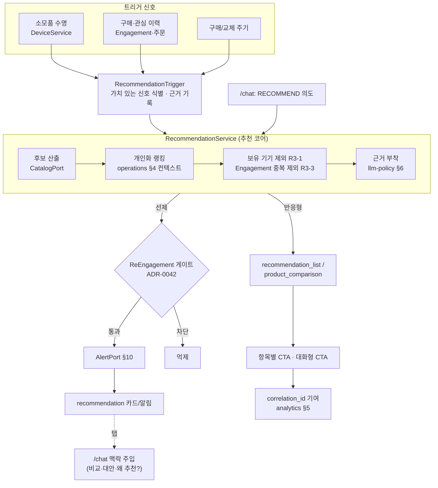

# 설계 (Design) — product-recommendation (선제적 제품 추천)

> 이 문서는 `requirements.md`의 요구사항을 **어떻게** 만족시킬지 설명한다.
> 공유 데이터 모델·아키텍처·정책은 **기반 문서를 참조(링크)** 하고, 본 기능 고유의 설계만 담는다.

## 토대 문서 (참조, 중복 정의 금지)
- 개인화 컨텍스트 조립: `docs/operations.md` §4·§4-1 · 추천 캐시: §2
- 선제 파이프라인·게이트: `docs/architecture.md` §10 · **ADR-0042**(엄격 게이트)
- 도메인 모델·Port: `docs/data-model.md`(`Product`·`Part`·`User`·`EngagementRecord`·`Consent`·`Notification`·`OpenLoop`·`CatalogPort`·`EngagementRepository`)
- 응답 표현: `docs/response-templates.md`(`recommendation_list`·`product_card`·`product_comparison`·`bridge` §9)
- 추천 정책·근거·차등 출력: `docs/llm-policy.md` §3·§4·§5·§6
- 전환 기여: `docs/analytics.md` §4·§5 · 동의: ADR-0030 · Engagement vs Analytics: ADR-0029
- 컴패니언 연계: `specs/always-present-companion/`(ResumeService·OpenLoopTracker·ReEngagementService)
- 카탈로그 경계: ADR-0020(Port Mock↔실)
- 기존 구현: `backend/app/services/services.py`(`CatalogService.recommend`·`NotificationService.pending_alerts`)

## 개요

추천은 두 진입(**선제 / 반응형**)이 같은 **추천 코어**를 공유한다.

- **추천 코어(`RecommendationService`)** — 후보 산출 → 개인화 랭킹 → 중복/보유 제외 → 근거 부착.
  도메인 서비스이며 `CatalogPort`·`EngagementRepository`·개인화 컨텍스트만 의존(요구 8-1).
- **선제 진입** — 트리거 평가(`RecommendationTrigger`) → 추천 코어 → **컴패니언 `ReEngagementService` 게이트 재사용**(ADR-0042) → `AlertPort`(요구 1·2·7).
- **반응형 진입** — `/chat`의 `RECOMMEND` 의도 → 추천 코어 → `recommendation_list`/`product_comparison` 템플릿(요구 5).

새 선제 인프라를 만들지 않고 **기존 §10 선제 파이프라인 + 컴패니언 게이트**에 추천 트리거를 끼워 넣는다.

## 아키텍처



## 주요 컴포넌트 / 인터페이스

> 시그니처는 의사 타입(구현 시 Pydantic/도메인 클래스). 공유 모델은 `data-model.md`를 따른다.

- **RecommendationService (추천 코어)** — 후보→랭킹→제외→근거의 단일 파이프라인. _(요구 3·4·5·8)_
  - `recommend(ctx: PersonalizationContext) -> list[RecommendationItem]`
  - 보유 기기 제외(요구 3-1), Engagement `viewed/dismissed` 제외(요구 3-3, 기존 `CatalogService.recommend` 패턴 계승),
    `personalization` 동의 없으면 일반 추천 폴백 + 제한 고지(요구 4). 후보는 `CatalogPort`로만 조회(요구 8-1).
  - 근거(`reason`)는 트리거·개인화 신호 기반(요구 5-1). 무근거 문구 금지(`llm-policy` §4).
- **RecommendationTrigger (선제 트리거 평가)** — 신호→추천 가치 후보 생성. _(요구 1)_
  - `evaluate(user) -> list[TriggerHit]` — 소모품 수명(`DeviceService.consumable_alerts` 재사용), 구매/교체 주기(주문 이력),
    관심 이력. 신호 없으면 빈 결과(요구 1-4, 무근거 추천 방지). 각 hit에 트리거 근거 기록(요구 1-3).
- **PersonalizationContext (조립)** — `operations.md` §4 컨텍스트를 동의 범위 안에서 조립. _(요구 3·4)_
  - 소스: 보유 기기(`device_data`), 관심·이력(`personalization`+`engagement`), 프로필. scope별 차등(요구 4-3).
  - **새 모델 정의 아님** — operations §4의 "사용자 컨텍스트" 조립 규칙을 추천에 적용하는 어셈블러.
- **컴패니언 게이트 재사용** — 선제 추천은 `ReEngagementService`(`specs/always-present-companion/`)의
  게이트(`Consent/opted_in → R26 빈도 → 가치/중복 → R27 묶음`)를 **그대로 통과**시킨다. _(요구 2·7-4)_
  - 추천 후보를 컴패니언 트리거(open-loop 후속과 동렬)로 등록 → 별도 선제 인프라 신설 없음(ADR-0042 결과/영향).
- **추천 표현 매핑** — 의도/상황 → 템플릿. _(요구 5)_
  - 반응형 `RECOMMEND` → `recommendation_list`(근거 포함) 또는 `product_comparison`(비교 요청).
  - 선제 알림 탭 → `bridge`(`card_type: recommendation`, 간단) / 패널(비교·상담 필요) 동적 분기(`response-templates` §9).
  - 대화형 CTA("왜 추천?"·"비교/대안") → `/chat` 재진입 + 추천 맥락 주입(요구 5-2, proactive→reactive).
- **OpenLoop 연계** — 보류 추천을 open-loop로 추적, resume에 포함, 해소 시 닫음. _(요구 7)_
  - `OpenLoop{kind:"flow", ref: 추천 식별, label, priority}`(data-model). 생성/해소는 `OpenLoopTracker` 재사용.
- **전환 기여 배선** — 추천 노출~주문을 `correlation_id`로 잇는다. _(요구 6)_
  - `template_shown(kind=recommendation_list)`→`cta_clicked`→`cart_item_added`→`order_confirmed` 동일 ID 전파(analytics §5).
  - 선제 전달은 `notification_delivered`/`notification_opened`/`notification_dismissed`(analytics §4).

## 데이터 모델

**공유 모델 재사용 (정의는 `docs/data-model.md`).** 본 스펙은 새 영속 엔티티를 만들지 않는다.

| 쓰임 | 재사용 모델 | 비고 |
|------|------------|------|
| 추천 제품 | `Product`(category·specs·image) | demand-driven, by-id 조회 |
| 부품/소모품 | `Part`·`Consumable` | 소모품 트리거 |
| 보유 기기 | `User.linked_device_ids`·`Device` | 중복 제외(요구 3-1) |
| 관심·확인 상태 | `EngagementRecord`·`EngagementRepository`(interests·has_seen·dismissed) | 중복 억제·관심 반영(요구 3) |
| 관심 카테고리 | `UserPreferences.interest_categories` | 개인화 보조 |
| 동의 | `Consent.scopes`(`personalization`·`engagement`·`device_data`·`analytics`) | 게이트(요구 4·6) |
| 선제 전달 | `Notification`(opted_in·priority) | 게이트(요구 2) |
| 보류 추천 | `OpenLoop` | 컴패니언 연계(요구 7) |
| 추천 표현 | `Template`(recommendation_list·product_comparison·bridge)·`Cta` | 표현(요구 5) |
| 컨텍스트 | `ConversationMemory`(facts·summary) | 이력 활용(요구 7-4) |

**경량 내부 타입(비영속, 서비스 내부 표현):**
```python
TriggerKind = "consumable_due" | "repurchase_cycle" | "interest_signal" | "complement"

class TriggerHit:                 # RecommendationTrigger 산출 (비영속)
    kind: TriggerKind
    subject_ref: Id               # device_id / part_id / category 등
    reason_seed: str              # 근거 생성용 신호 요약("필터 수명 12%")
    priority: Severity            # R26/R27 게이트 입력

class RecommendationItem:         # 추천 코어 산출 → recommendation_list.items 매핑
    product: Product              # 또는 ProductRef
    reason: str                   # 개인화 근거(R8-4) — recommendation_list.items[].reason
    trigger: TriggerKind | None   # 선제 출처(반응형이면 None)
    personalized: bool            # False면 일반 추천 폴백(요구 4-2 고지)
```
> `RecommendationItem`은 응답 시 `recommendation_list`(reason 포함)로 직렬화된다(`response-templates` §3). 새 영속 스키마 아님.

**추천 캐시** — `recommend(user·interest)` 캐시(`operations.md` §2 표). **Engagement 변경 시 무효화**,
개인화 응답은 **사용자 경계 밖 캐시 금지**(요구 3-3·`operations` §2). 키에 `user`/`consent` 포함.

## 에러 처리

- **카탈로그 빈/부분/실패(`PortError`)** — 흐름 중단 없이 일반 추천 또는 안내로 폴백(요구 8-2·R13).
- **개인화 데이터 부족·동의 없음** — 일반 추천 폴백 + "개인화 제한" 고지(요구 4-1·4-2, `llm-policy` §6).
- **동의 철회 중** — 개인화·선제 즉시 중단, 진행 중 흐름은 일반 추천으로 강등(요구 4-4·R19).
- **선제 게이트 차단** — 조용히 억제(전달 안 함). 사용자 노출/에러 아님(ADR-0042·analytics 비차단).
- **추천 후보 0개** — 빈 추천을 억지로 채우지 않음. 선제는 생성 안 함(요구 1-4), 반응형은 솔직히 안내.
- **근거 생성 실패** — 최소 일반 문구로 폴백하되 무근거 사양·가격 날조 금지(`llm-policy` §4).

## 테스트 전략

- **추천 코어(단위)** — 보유 기기 제외(요구 3-1), `viewed/dismissed` 제외(요구 3-3), 관심 반영 랭킹(요구 3-2). Mock Port·Engagement.
- **동의 차등(가장 중요)** — `personalization` 없음→일반 폴백+고지(요구 4-1·4-2), `device_data`만→보유 제외만 적용(요구 4-3), 철회→즉시 중단(요구 4-4).
- **선제 게이트** — opt-out·빈도 초과·저가치·중복에서 **선제 차단**(요구 2), 컴패니언 게이트와 동일 동작 검증(재사용 회귀).
- **트리거** — 소모품 수명/주기/관심 신호 → 정확한 `TriggerKind`·근거(요구 1). 무신호→생성 안 함(요구 1-4).
- **근거** — 트리거·개인화 신호 기반 reason 생성, 폴백 시 일반 추천 명시(요구 5-1, 4-2).
- **CTA 재진입** — 대화형 CTA → `/chat` 맥락 주입·FlowState 이어가기(요구 5-2). bridge↔패널 분기(요구 5-3).
- **OpenLoop** — 보류→추적→resume 포함→해소 닫힘(요구 7). 컴패니언 라이프사이클 결정적 테스트.
- **전환 기여(통합)** — 추천 노출→cta_clicked→cart→order를 같은 `correlation_id`로 추적(요구 6). 동의 없으면 미수집(요구 6-2).
- **카탈로그 경계(계약)** — Mock↔실 교체 시 추천 로직 불변(요구 8-1). 빈/실패 폴백(요구 8-2).

## 설계 결정 / 대안

- **선제 추천 = 컴패니언 게이트 재사용**(추천 전용 선제 파이프라인 신설 X) — ADR-0042가 "선제 인프라는 신규가 아니라
  기존 §10 재사용"을 못 박았다. 추천을 컴패니언 트리거의 한 종류로 합류시켜 빈도·중복·동의 규율을 단일 출처로 유지한다.
  *대안(기각): 추천 전용 알림 큐 — 빈도/피로 게이트가 이중화되어 ADR-0042 취지(단일 규율) 위반.*
- **추천 코어를 도메인 서비스에 둠**(카탈로그 어댑터가 아니라) — 트리거·랭킹·개인화·제외는 Mock↔실 교체와 무관해야 한다(요구 8-3).
  `CatalogPort`는 후보 조회·by-id만 담당. *대안(기각): Port가 랭킹까지 반환 — 실 추천엔진 교체 시 도메인 규칙이 어댑터에 샘.*
- **새 영속 엔티티 0개** — 추천은 `Product`·`Engagement`·`OpenLoop`·`Notification` 등 기존 모델 조합으로 표현(data-model 갱신 불요).
  `TriggerHit`·`RecommendationItem`은 서비스 내부 비영속 타입. *모델·인터페이스가 실제로 바뀌면 스펙이 아니라 `docs/`를 갱신한다(CLAUDE.md 규칙).*
- **scope별 차등**(`personalization` vs `device_data`) — 부분 동의에서도 가능한 만큼만 개인화(요구 4-3). ADR-0030의 기능별 scope 정합.
- **추천 캐시 무효화 = Engagement 트리거** — `operations.md` §2 표의 "추천 캐시: Engagement 변경 시 무효" 규칙을 따른다(요구 3-3 연계).
- **(설계 단계 결정 후보)** 선제 추천 트리거를 컴패니언 `ReEngagementService`에 합류시키는 방식(이벤트 vs 스케줄)은
  구현 진입 전 확정하고, 결정이 무거우면 **신규 ADR**로 기록한다(requirements 미해결 질문).
