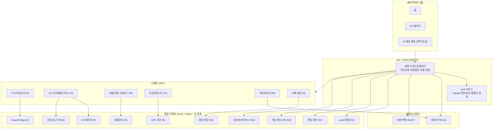
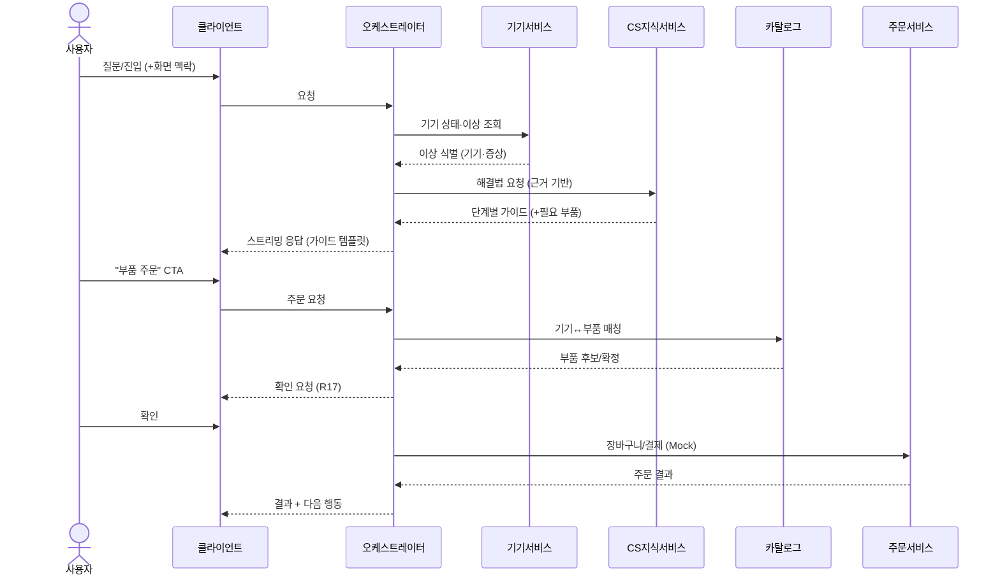
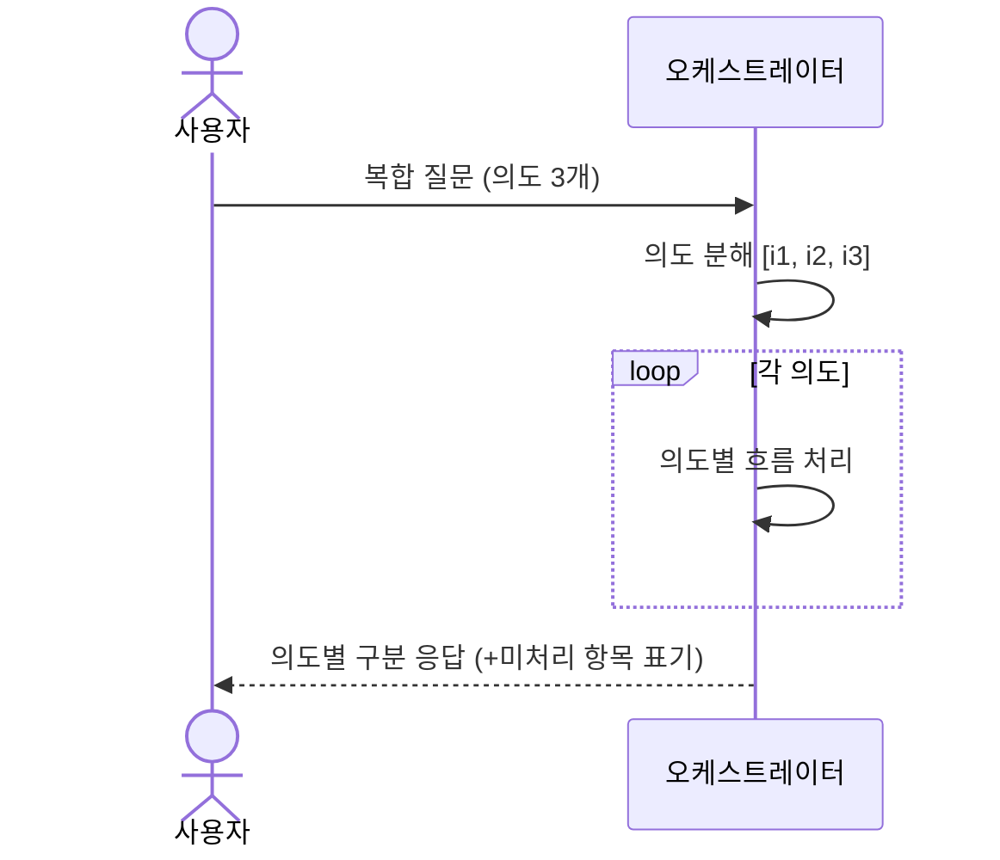
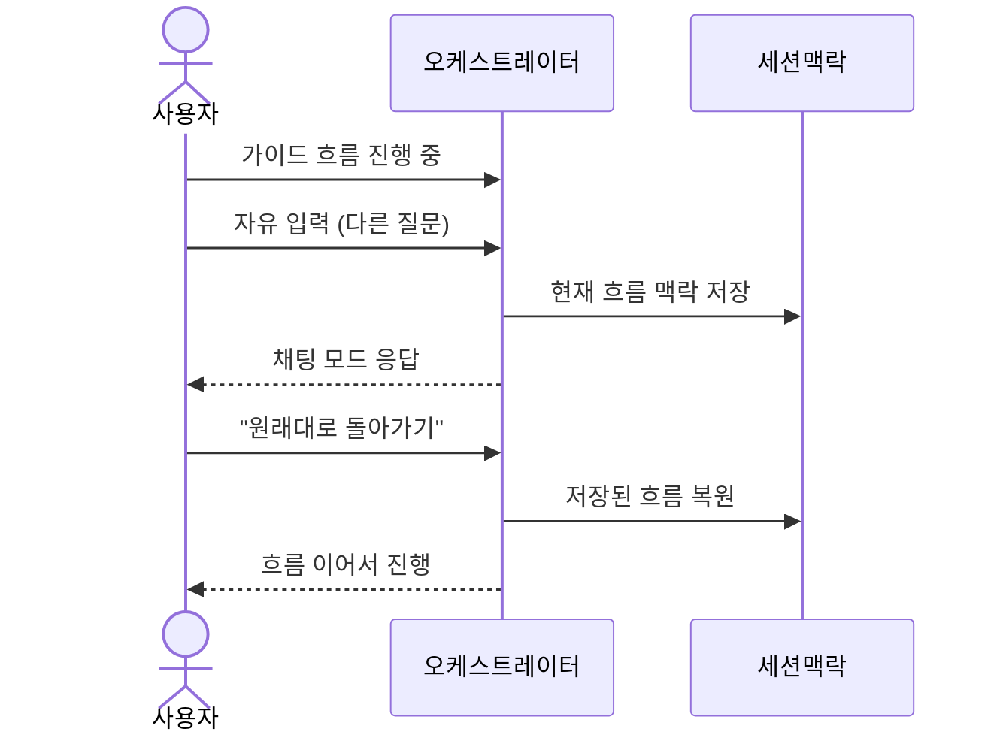
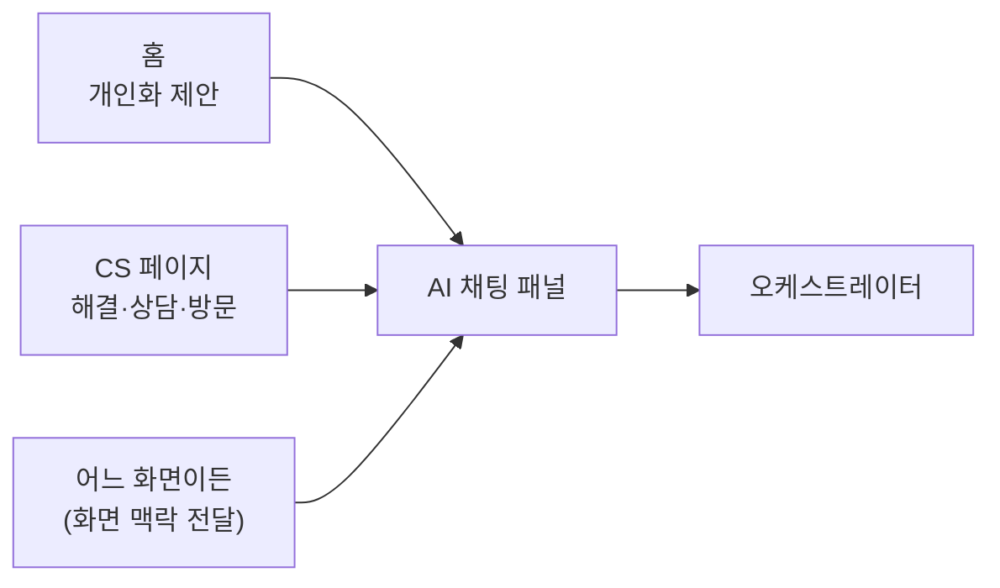
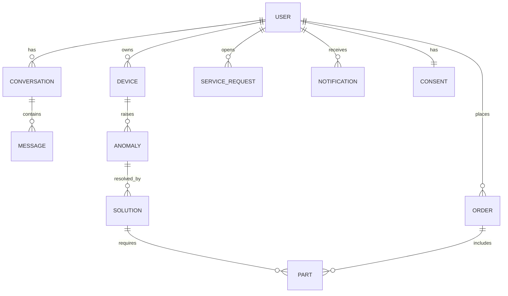

# 설계 (Design) — 삼성 AI 컨시어지

> 이 문서는 `requirements.md` 의 요구사항(이하 R1~R20)을 **어떻게** 만족시킬지 설명한다.
> 외부 API/데이터 검증 스파이크는 후속으로 미루고, 검증 결과로 본 설계를 보정한다.

## 1. 개요

대화 **오케스트레이터**를 중심에 두고, 도메인 기능은 **도메인 서비스**로,
외부 연동(SmartThings·O2O·CS 데이터·인증 등)은 **어댑터(Port)** 로 추상화한다.
이 어댑터 경계가 **Mock ↔ 실 기능 교체 지점**이 된다.

### 핵심 설계 원칙
1. **어댑터(Port) 경계로 Mock→실 교체** — R15·R16·R17·R18·R19·R20 의 Mock 구현을
   인터페이스 뒤에 두어, 나머지 시스템은 지금부터 동일 인터페이스로 통합한다.
2. **스트리밍 우선** — 모든 응답 경로는 점진적 전달을 기본으로 한다. (R14)
3. **폴백 내장** — 모든 외부 호출은 실패/미연동 시 대체 경로를 가진다. (R13)
4. **상태 있는 대화 세션** — 흐름 전환·복합 질문·이력을 위해 세션 맥락을 1급으로 둔다. (R6·R7·R12)
5. **UI 디커플링** — 응답은 데이터(템플릿 모델)로 표현하고, 렌더링은 클라이언트가 담당해
   디자이너 애셋 도착 전에도 골격으로 진행한다. (R9·R11)

---

## 2. 아키텍처



### 레이어 책임
- **클라이언트** — 홈/CS/전역 채팅 패널(R9), 멀티모달 입력·출력 렌더링(R10),
  템플릿·CTA 렌더링(R11), 스트리밍 표시(R14). 애셋 전엔 플레이스홀더.
- **오케스트레이터** — 의도 분류, 복합 의도 분해(R7), 흐름 전환·복원(R6),
  세션/맥락 관리, 도메인 서비스 호출 조합, 스트리밍 집계.
- **LLM 서비스** — Claude 호출, 멀티모달 입력 처리, 응답을 **템플릿 모델**로 구조화.
- **도메인 서비스** — 비즈니스 로직. 외부 연동은 직접 하지 않고 Port를 통한다.
- **통합 어댑터(Port)** — 외부 시스템/민감 기능 추상화. **Mock↔실 교체 지점.**
- **데이터 저장소** — 대화·이력(R12), 세션 맥락(R6·R7).

### Mock ↔ 실 기능 경계
| Port | MVP | 실 전환 시 |
|------|-----|-----------|
| SmartThings (STP) | 개인 API(PAT) 실연동 + 일부 Mock 시나리오 | 기업 API 확장 |
| CS 데이터 (CSDataP) | 실데이터 일부 적재 | 전체 CS 연동 |
| 제품정보 (CatP) | 실데이터 일부 | 전체 카탈로그 |
| O2O 주문 (O2OP) | **Mock** (주문 성공/실패 시뮬레이션) | 실제 주문/결제 연동 |
| Auth/계정 (AuthP) | **Mock** 고정 사용자/기기 | 삼성 계정 SSO |
| 신뢰성/근거 (TrustP) | **Mock** 고정 규칙/샘플 출처 | 실제 grounding·평가 |
| 행동 확인 (ActP) | 확인 UX는 실제, 처리만 Mock | 실 결제/주문 커밋 |
| 핸드오프 (HandoffP) | **Mock** 접수 응답 | 상담/방문 시스템 |
| 알림 전달 (AlertP) | **Mock** 인앱 표시 | 푸시/외부 채널 |
| 동의/프라이버시 (ConsentP) | **Mock** 동의/삭제 | 실 동의·데이터 관리 |

---

## 3. 주요 흐름 / 시퀀스

### 3.1 메인 흐름: 이상 감지 → 해결 → 주문 (R2·R3·R4·R17)


### 3.2 복합(다중 의도) 질문 분해 (R7)


### 3.3 흐름 중 채팅 전환·복원 (R6)


### 3.4 진입점 개요 (R9)


---

## 4. 주요 컴포넌트 / 인터페이스

### 컴포넌트 책임 요약
| 컴포넌트 | 책임 | 요구사항 |
|----------|------|----------|
| 대화 오케스트레이터 | 의도분류·분해, 흐름 전환/복원, 세션, 호출 조합 | R1·R6·R7 |
| LLM 서비스 | Claude 호출, 멀티모달, 템플릿 모델 생성 | R1·R10·R11 |
| 기기/이상감지 | 기기 상태 조회, 이상 기준 판정 | R2·R5 |
| CS 지식/해결 | 근거 기반 해결 가이드 | R3·R16 |
| 카탈로그 | 기기↔부품 매칭 | R4 |
| 주문 | 장바구니·결제·주문 | R4·R17 |
| 개인화/추천 | 이력·보유기기 반영 추천 | R8 |
| 선제 알림 | 임계치 감지 → 알림 발생 | R5·R20 |

### Port 인터페이스 스케치 (언어 무관, 의사 시그니처)
> 각 Port는 `Mock*` 와 (후속) `Real*` 구현을 가지며, 주입으로 교체한다.

```text
DevicePort        listDevices(user), getStatus(deviceId), detectAnomalies(deviceId)
CSKnowledgePort   findSolutions(query|anomaly) -> { steps[], sources[], requiredParts[] }
CatalogPort       matchParts(deviceId, partSpec) -> Part[] | Ambiguous
OrderPort         addToCart(items), checkout(cart) -> OrderResult        # MVP: Mock
AuthPort          currentUser(), linkedDevices()                          # MVP: Mock
TrustPort         ground(answer, sources) -> { grounded, confidence }     # MVP: Mock
ActionGatePort    confirm(action) -> Confirmed | Cancelled                # 확인 UX 실, 처리 Mock
HandoffPort       handoff(context) -> Ticket                              # MVP: Mock
AlertPort         deliver(notification, channel)                          # MVP: Mock(인앱)
ConsentPort       getConsent(user), revoke(user), deleteData(user)        # MVP: Mock
```

---

## 5. 데이터 모델



### 핵심 엔티티(MVP 필드 예시)
- **User** — id, mockAuth, linkedDeviceIds
- **Device** — id, type, model, status, consumables[{name, life}]
- **Anomaly** — id, deviceId, type(오류코드/소모품/비정상수치), severity, detectedAt
- **Conversation / Message** — id, userId, turns; message{role, modality(text/image/video), content, template?, ctas?}
- **Solution** — id, steps[], sources[], requiredParts[], escalationNeeded
- **Part** — id, deviceModel, name, sku, price
- **Order** — id, items[], status(Mock)
- **ServiceRequest** — id, type(상담/방문), contextRef
- **Notification** — id, type(이상/소모품), channel, optedIn
- **Consent** — userId, scopes[], updatedAt

데이터 소스 매핑: Device←SmartThings, Solution/Source←CS 데이터, Part←제품정보, Order←O2O.

---

## 6. 에러 처리 / 폴백 (R13)

| 상황 | 처리 |
|------|------|
| SmartThings 호출 실패/미연동 | 기기 의존 답변 → 일반 안내로 폴백, 연동 유도 |
| O2O(주문) 실패 | 주문 보류 안내 + 재시도/대안(직접 주문 링크) |
| CS 지식 미발견 | 단정 금지 → 사람 핸드오프(R18) 안내 |
| LLM 응답 지연/타임아웃 | 상태 표시 + 대기/재시도/취소 (R14) |
| 신뢰도 낮음(TrustPort) | 경고 + 사람 연결 권유 (R16) |
| 부품 매칭 모호 | 임의 선택 금지 → 후보 제시/확인 (R4-3) |

원칙: **어떤 단일 외부 실패도 전체 대화를 중단시키지 않는다.**

---

## 7. 테스트 전략

- **단위** — 의도 분류/분해(R7), 이상 판정(R2·R5), 부품 매칭(R4),
  각 Port의 Mock 구현 계약 테스트.
- **계약(Contract)** — Port 인터페이스 기준으로 Mock/실 구현이 동일 계약을 만족하는지
  (Mock→실 교체 안전성, R15~R20).
- **통합** — 메인 흐름(3.1) end-to-end, 흐름 전환(3.3), 복합 질문(3.2).
- **폴백** — 각 외부 실패 주입 시 폴백 동작(R13).
- **스트리밍/UX** — 점진적 전달·지연 상태(R14).
- 외부 실연동(SmartThings 개인 API 등)은 검증 스파이크 이후 통합 테스트에 편입.

---

## 8. 설계 결정 / 대안

- **어댑터(Port) 패턴 채택** — Mock→실 교체(R15~R20)를 인터페이스 경계로 강제. 대안(직접 호출)은 교체 비용이 커서 배제.
- **오케스트레이터 중심(중앙 조정)** — 복합 의도·흐름 전환·세션을 한 곳에서 관리. 대안(서비스별 자율)은 흐름 전환/복원 추적이 어려워 배제.
- **응답을 템플릿 모델(데이터)로 표현** — UI 애셋 디커플링(R9·R11), 멀티모달 소스 포함(R10) 용이.
- **LLM = Claude** — 멀티모달·구조화 출력에 적합. 기본은 비용/지연 균형 모델, 복잡 추론은 상위 모델로 라우팅(설계 시 확정).

### 확인 필요 (사용자 결정)
- **기술 스택** — 제안: 웹 프론트(React/TypeScript) + 백엔드(Node/TypeScript). 변경 가능.
- **데이터 저장소** — 대화/세션 저장에 쓸 스토리지(예: Postgres/Redis) 선택.
- 위 항목은 tasks 진행 전 확정한다.

### design 단계 입력으로 남은 검증 (후속 스파이크)
`requirements.md` 의 "미해결 질문" 항목(O2O 주문 지원, SmartThings 이상 지표,
CS 구조, 제품-부품 매핑, 개인화 데이터 동의)을 스파이크에서 확인해 본 설계를 보정한다.
