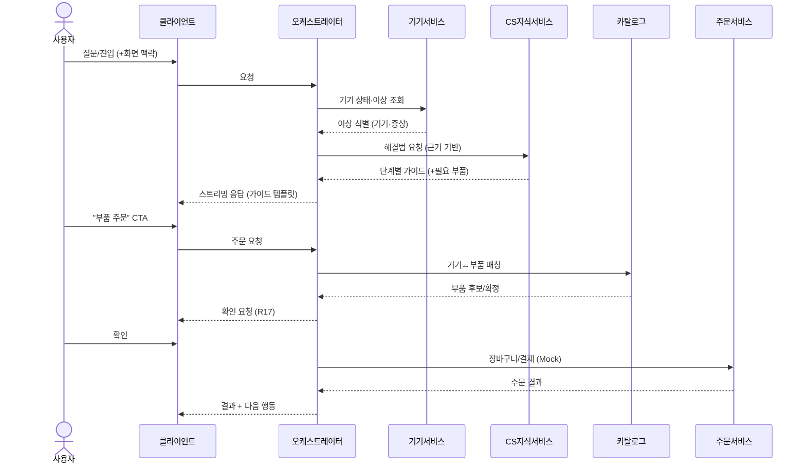
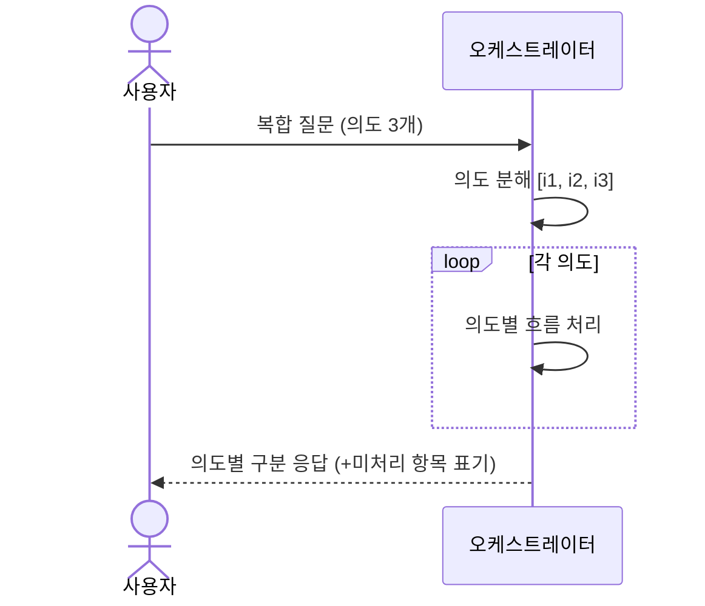
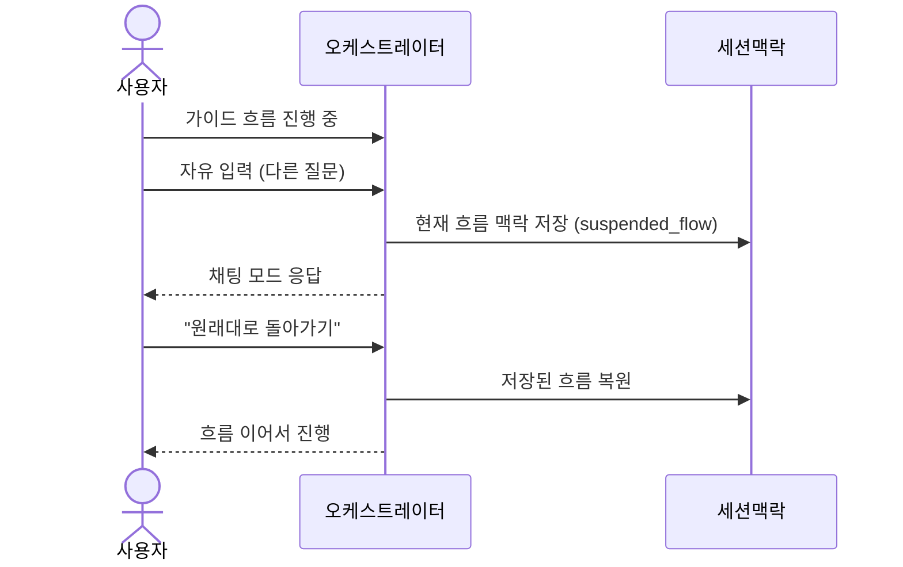
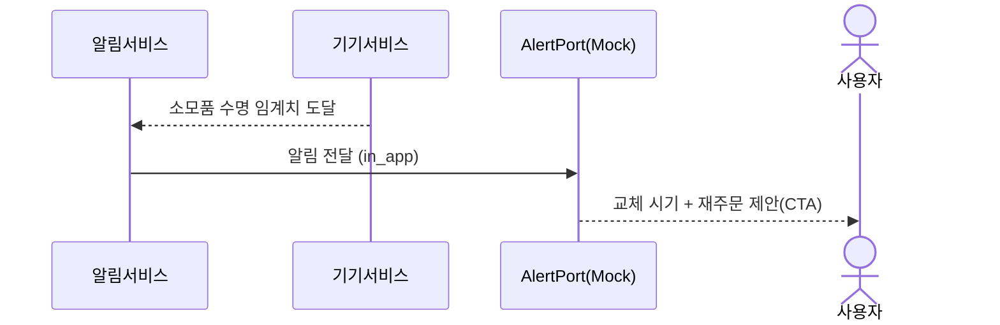
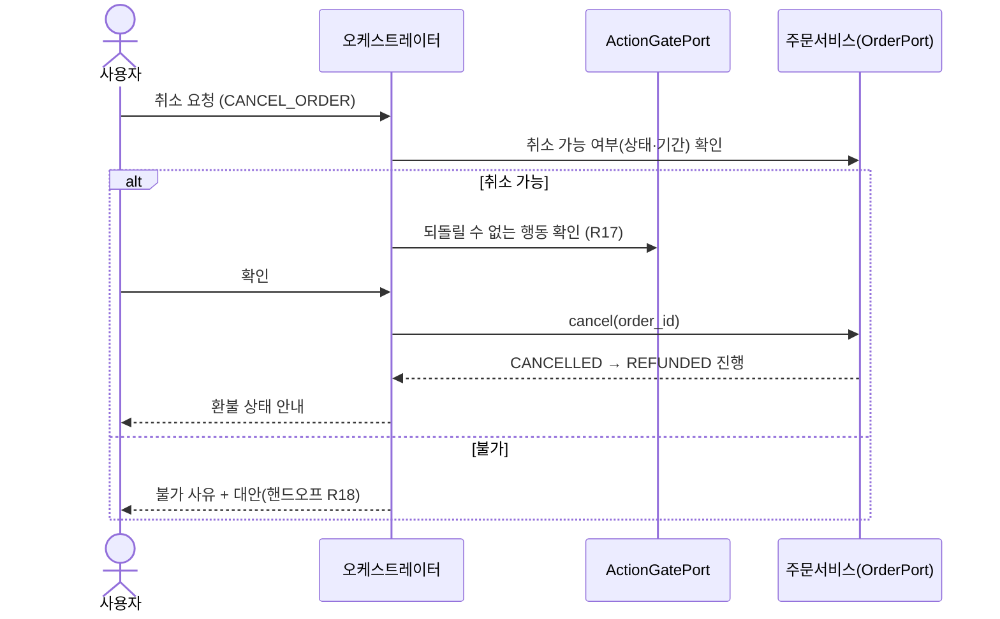

# 설계 (Design) — 삼성 AI 컨시어지

> 이 문서는 `requirements.md` 의 요구사항(이하 R1~R29)을 **어떻게** 만족시킬지 설명한다.
> 전체 아키텍처·기술 스택·Mock↔실 전략은 **기반 문서**를 따른다 — 여기서 중복 정의하지 않는다.
> - 시스템 아키텍처: [`docs/architecture.md`](../../docs/architecture.md)
> - 공유 데이터 모델/클래스 구조/Port·Repository 타입: [`docs/data-model.md`](../../docs/data-model.md)
>
> 외부 API/데이터 검증 스파이크는 후속으로 미루고, 검증 결과로 본 설계를 보정한다.

## 1. 개요

이 스펙은 위 기반 아키텍처 위에서 **컨시어지 기능의 동작(흐름)** 을 정의한다.
오케스트레이터가 도메인 서비스와 Port를 조합해 다음 가치를 제공한다:

- 대화형 진입과 멀티모달 (R1·R10), 복합 질문 분해(R7), 흐름 전환·복원(R6)
- 메인 가치 흐름: **이상 감지 → 해결 안내 → 부속품 주문** (R2·R3·R4)
- 소모품 재주문 선제안(R5), 개인화 추천(R8)
- 응답 템플릿·CTA(R11), 스트리밍(R14), 폴백(R13)
- **주문 사후·CS 보강** — 취소·환불(R21), 보증 판별(R22), 안전 경고(R23), 미연동 온보딩(R24), 수리 후 확인(R25)
- **선제(proactive) 보강** — 알림 빈도·중요도(R26), 다중 기기 우선순위(R27). 선제 파이프라인은
  [`docs/architecture.md`](../../docs/architecture.md) §10, 시나리오 분류는 [`scenarios.md`](./scenarios.md) §4-B.

컴포넌트 책임·Port/Repository 시그니처·엔티티 타입은 기반 문서를 참조한다.

## 2. 주요 흐름 / 시퀀스

### 2.1 메인 흐름: 이상 감지 → 해결 → 주문 (R2·R3·R4·R17)

### 2.2 복합(다중 의도) 질문 분해 (R7)

### 2.3 흐름 중 채팅 전환·복원 (R6)

> 흐름 상태는 `Conversation.active_flow / suspended_flow`(`docs/data-model.md` §3)로 표현한다.

### 2.4 소모품 재주문 선제안 (R5·R20)

### 2.5 주문 취소 · 환불 (R21·R17)

## 3. 기능 고유 설계 포인트

- **의도 분류/분해** — 오케스트레이터가 입력을 `IntentType`(단일/복수)으로 분류. 3개 이상이면
  각 의도를 순회 처리하고 `IntentResult.handled/unhandled`로 구분 응답(R7).
- **흐름 전환** — 가이드 흐름 진행 중 자유 입력이 오면 `active_flow`를 `suspended_flow`로 보관,
  복귀 요청 시 복원(R6).
- **개인화** — 추천 시 대화 이력(관심 제품)과 보유 기기를 반영하고, 보유 기기는 중복 추천 제외,
  근거를 함께 제시. 데이터 부족 시 일반 추천 폴백(R8).
- **확인 정보(Engagement)** — 열람/무시/관심을 `EngagementRepository`에 기록(R29). 추천·알림 생성 시
  `has_seen`/`dismissed`로 **중복 제시 방지**, `interests`로 개인화 신호 반영(R8·R26). 분석(R28)과 달리
  **앱 동작을 바꾸는 내부 도메인 상태**다(`architecture.md` §12). 동의·삭제는 R19.
- **템플릿/CTA** — 응답은 `Template` + `Cta`로 구조화, 클라이언트가 렌더링. 템플릿 카탈로그·data
  스키마·선택/CTA 매핑 규칙은 기반 문서 [`docs/response-templates.md`](../../docs/response-templates.md) 참조(R10·R11).
- **확인 게이트** — 결제·주문·방문 등은 `ActionGatePort.requires_confirmation`으로 확인 후 처리(R17).
- **주문 취소·환불** — `OrderStatus`를 `CONFIRMED→CANCELLED→REFUNDED`로 전이. 취소 CTA는 취소 가능 단계에만
  노출, 실행은 확인 게이트(R17) 경유(R21).
- **보증 판별** — `WarrantyPort.get_warranty`로 유·무상(`Coverage`)을 판정해 해결/주문/방문 안내에 표시.
  불확실하면 단정 금지 → CS 확인 안내(R22).
- **안전 경고** — `SolutionStep.safety`(caution/danger)·`pro_required`를 가이드에 표시. `danger`/`pro_required`면
  셀프 진행 대신 기사 연결 우선(R23·R16-2·R18).
- **미연동 온보딩** — 기기 의존 기능 접근 시 차단 대신 연동 유도 + 일반 안내 폴백, 완료 후 개인화 활성화(R24·R13-2).
- **수리 후 확인** — 해결/주문/방문 완료 후 시스템이 해결 여부를 후속 질의(proactive). 미해결이면 재진단·핸드오프(R25).
- **선제 알림 정책** — `Notification.priority`로 중요도 정렬·묶음, 빈도 제한(R26). 다중 기기 동시 이상은
  심각도·안전 우선순위로 `home_summary`에 종합(R27). 전달은 옵트인·동의 게이트 통과(architecture §10).

## 4. 에러 처리 / 폴백 (R13)

| 상황 | 처리 |
|------|------|
| SmartThings 호출 실패/미연동 | 기기 의존 답변 → 일반 안내로 폴백, 연동 유도 |
| O2O(주문) 실패 | 주문 보류 안내 + 재시도/대안(직접 주문 링크) |
| CS 지식 미발견 | 단정 금지 → 사람 핸드오프(R18) 안내 |
| LLM 응답 지연/타임아웃 | 상태 표시 + 대기/재시도/취소 (R14) |
| 신뢰도 낮음(TrustPort) | 경고 + 사람 연결 권유 (R16) |
| 부품 매칭 모호 | 임의 선택 금지 → 후보 제시/확인 (R4-3) |
| 결제/취소 실패 | 결제 보류·재시도, 취소 불가 단계면 사유 안내 + 대안 (R21) |
| 위험 작업(R23) | 안전 경고 표시, `danger`/`pro_required`면 셀프 차단 → 기사 연결 우선 |
| 미연동 사용자 | 기능 차단 금지 → 연동 유도 + 일반 안내 폴백 (R24·R13-2) |

원칙: **어떤 단일 외부 실패도 전체 대화를 중단시키지 않는다.**

## 5. 테스트 전략

- **단위** — 의도 분류/분해(R7), 이상 판정(R2·R5), 부품 매칭(R4).
- **계약(Contract)** — 각 Port의 Mock/실 구현이 동일 계약을 만족하는지(Mock→실 교체 안전성).
  Repository(인메모리/Postgres+Redis)도 동일 계약 테스트.
- **통합** — 메인 흐름(2.1) end-to-end, 흐름 전환(2.3), 복합 질문(2.2), 재주문 선제안(2.4).
- **폴백** — 각 외부 실패 주입 시 폴백 동작(R13).
- **스트리밍/UX** — 점진적 전달·지연 상태(R14).

## 6. 비즈니스 로직 설계 결정 / 대안 검토 (Trade-off)

> 각 결정은 안(A/B/C)과 트레이드오프, **추천(잠정)** 을 둔다. 추천은 사용자 확인 후 확정한다.
> 하드 불변식·데이터 제약은 `docs/data-model.md`(§0·불변식)에 있고, 여기서는 **로직 선택**을 다룬다.

### 6.1 의도 분류·분해 (R1·R7)
| 안 | 내용 | 트레이드오프 |
|----|------|--------------|
| A | 규칙/키워드 기반 | 빠르고 저렴 · 자연어 변형에 취약 |
| B | LLM 구조화 출력 1회(분류+분해) | 자연어 강함 · 비용/지연·비결정성 |
| C | 하이브리드(LLM + 규칙 가드레일) | 안정성↑ · 복잡도↑ |

**결정: C** — LLM 구조화 출력(분류+분해)에 핵심 의도(주문·핸드오프) 규칙 가드레일을 덧댄다.

### 6.2 해결책 근거(grounding) (R3·R16)
| 안 | 내용 | 트레이드오프 |
|----|------|--------------|
| A | LLM 자체 지식 | 간단 · 환각 위험, 출처 없음(R16 위배) |
| B | CS 데이터 검색(RAG) 후 근거 생성 | 출처·신뢰성 확보 · 검색 품질 의존 |
| C | 큐레이션 FAQ 정확 매칭 | 정확 · 커버리지 좁음 |

**결정: B** — MVP의 `TrustPort`는 Mock이나 인터페이스는 RAG 전제로 둔다. 근거 없으면 핸드오프(R18).

### 6.3 이상 감지 판정 (R2·R5)
| 안 | 내용 | 트레이드오프 |
|----|------|--------------|
| A | 고정 임계치(rule) | 단순·예측 가능 · 기기별 편차 반영 약함 |
| B | 기기별 임계치 + SmartThings 오류코드/이벤트 사용 | 현실적 · 제공 데이터에 의존 |
| C | 통계/학습 이상탐지 | 강력 · 데이터·복잡도 큼 |

**결정: B** — MVP. C는 후속(데이터 축적 후).

### 6.4 부품 매칭 모호성 (R4)
| 안 | 내용 | 트레이드오프 |
|----|------|--------------|
| A | 최고 점수 자동 선택 | 빠름 · 오선택 위험(R4-3 위배) |
| B | 후보 제시 + 사용자 확인 | 정확·안전 · 단계 추가 |
| C | 모델 정확 매칭만, 없으면 핸드오프 | 안전 · 커버리지 좁음 |

**결정: B** — 요구사항 R4-3(임의 선택 금지)과 정합.

### 6.5 흐름 전환 감지 (R6)
| 안 | 내용 | 트레이드오프 |
|----|------|--------------|
| A | 명시적 토글 UI | 명확 · 사용자 수동 조작 |
| B | 의도 자동 감지(현 흐름과 무관 입력 시 전환) | 매끄러움 · 오탐 위험 |
| C | 자동 감지 + 가벼운 확인 | 균형 · 약간의 마찰 |

**결정: B** — 의도 자동 감지로 전환(현 흐름과 무관한 입력 시). 오탐은 흐름 복원/되돌리기로 완화.

### 6.6 복합 질문 처리 순서·부분 실패 (R7)
| 안 | 내용 | 트레이드오프 |
|----|------|--------------|
| A | 순차 처리 | 단순 · 느릴 수 있음 |
| B | 병렬 후 합성 | 빠름 · 의도 간 의존 처리 어려움 |
| C | 우선순위(안전/CS 우선) + 순차 | 안전 · 약간 복잡 |

**결정: C** — 미처리 의도는 `IntentResult.unhandled`로 구분 응답.

### 6.7 세션 맥락 보존 (R12)
| 안 | 내용 | 트레이드오프 |
|----|------|--------------|
| A | 전체 대화를 LLM 컨텍스트로 | 단순 · 토큰 비용·한계 |
| B | 요약 + 최근 N턴 | 비용↓ · 요약 손실 |
| C | 구조화 상태(FlowState) + 요약 | 정확·비용 균형 · 구현 복잡 |

**결정: C** — `docs/data-model.md`의 `FlowState`와 정합.

> 위 결정은 사용자 확정됨(2026-06-11). 변경 시 본 섹션과 관련 설계·기반 문서를 함께 갱신한다.

## 7. 후속 검증 (Spike)

- 아키텍처·기술 스택·데이터 모델 결정은 기반 문서(`docs/architecture.md`, `docs/data-model.md`)에 기록.
- **후속 검증 스파이크** — `requirements.md` "미해결 질문"(O2O 주문 지원, SmartThings 이상 지표,
  CS 구조, 제품-부품 매핑, 개인화 동의)을 확인해 본 설계와 기반 문서를 보정한다.
