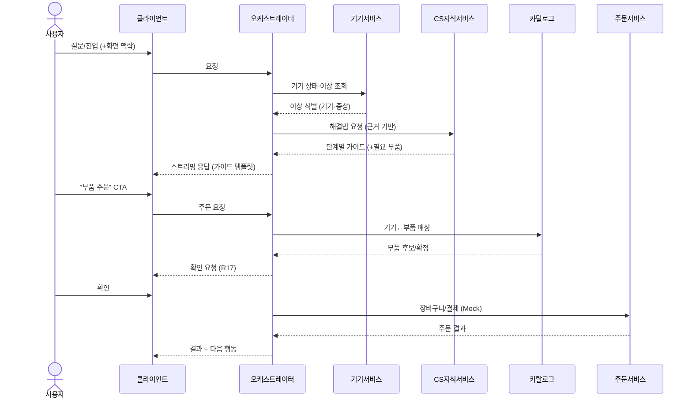
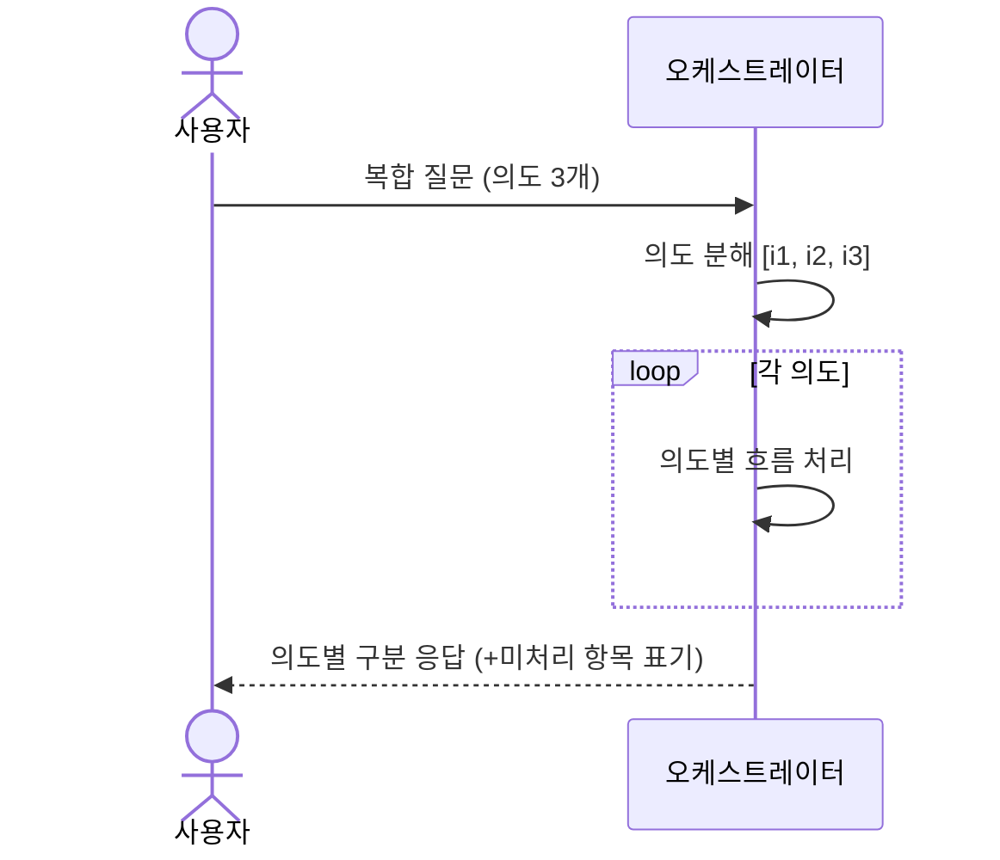
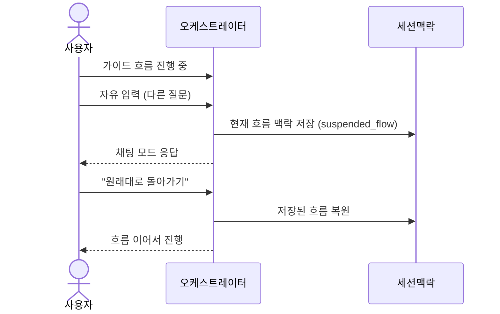
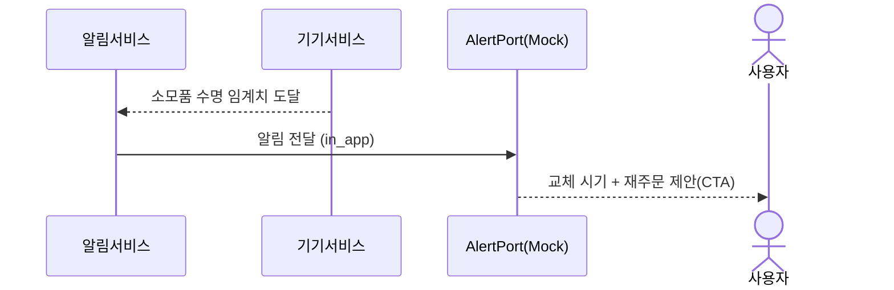

# 설계 (Design) — 삼성 AI 컨시어지

> 이 문서는 `requirements.md` 의 요구사항(이하 R1~R20)을 **어떻게** 만족시킬지 설명한다.
> 전체 아키텍처·기술 스택·Mock↔실 전략은 **기반 문서**를 따른다 — 여기서 중복 정의하지 않는다.
> - 시스템 아키텍처: [`docs/architecture.md`](../../docs/architecture.md)
> - 공유 데이터 모델/클래스 구조/Port·Repository 타입: [`docs/data-model.md`](../../docs/data-model.md)
>
> 외부 API/데이터 검증 스파이크는 후속으로 미루고, 검증 결과로 본 설계를 보정한다.

## 1. 개요

이 스펙은 위 기반 아키텍처 위에서 **컨시어지 기능의 동작(흐름)** 을 정의한다.
오케스트레이터가 도메인 서비스와 Port를 조합해 다음 가치를 제공한다:

- 대화형 진입과 멀티모달 (R1·R10), 복합 질문 분해(R7), 흐름 전환·복원(R6)
- 메인 가치 흐름: **이상 감지 → 해결 안내 → 부속품 주문** (R2·R3·R4)
- 소모품 재주문 선제안(R5), 개인화 추천(R8)
- 응답 템플릿·CTA(R11), 스트리밍(R14), 폴백(R13)

컴포넌트 책임·Port/Repository 시그니처·엔티티 타입은 기반 문서를 참조한다.

## 2. 주요 흐름 / 시퀀스

### 2.1 메인 흐름: 이상 감지 → 해결 → 주문 (R2·R3·R4·R17)

### 2.2 복합(다중 의도) 질문 분해 (R7)

### 2.3 흐름 중 채팅 전환·복원 (R6)

> 흐름 상태는 `Conversation.active_flow / suspended_flow`(`docs/data-model.md` §3)로 표현한다.

### 2.4 소모품 재주문 선제안 (R5·R20)

## 3. 기능 고유 설계 포인트

- **의도 분류/분해** — 오케스트레이터가 입력을 `IntentType`(단일/복수)으로 분류. 3개 이상이면
  각 의도를 순회 처리하고 `IntentResult.handled/unhandled`로 구분 응답(R7).
- **흐름 전환** — 가이드 흐름 진행 중 자유 입력이 오면 `active_flow`를 `suspended_flow`로 보관,
  복귀 요청 시 복원(R6).
- **개인화** — 추천 시 대화 이력(관심 제품)과 보유 기기를 반영하고, 보유 기기는 중복 추천 제외,
  근거를 함께 제시. 데이터 부족 시 일반 추천 폴백(R8).
- **템플릿/CTA** — 응답은 `Template`(product_card/guide_steps/comparison/text) + `Cta`로 구조화,
  클라이언트가 렌더링. 구매계열 CTA는 장바구니/결제, CS계열은 상담/방문(R11).
- **확인 게이트** — 결제·주문·방문 등은 `ActionGatePort.requires_confirmation`으로 확인 후 처리(R17).

## 4. 에러 처리 / 폴백 (R13)

| 상황 | 처리 |
|------|------|
| SmartThings 호출 실패/미연동 | 기기 의존 답변 → 일반 안내로 폴백, 연동 유도 |
| O2O(주문) 실패 | 주문 보류 안내 + 재시도/대안(직접 주문 링크) |
| CS 지식 미발견 | 단정 금지 → 사람 핸드오프(R18) 안내 |
| LLM 응답 지연/타임아웃 | 상태 표시 + 대기/재시도/취소 (R14) |
| 신뢰도 낮음(TrustPort) | 경고 + 사람 연결 권유 (R16) |
| 부품 매칭 모호 | 임의 선택 금지 → 후보 제시/확인 (R4-3) |

원칙: **어떤 단일 외부 실패도 전체 대화를 중단시키지 않는다.**

## 5. 테스트 전략

- **단위** — 의도 분류/분해(R7), 이상 판정(R2·R5), 부품 매칭(R4).
- **계약(Contract)** — 각 Port의 Mock/실 구현이 동일 계약을 만족하는지(Mock→실 교체 안전성).
  Repository(인메모리/Postgres+Redis)도 동일 계약 테스트.
- **통합** — 메인 흐름(2.1) end-to-end, 흐름 전환(2.3), 복합 질문(2.2), 재주문 선제안(2.4).
- **폴백** — 각 외부 실패 주입 시 폴백 동작(R13).
- **스트리밍/UX** — 점진적 전달·지연 상태(R14).

## 6. 설계 결정 / 후속 검증

- 아키텍처·기술 스택·데이터 모델 결정은 기반 문서(`docs/architecture.md`, `docs/data-model.md`)에 기록.
- **후속 검증 스파이크** — `requirements.md` "미해결 질문"(O2O 주문 지원, SmartThings 이상 지표,
  CS 구조, 제품-부품 매핑, 개인화 동의)을 확인해 본 설계와 기반 문서를 보정한다.
